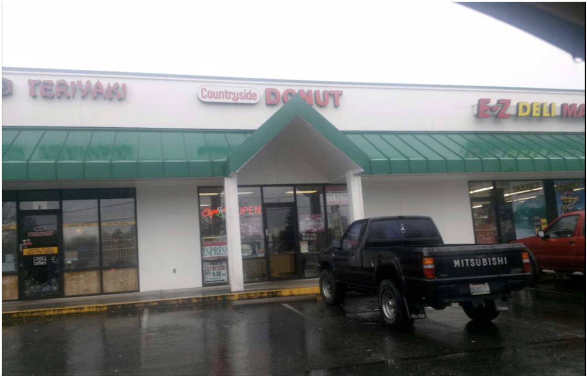

Those of us who succumb to the occasional urge for these nutritional hand-grenades, there is a glimmer of hope. Nestled in a small strip mall on [220th and 66th Ave. in Edmonds](https://www.google.com/maps/place/Countryside+Donut+LLC/@47.7998379,-122.3236109,17z/data=!3m1!4b1!4m6!3m5!1s0x54901aa58b606653:0xaa64a0cbd98873e4!8m2!3d47.7998343!4d-122.3210306!16s%2Fg%2F1tf9sjfm?entry=ttu&g_ep=EgoyMDI2MDYxMy4wIKXMDSoASAFQAw%3D%3D) is the best doughnut shop around—possibly on the west coast—and their scant use of oil and sugar make these delicious treats almost healthy.

Countryside Donut has been open in the same spot every single day since 1976; but if you stop by this shop after 1pm, you will most likely see their note, "Sorry, sold out, please come tomorrow" posted on the door. On weekends, it's best to arrive before 9am.

When you enter this humble store, you will see a short and svelte owner behind the counter: "The Donut Man" as he likes to be called. If he's not already helping another customer, his warm smile and genuine greeting will make you feel like you’re his favorite customer. Various articles and reviews of his unique doughnut recipes are subtly posted near his cash register, but by his down-to-earth demeanor, you’d never guess that he’s been interviewed by many—including the Discovery Channel.

Saying the police know where to go for the best doughnuts is an understatement; police from various cities and even the mayor are often spotted in this piece of Seattle culinary history to pick up their orders of the most amazing apple fritters.

The Donut Man bakes 4-7am every day and serves people until he is sold out. He takes a short lunch break and has always eaten 3-5 doughnuts daily. When asked how he keeps such a trim shape, he happily points out the secrets to his doughnut success:

- _“They are dry on the bottom since they are much less oily”_
- _“I use very little sugar coating so they are not too sweet”_

There may be no such thing as a healthy doughnut, but these exquisite creations are the closest you’ll find—so enjoy another one!