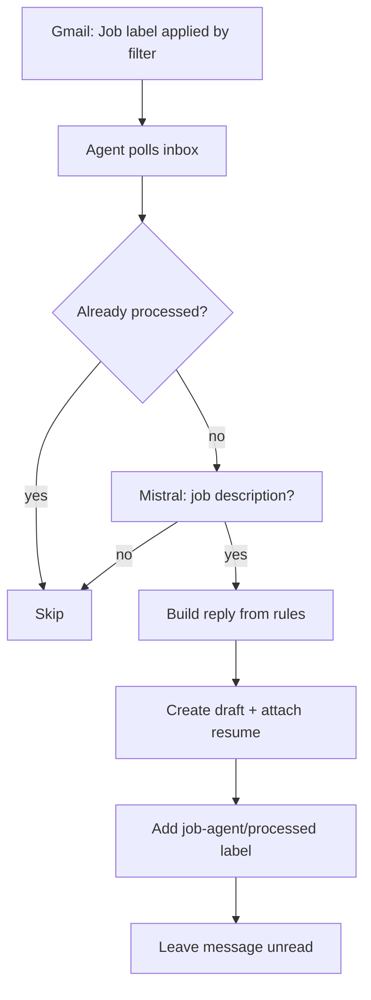

# Building a local Gmail job-reply agent with Mistral and Ollama

*How I built a privacy-first agent that drafts customized replies to recruiter emails without sending my inbox to the cloud.*


## The problem

Like many people job hunting, I get a steady stream of recruiter emails. Many are missing one or more key components: Job ID, pay range (required in California), or complete job description. And they want a quick reply with a resume attached.

I wanted an agent that would:

1. Watch my Gmail inbox for job-related messages
2. Detect whether an email is actually a job description
3. Draft a reply using exact wording I specified
4. Attach my latest resume
5. Run _entirely locally_ for security (no LLM API calls with email content)

My target account: `guy.klages@gmail.com`


## Prerequisites

Before writing an agent, you need to have a clear list of which emails you want to reply to. I used Gmail's built-in Filters to distill which emails to target and then the built-in Labels feature to tag those filtered emails with a "Job" label.

Stack:

- **Python 3.12** + Gmail API
- **Ollama** + **Mistral 7B** (local)
- **Gmail filters** for the "Job" label (upstream of the agent)

### Important caveats

As you write your prompt, these are good things to keep in mind:

| Advice               | Description |
|----------------------|-------------|
| Output to draft      | You will likely need to modify this email agent many times to perfect it, so you don't want this agent to auto-reply until after you've worked out all the kinks. |
| Structured logging   | Log the subject, sender, classification result, and the conditional paragraphs to make debugging reply content easy. |

The overall process is:

> **Gmail Filters route → local LLM classifies → code templates reply → human approves send.**


## What I asked for (the initial prompt)

I asked Cursor to build an agent to write a customized email reply to any email tagged as "Job" with the following reply rules:

**Always start with:**

> Hi, thank you for your email, I have attached my latest resume.

**If the email lacks "Job ID"** (subject or body):

> To prevent duplicate submission, please tell me the **Job ID**.

**If there's no numeric pay range:**

> California state law requires Job Descriptions to include the pay range. Please tell me their budgeted W2 pay range for this role.

**Always end with:**

> To answer common questions:
> - I'm a US Citizen
> - My legal name is Guy Klages
> - My birth month and day are 0231
> - I don't have any vacations planned
> - I just started initial rounds of interviews with three other companies.
> 
> Please email me for any other questions or send me the RTR.
>
> Thank you

And one hard constraint: **use Mistral locally**—no cloud LLM processing email content.


## Architecture

The biggest design decision was **not** letting the LLM write replies.

| Task                         | Tool                     | Why                  |
|------------------------------|--------------------------|----------------------|
| "Is this a job description?" | Local Mistral via Ollama | Needs judgment; must stay on-device |
| Job ID present?              | String search            | Exact, deterministic |
| Pay range present?           | Regex                    | Exact, deterministic |
| Reply body                   | Python template          | Zero wording drift   |



<mark>Lesson for builders</mark> Use the LLM for classification only. Put legal/compliance/personal boilerplate in code.

---

## Project structure

```
gmail-job-agent/
├── agent.py                         # Main poll loop
├── classifier.py                    # Ollama/Mistral YES-NO classification
├── reply_builder.py                 # Deterministic reply rules
├── gmail_client.py                  # Gmail API: read, draft, label
├── setup_auth.py                    # One-time OAuth
├── config.yaml                      # Account, resume path, mode, labels
├── credentials.json                 # Google OAuth client (gitignored)
├── token.json                       # Refresh token (gitignored)
└── com.guyklages.gmail-agent.plist  # Optional macOS background job
```


---

## Step 1: Google Cloud and Gmail API

### Setup

1. [Google Cloud Console](https://console.cloud.google.com/) → new project
2. Enable **Gmail API**
3. **OAuth consent screen** → External, Testing mode
4. **Credentials** → OAuth 2.0 **Desktop app**
5. Download JSON → save as `credentials.json`

### Scopes needed

```
gmail.readonly
gmail.send
gmail.modify
```

Notes:

- `gmail.send` is required for drafts.
- `modify` is required for labels.

### `Error 403: access_denied`

After running `setup_auth.py`, I hit:

> Access blocked: Gmail-autoreply-to-job-agent has not completed the Google verification process

**Cause:** OAuth apps in _Testing_ mode only work for explicitly listed test users.

**Fix:**

1. **APIs & Services** → **OAuth consent screen**
2. **Test users** → Add `guy.klages@gmail.com`
3. Save, wait ~1 minute, rerun `setup_auth.py`

Notes:
- You do _not_ need Google verification for a personal single-user agent. 
- Testing mode + your email address as a test user is enough.

---

## Step 2: Local Mistral with Ollama

```bash
brew install ollama

brew services start ollama

ollama pull mistral
```

Health check from Python:

```python
requests.get("http://localhost:11434/api/tags")
```

### Mistral ignores YES/NO

Early on, `/api/generate` returned `" Job Opening"` instead of `YES` or `NO`.

**Fix:** Switch to the **chat API** with a strict system prompt, plus fallback parsing:

```python
messages = [
    {
        "role": "system",
        "content": (
            "You classify incoming emails. Respond with exactly one word: "
            "YES if the email is about a job opening or job description, "
            "otherwise NO. Do not explain."
        ),
    },
    {"role": "user", "content": f"Subject: {subject}\n\nBody:\n{body}"},
]
```

If the model still wanders, parse markers like `JOB OPENING`, `HIRING`, `NOT A JOB`, etc.

<mark>Lesson</mark> Never assume instruction-following models follow instructions. Always validate and parse defensively.

---

## Step 3: OAuth authorization

### "I don't have a python directory"

In `.venv/bin/` you see:

```
python -> python3.12
python3 -> python3.12
python3.12 -> /Library/Frameworks/.../python3.12
```

That's normal. `python` is a <abbr title="A symlink (symbolic link) is an advanced computer shortcut. It points to another file or folder on your system. Opening a symlink opens the target file or folder without copying any data.">_symlink_</abbr>, not a folder.

Run:

```bash
cd ~/Projects/gmail-job-agent

.venv/bin/python setup_auth.py
```

All of `.venv/bin/python`, `python3`, and `python3.12` work the same.

Success looks like:

```
Authenticated successfully as guy.klages@gmail.com
Token saved to .../token.json
```

---

## Step 4: Reply rules in code

Pay-range detection uses regex:

```python
PAY_PATTERNS = [
    r'\$[\d,]+(?:\.\d{2})?\s*[-–—to]+\s*\$[\d,]+',
    r'\$[\d,]+k\s*[-–—to]+\s*\$[\d,]+k',
    r'salary[:\s]+\$?[\d,]+',
    # ...
]
```

Job ID check is a simple case-insensitive search for `"job id"`.

The full reply is assembled from fixed strings.

---

## Step 5: Evolving requirements

My first version _automatically sent_ replies and scanned all unread mail. After testing, I changed three things:

### Auto-send → drafts

```yaml
mode: draft  # was: send
```

Safer default: review every reply before it goes out.

### Gmail filter first, agent second

My Gmail filter already applies a **Job** label. The agent should only process those:

```yaml
gmail:
  source_label: Job
  processed_label: job-agent/processed
```

Gmail search query:

```
label:"Job" -label:job-agent/processed
```

**Flow:**

1. Email arrives
2. Gmail filter → **Job** label
3. Agent polls → classifies → creates draft
4. Agent adds **job-agent/processed** (won't run twice)

The agent never adds the Job label.

### Don't mark messages as read

Originally, `mark_processed` removed the `UNREAD` label. I removed that:

```python
body = {"addLabelIds": [self.processed_label_id]}
# No removeLabelIds: ["UNREAD"]
```

The inbox stays visually "unread" until I actually open the message.

---

## Step 6: Running the agent

You can run your agent three ways:

#### A) One-shot test

```bash
.venv/bin/python agent.py --once --verbose
```

#### B) Continuous (foreground)

```bash
.venv/bin/python agent.py
```

#### C) Background (macOS launchd)

```bash
cp com.guyklages.gmail-job-agent.plist ~/Library/LaunchAgents/

launchctl bootstrap gui/$(id -u) ~/Library/LaunchAgents/com.guyklages.gmail-job-agent.plist
```

Logs: `agent.log` in the project directory.

#### `launchctl unload`

I tried to restart a service that _was never installed_:

- Plist wasn't in `~/Library/LaunchAgents/`
- Service wasn't loaded

**Fix:** On modern macOS, use `bootstrap` / `bootout` instead of `load` / `unload`:

```bash
# Install
launchctl bootstrap gui/$(id -u) ~/Library/LaunchAgents/com.guyklages.gmail-job-agent.plist

# Remove
launchctl bootout gui/$(id -u) ~/Library/LaunchAgents/com.guyklages.gmail-job-agent.plist
```

Note: Error 5 on unload usually means _nothing to unload_. (not a broken agent)

---

## Advice for others building Gmail agents

### Start with drafts, not send

Auto-reply agents can embarrass you. Draft mode + human review is the right first ship.

### Use Gmail filters as the first gate

Let Gmail's fast, free rules handle obvious routing. Use your agent for judgment calls (classification) and structured output (templated replies).

### Keep a processed label

Without the `job-agent/processed` label, every poll recreates drafts for the same thread. Idempotency matters.

### Don't send PII to cloud LLMs

Recruiter emails contain names, companies, sometimes compensation. Local inference (Ollama, llama.cpp, MLX) keeps that on your machine. Gmail API traffic to Google is unavoidable; LLM inference doesn't have to leave your Mac.

### Put personal details in config

Legal name, birth month/day, citizenship lines belong in `config.yaml` (gitignored), not hardcoded in your source repo.

### Test classification with real emails

Mistral correctly classified "Backend Engineer opening" vs "Your Amazon order shipped" after the chat API fix, but your recruiter corpus may differ. Keep a `--once --verbose` loop handy.

### OAuth Desktop app, not Web

Web OAuth clients need redirect URI gymnastics. Desktop app + `run_local_server()` is simpler for CLI agents.

### Regex pay-range detection

Regex pay-range detection will miss edge cases such as "$140K DOE" and "€120k", so tune patterns from real emails. When in doubt, include the California pay-range ask since false positives are safer than false negatives.

### Resume path: One canonical file

Point config at a single PDF. Update that file when you revise your resume; the agent will then always attach the latest.


---

## Reference

### Final config file

```yaml
gmail:
  account: guy.klages@gmail.com
  source_label: Job
  processed_label: job-agent/processed

resume:
  path: /Users/guyklages/Downloads/Guy_Klages_resume.pdf

ollama:
  base_url: http://localhost:11434
  model: mistral

mode: draft

poll_interval_seconds: 300

reply:
  legal_name: Guy Klages
  birth_month_day: "0231"
```

---

### Stop your agent

The methods below turn off everything, depending on how you started your agent.

#### Running in a terminal

If you ran `.venv/bin/python agent.py` then go to that terminal window and press `CTRL + C`. That stops the poll loop immediately.

#### Running as a backgroup service

If you used `launchd` to run your agent in the background, check if it's loaded:

```
launchctl print gui/$(id -u)/com.guyklages.gmail-job-agent
```

If that prints service info, then stop and remove it by entering:

```
launchctl bootout gui/$(id -u) ~/Library/LaunchAgents/com.guyklages.gmail-job-agent.plist
```

_(Optional)_ Remove the `plist` so it doesn't come back:

```
rm ~/Library/LaunchAgents/com.guyklages.gmail-job-agent.plist
```

#### Kill any leftover agent process

If you're not sure, you can kill any other leftover agent process by entering the following:

```
pkill -f "gmail-job-agent/agent.py"
```

You can verify nothing is left with `pgrep -fl agent.py`. No output means it stopped.

### Stop Ollama

Ollama runs in the background and loads Mistral when needed. To stop it, enter:

```
brew services stop ollama
```

To prevent it from starting at login, run that command a second time. Then Ollama won't auto-start again until you run `brew services start ollama`.