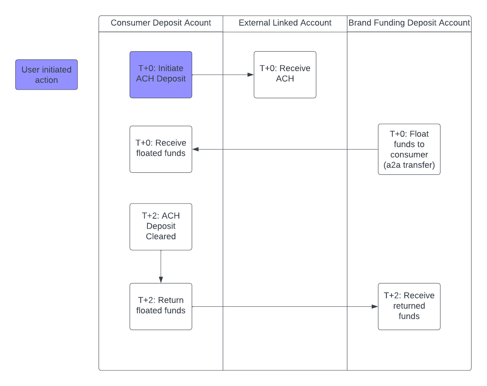

# Consumer secured charge card

## Overview

Issuing secured charge cards involves using Atelio APIs and webhooks to request credit on behalf of your customers and manage the state throughout the credit application process. Once the credit application is approved, the customer gets a security deposit account (SDA) and can be issued a secured charge card. This guide walks through the KYC and credit application process to issue a card for an imaginary consumer named Eline Amista.

### Before you start

**You need a program ID**: Start by retrieving your program ID for the card program from the Atelio Portal under the Developers tab.

**Register webhooks**: We use [webhooks](https://docs.atelio.com/embedded/docs/webhook) to signal asynchronously that work has been done in response to certain API requests. These webhooks are for convenience and any information provided asynchronously by the webhooks can also be queried using synchronous API requests. For this guide, we are interested in webhooks, specifically in the following categories:

- `credit`
- `kyc`

Webhook registration can be done through [Atelio Portal](https://docs.atelio.com/embedded/docs/bondos-webhooks) or via [API](https://docs.atelio.com/embedded/reference/post_webhooks). For more information, see [Webhook events and subscriptions](https://docs.atelio.com/embedded/docs/event-subscriptions).

> 📘 **Note**
>
> When creating the webhook subscription, you can subscribe exclusively to `kyc.*` and `credit.*` webhook events to limit the webhooks posted to your application endpoint. Read [this](https://docs.atelio.com/embedded/docs/event-subscriptions#webhook-configuration-example) for more on webhook configuration with wildcards.


## Steps to issue a card

To issue a consumer secured charge card, you need to do the following steps:

| Step | Description |
| ---- | --- |
| 1\. [Create a customer](https://docs.atelio.com/embedded/docs/consumer-secured-charge-cards#create-a-customer) | Use the Customer API [to retrieve an existing customer](https://docs.atelio.com/embedded/reference/get_customers_id) or [create a new one](https://docs.atelio.com/embedded/reference/post_customers) , then obtain their `customer_id` endpoint to get the `customer_id` using their `brand_person_id`. |
| 2\. [Create an application](https://docs.atelio.com/embedded/docs/consumer-secured-charge-cards#create-an-application) | With the `customer_id`, use the [CreateCreditApplication](https://docs.atelio.com/embedded/reference/post-credit-applications) endpoint to create a new credit application and input details about the applicant, such as employment status and annual income. |
| 3.&nbsp;[Submit&nbsp;the&nbsp;application](https://docs.atelio.com/embedded/docs/consumer-secured-charge-cards#submit-the-application) | With the `application_id` obtained from the [CreateCreditApplication](https://docs.atelio.com/embedded/reference/post-credit-applications) response, call [SubmitCreditApplication](https://docs.atelio.com/embedded/reference/credit-applications-submit) to submit the credit application. |
| 4\. [Start KYC process](https://docs.atelio.com/embedded/docs/consumer-secured-charge-cards#start-kyc-process) | Atelio initiates the regulatory KYC checks on the customer. |
| 5.  [Get application status](https://docs.atelio.com/embedded/docs/consumer-secured-charge-cards#get-application-status) | Retrieve the application status via the `credit.application.approved` webhook event or the [GetCreditApplication](https://docs.atelio.com/embedded/reference/get-credit-applications-id) endpoint. |
| 6\. [Issue :card](https://docs.atelio.com/embedded/docs/consumer-secured-charge-cards#issue-card) | Call the [CreateCard](https://docs.atelio.com/embedded/reference/post_cards) endpoint to issue a secured charge card to the customer. |

### Create a customer

On the Atelio platform, every consumer who is issued a financial product must have an associated [Customer](https://docs.atelio.com/embedded/docs/customer) object. This customer object stores important information on the consumer, including name, address, and other sensitive information that is required for regulatory purposes. In the following example, we'll call [CreateCustomer](post:post_customers) to create a customer profile for Eline Amista. To retrieve an existing customer, use the [GetCustomer](https://docs.atelio.com/embedded/docs/get_customers_id) endpoint.

#### Example request

```curl title="cURL"
curl --request POST \
     --url https://sandbox.atelio.com/api/v0.1/customers/ \
     --header 'Accept: application/json' \
     --header 'Authorization: YOUR-AUTHENTICATION' \
     --header 'Content-Type: application/json' \
     --header 'Identity: <YOUR_IDENTITY>' \
     --data '
{
     "addresses": [
          {
               "address_type": "PHYSICAL",
               "street": "345 California Ave.",
               "street2": "Suite 600",
               "city": "San Francisco",
               "state": "CA",
               "zip_code": "12345-1234",
               "country": "US",
               "is_primary": true
          }
     ],
     "dob": "1997-12-25",
     "first_name": "Eline",
     "last_name": "Amista",
     "ssn": "333-245-8546",
     "phone": "555-111-2222",
     "phone_country_code": "1",
     "email": "eline@mi6.gov.uk"
}
'
```

#### Example response

Upon success, Atelio returns a `201` status with the customer's details, including the `customer_id` UUID value `3a43b612-825c-48d4-b025-47083ab10755`, which uniquely identifies the newly created customer object associated with Eline.

```json title="JSON"
{
  "customer_id": "3a43b612-825c-48d4-b025-47083ab10755",
  "brand_person_id": "ac6ee2d3-5a03-4043-a4aa-dda51836b9fd",
  "atelio_brand_id": "8c7e08c8-0320-444c-b834-007cd9e18c0e",
  "business_id": "null",
  "dob": "1997-12-25",
  "first_name": "Eline",
  "middle_name": "null",
  "last_name": "Amista",
  "ssn": "333-245-8546",
  "phone": "555-111-2222",
  "phone_country_code": "1",
  "email": "eline@mi6.gov.uk",
  "addresses": [
    {
      "address_id": "9de0c172-dc43-4c80-9d2c-dc0e4687cdb5",
      "address_type": "PHYSICAL",
      "street": "345 California Ave.",
      "street2": "Suite 600",
      "city": "San Francisco",
      "state": "CA",
      "zip_code": "12345-1234",
      "country": "US",
      "is_primary": true,
      "date_created": "2021-10-11T17:54:26.784367+00:00"
    }
  ],
  "date_created": "2021-06-02T13:38:27.965404+00:00"
}
```

### Create a credit application

In order to determine whether your user is eligible for a charge card, you need to create and submit a credit application on their behalf which contains personal details of the user. The following example of a calls [CreateCreditApplication](https://docs.atelio.com/embedded/reference/post-credit-applications) and with Eline's `customer_id` and other details, such as employment status and annual income.

#### Example request

```curl title="cURL"
curl --request POST \
     --url https://sandbox.atelio.com/api/v0.1/credit/applications \
     --header 'Accept: application/json' \
     --header 'Authorization: YOUR-AUTHENTICATION' \
     --header 'Content-Type: application/json' \
     --header 'Identity: <YOUR_IDENTITY>' \
     --data '
{
     "applicant": {
          "customer_id": "3a43b612-825c-48d4-b025-47083ab10755",
          "total_annual_income": 6500000,
          "monthly_housing_payment": 68500
     },
     "program_id": "92637aa9-2699-40cb-a492-dd0c8fadadc0"
}
'
```

#### Example response

Upon success, Atelio returns a `201` status containing all the information related to the application. It also includes the `application_status`, which indicates that the application process status is `created`.

```json title="JSON"
{
  "customer_id": "3a43b612-825c-48d4-b025-47083ab10755",
  "brand_person_id": "ac6ee2d3-5a03-4043-a4aa-dda51836b9fd",
  "atelio_brand_id": "8c7e08c8-0320-444c-b834-007cd9e18c0e",
  "business_id": "null",
  "dob": "1997-12-25",
  "first_name": "Eline",
  "middle_name": "null",
  "last_name": "Amista",
  "ssn": "333-245-8546",
  "phone": "555-111-2222",
  "phone_country_code": "1",
  "email": "eline@mi6.gov.uk",
  "addresses": [
    {
      "address_id": "9de0c172-dc43-4c80-9d2c-dc0e4687cdb5",
      "address_type": "PHYSICAL",
      "street": "345 California Ave.",
      "street2": "Suite 600",
      "city": "San Francisco",
      "state": "CA",
      "zip_code": "12345-1234",
      "country": "US",
      "is_primary": true,
      "date_created": "2021-10-11T17:54:26.784367+00:00"
    }
  ],
  "date_created": "2021-06-02T13:38:27.965404+00:00"
}
```

### Submit the credit application

Submitting a credit application starts the KYC process and creates a secured deposit account after KYC approval. Next, call [SubmitCreditApplication](https://docs.atelio.com/embedded/reference/credit-applications-submit) using the `application_id` from the [CreateCreditApplication](https://docs.atelio.com/embedded/reference/post-credit-applications) to submit the credit application

#### Example request

```curl title="cURL"
curl --request POST \
     --url https://api.atelio.com/api/v0.1/credit/applications/9b3dbb5c-97c1-4c18-97bc-e376e62cc2c9/submit \
     --header 'Accept: application/json' \
     --header 'Authorization: <YOUR_AUTHORIZATION>' \
     --header 'Identity: <YOUR_IDENTITY>'
```

#### Example response

Upon success, Atelio returns a `201` status with all the details related to the credit application submission.

```json title="JSON"
{
  "application_id": "2629182a-3aeb-4834-846a-1688d4649bb9",
  "program_id": "PROGRAM_ID",
  "date_created": "2021-11-15T00:17:56.842105Z",
  "date_updated": "2021-11-15T00:17:56.842105Z",
  "application_status": "kyc_started",
  "applicant": {
    "customer_id": "05a8054f-8259-4e30-8d1d-d286081987bd",
    "address_id": "bb5fa77d-fd66-4e31-81c0-eaf549b0c797",
    "total_annual_income": 5000050,
    "monthly_housing_payment": 1000,
    "terms_accepted": true,
    "currency": "USD",
    "first_name": "Elise",
    "middle_name": null,
    "last_name": "Amista",
    "date_of_birth": "1997-12-25",
    "street": "45 California St.",
    "street2": "Suite 600",
    "city": "San Francisco",
    "state": "CA",
    "country": "US",
    "zip_code": "94105",
    "ssn": "tok_sandbox_xoZzhoxaCXHb823bZp3x2e",
    "email": "elise@mi6.gov.uk"
  },
  "accounts": {
    "security_deposit_account_id": null
  }
}
```

### Initiate the KYC process

As shown in the previous response, the `application_status` value of `kyc_started` indicates that Atelio has automatically initiated regulatory KYC checks on Eline. These KYC checks are the same as the KYC checks initiated by the [StartKYC (Know-Your-Customer)](https://docs.atelio.com/embedded/docs/post_verification_kyc) endpoint and should be handled in the same way.

In the majority of cases, these checks run automatically and are completed in a few seconds. However, in certain scenarios, additional information may be required to complete identity verification. For more information, see the [How KYC Works](https://docs.atelio.com/embedded/docs/kyc) guide.

There are a few cases that arise during KYC that may require additional intervention:

| Webhook `kyc.verification` | Required | Remarks |
| -------------------------- | -------- | ------- |
| `.document_required`       | Yes      | The documents required for the `document required` state are accessible via webhook or via the [Retrieve KYC Status](https://docs.atelio.com/embedded/reference/get_verification_kyc) endpoint using the relevant `customer_id` and `program_id`. |
| `.reenter_information`     | No       | To respond to the `reenter_information` webhook, information provided via the customer object can be patched directly via the [Update a customer](https://docs.atelio.com/embedded/reference/patch_customers) endpoint, while information provided via the credit application can be changed directly via the [Patch credit application](https://docs.atelio.com/embedded/reference/patch-credit-applications) endpoint. <br/> <br/> After changing the relevant fields described by the `kyc.verification.reenter_information` webhook, the credit application can be resubmitted again using the [Submit credit application](https://docs.atelio.com/embedded/reference/credit-applications-submit) endpoint. |
| `.failure`                 | No       | This triggers a denial of the credit application and triggers a `credit.application.adverse_action`. <br/> <br/> The application can no longer be submitted. To try another KYC attempt, the brand needs to create a new credit application for the customer. |

### Idempotency

> 📘 **Note**
>
> The KYC endpoint is idempotent, so repeated requests using the same `Idempotency-Key` within a 24 hour period will fail.

Idempotency is a Web API design principle that prevents you from running the same operation multiple times. Because a certain amount of intermittent failure is to be expected, you need a way to reconcile failed requests with a server, and idempotency provides a mechanism for that. 

Including an idempotency key makes `POST` requests idempotent, which prompts the API to do the record keeping required to prevent duplicate operations. You can safely retry requests that include an idempotency key as long as the second request occurs within 24 hours from when you first receive the key (keys expire after 24 hours).

Providing the idempotency key string in the header is optional. The following is an example:

```json title="JSON"
{
   "Authorization": "<YOUR_AUTHORIZATION>",
   "Identity": "<YOUR_IDENTITY>",
   "Idempotency-Key": "dd6dcedd-2a11-4098-1223-876902123abc"
}
```

### Check application status

Pending a successful KYC, the credit application is moved to the `approved` state. This is accompanied by a `credit.application.approved` webhook event. The application state can also be viewed using the [GetCreditApplication](https://docs.atelio.com/embedded/reference/get-credit-applications-id) endpoint.

#### Example `GET` response for an approved application

```json title="JSON"
{
  "program_id": "54f7882b-6b95-4cde-a7eb-775b9468bcb1",
  "date_created": "2022-05-15T00:17:56.842105Z",
  "date_updated": "2022-05-15T00:17:56.842105Z",
  "application_id": "9b3dbb5c-97c1-4c18-97bc-e376e62cc2c9",
  "application_status": "approved",
  "applicant": {
    "customer_id": "05a8054f-8259-4e30-8d1d-d286081987bd",
    "address_id": "bb5fa77d-fd66-4e31-81c0-eaf549b0c797",
    "total_annual_income": 8000000,
    "monthly_housing_payment": 200000,
    "terms_accepted": true,
    "currency": "USD",
    "first_name": "Elise",
    "middle_name": "null",
    "last_name": "Amista",
    "date_of_birth": 1997-12-25",
    "street": 45 California St.",
    "street2": "Suite 600",
    "city": San Francisco",
    "state": ""CA,
    "country": "USA",
    "zip_code": ""94105,
    "ssn": "333-245-7829",
    "email": "elise@bondhq.com"
  },
  "accounts": {
    "security_deposit_account_id": "173121d8-f05e-4bb6-b280-b5b761d2214f"
  }
}
```

Take note of the `security_deposit_account_id` field `173121d8-f05e-4bb6-b280-b5b761d2214f` under the `accounts` key. This value uniquely identifies the security deposit account that has been created for Eline.

#### Adverse action notices

Not all credit applications are approved. When a credit application is rejected, an adverse action notice is generated. These notices need to be supplied to the end consumer (in this case, Eline) via email in an approved template.

You can use the [GetAdverseActions](https://docs.atelio.com/embedded/reference/get-adverse-actions) endpoint to get additional information on the reason for the rejection.

The following is an example of a request to retrieve the reason for rejection:

```curl title="cURL"
curl --request GET \
     --url https://api.atelio.com/api/v0.1/credit/applications/9b3dbb5c-97c1-4c18-97bc-e376e62cc2c9/adverse-actions \
     --header 'Accept: application/json' \
     --header 'Authorization: <YOUR_AUTHORIZATION>' \
     --header 'Identity: <YOUR_IDENTITY>'
```

For the majority of credit applications, we expect that the application will encounter no difficulties and receive the following `404` response:

```json title="JSON"
{
    "status": "ERROR_CODE_CREDIT_APPLICATION_GENERIC",
    "code": 3001,
    "message": "Not found.",
    "details": {}
}
```

The following is an example of a response for a different `application_id` that contains an adverse action:

```json title="JSON"
{
    "id": "585ffb6a-98f9-40f6-a2b9-81ab22fb169a",
    "application_id": "8d3dbb5c-97c1-4c18-97bc-e376e62cc2c9",
    "date_created": "2022-05-15T21:39:10.130756Z",
    "date_updated": "2022-05-15T21:39:10.192226Z",
    "service": "kyc",
    "reasons": [
        "Unable to verify identity"
    ]
}
```

### Issue a secured charge card

The status of an application can be actively monitored using the [GetCreditApplication](https://docs.atelio.com/embedded/reference/get-credit-applications-id) API, or it can be passively received using the `credit.application.approved` webhook event.

After Eline's `application_status` is `approved`, we'll call [CreateCard](https://docs.atelio.com/embedded/reference/post_cards) to issue a secured charge card and pass the `security_deposit_account_id` value in the request `account_id` field. This allows us to link the card with the security deposit account. 

Creating a card will also create an associated credit account.

> 📘 **Note**
>
> The KYC endpoint is idempotent, so repeated requests using the same `Idempotency-Key` within a 24 hour period will fail.

> 📘 **Note**
>
> To be able to make purchases on a secured charge card you need to fund the security deposit account. This can be done before or after the card is issued. Until there are funds in the secured deposit account, the credit limit on the card is zero.

#### Example request

```curl title="cURL"
curl --request POST \
     --url https://api.atelio.com/api/v0.1/cards \
     --header 'Accept: application/json' \
     --header 'Authorization: <YOUR_AUTHORIZATION>' \
     --header 'Content-Type: application/json' \
     --header 'Identity: <YOUR_IDENTITY>' \
     --data '
{
     "account_id": "173121d8-f05e-4bb6-b280-b5b761d2214f"
}
'
```

#### Example response

Upon success, Atelio returns a `201` status with the card creation details.

```json title="JSON"
{
  "card_id": "057c6074-a02d-4a5a-bad9-bbc64b047df7",
  "customer_id": "3a43b612-825c-48d4-b025-47083ab10755",
  "account_id": "e913d434-bda9-494e-b6df-adf46a52c1cc",
  "card_number": "tok_live_283734",
  "cvv": "tok_live_p923u34",
  "expiry_date": "0331",
  "last_four": "6270",
  "status": "active",
  "card_design_id": null
}
```

## Fund security deposit accounts

When your consumers sign up for a secured charge card, they must fund the Security Deposit Account (SDA) before they can start using the card.

The basic steps after the SDA is created are as follows:

1. Consumer initiates an ACH deposit of $100 from an external account to their SDA
2. Consumer waits 2 or 3 business days for the ACH to clear
3. Once the ACH clears, the balance on the SDA and the credit limit of the charge card are both $100 and the user can start spending.

You can fund your security deposit account via ACH transfer or direct deposit. After initiating the ACH, instant funding is available for immediate spending.

## Funding account flow

1. Set up a deposit account for your business to use as the source of instant funding. Our [Create a consumer deposit account](https://docs.atelio.com/embedded/docs/create-a-consumer-deposit-account) guide describes the steps needed to set up a deposit account for your business.

2. Retrieve the `account_id`.

3. Move funds into the Funding Account by either:

    - Using the [GetAccount](https://docs.atelio.com/embedded/reference/get-accounts-by-id) endpoint to retrieve the account and routing numbers and initiate a transfer from your commercial bank portal.
    - Linking your commercial bank account via the [CreateAccount](https://docs.atelio.com/embedded/reference/post-accounts) endpoint, and initiate a transfer from the linked account to the Funding Account.


### Funding via an ACH Transfer

To fund an SDA using ACH, [first link an external bank account](https://docs.atelio.com/embedded/docs/link-an-external-account) . To initiate an ACH transfer, use the [CreateTransfer](https://docs.atelio.com/embedded/reference/post-transfer) endpoint and include the `ach` object. The `linked_account_id` identifies the linked external account and should be used as the `origination_account_id`. The `security_deposit_account_id` should be used as the `destination_account_id`.

> 📘 **Underwriting via external bank accounts**
>
> After linking the account, you can use the [Get external account history](https://docs.atelio.com/embedded/reference/get_transactions) endpoint to view recent transactions on the external account. This information can also be used to make an underwriting assessment as to whether or not you would like to offer your user a card.

#### Example request to create a transfer

```curl title="cURL"
curl --request POST \
--url https://api.atelio.com/api/v0.1/transfers \
--header 'Accept: application/json' \
--header 'Authorization: <YOUR_AUTHORIZATION>' \
--header 'Content-Type: application/json' \
--header 'Identity: <YOUR_IDENTITY>' \
--data '
{
  "ach": {
    "class_code": "WEB",
    "same_day": false
  },
  "origination_account_id": "f64eadeb-5398-46f7-b1a1-9a0a709039a9",
  "destination_account_id": "173121d8-f05e-4bb6-b280-b5b761d2214f",
  "amount": 25000,
  "description": "ach funding"
}
'
```

Note that ACH timelines typically include time for transactions to be processed and settled before the funds are made available. For more information, see [ACH transfers.](https://docs.atelio.com/embedded/docs/ach-transfers)

#### Example response

Upon success, Atelio returns a `200` status with details for the ACH transaction.

```json title="JSON"
{
  "date_created": "2022-05-16T17:14:09.686688",
  "date_updated": "2022-05-16T17:14:09.686688",
  "date_settled": null,
  "transfer_id": "4ead6cdc-77eb-45fa-9959-3f166385a60a",
  "transaction_id": "0fec1e58-b197-4052-99cf-2218496c5482",
  "origination_account_id": "f64eadeb-5398-46f7-b1a1-9a0a709039a9",
  "destination_account_id": "173121d8-f05e-4bb6-b280-b5b761d2214f",
  "description": "ach funding",
  "amount": "25000",
  "ach": {
    "ach_class_code": "WEB",
    "same_day": false,
    "ach_return_code": "R73",
    "failure_reason": null
  }
}
```

### Funding via a Direct Deposit

To fund an SDA via direct deposit, use the [GetAccount](https://docs.atelio.com/embedded/reference/get-accounts-by-id) endpoint to retrieve the `routing_number` and `account_number` for the SDA. These can be used to receive ACH transfers originating from other financial institutions, such as payroll deposits.

#### Example response

The following is an example of a successful response to a security deposit account information request:

```json title="JSON"
{
  "account_id": "173121d8-f05e-4bb6-b280-b5b761d2214f",
  "date_updated": "2022-05-16T19:39:34Z",
  "date_created": "2022-05-16T19:39:34Z",
  "program_id": "<YOUR_PROGRAM_ID>",
  "customer_id": "3a43b612-825c-48d4-b025-47083ab10755",
  "type": "security_deposit",
  "status": "active",
  "description": "string",
  "routing_number": 547897762,
  "account_number": 574771265,
  "balance": {
    "current_balance": 25600,
    "ledger_balance": 21300,
    "currency": "USD"
  },
  "security_deposit": {
    "credit_account": "e913d434-bda9-494e-b6df-adf46a52c1cc"
  }
}
```

Atelio uses the `routing_number` value `547897762` and `account_number` value `574771265` to receive ACH transfers originating from other financial institutions, such as from payroll via a direct deposit.

> 🚧 **Sandbox limitations**
>
> Note that in the sandbox, the `routing_number` and `account_number` values are not real and will not be accessible via direct deposit.


### Instant Funding

To enable users to start spending immediately after initiating an ACH transfer, you can offer Instant Funding. This allows them to complete the entire process from sign-up and KYC to spending money in one session. 

Implementing Instant Funding for CBCs is a relatively simple technical process (described in the diagram below), and developers on Atelio typically can add Instant Funding to their application in under a week.



#### Performing Instant Funding

When a user initiates an ACH to fund their SDA, trigger an account-to-account transfer to float funds for the user to spend while the ACH clears.

#### Example request to create a transfer:

```curl title="cURL"
curl --request POST \
--url https://api.atelio.com/api/v0.1/transfers \
--header 'content-type: application/json' \
--header 'Authorization: <YOUR_AUTHORIZATION>' \
--header 'Identity: <YOUR_IDENTITY>' \
--data '
{
  "origination_account_id": "funding_account_id",
  "destination_account_id": "consumer_sda_id",
  "description": "Instant Funding",
  "amount": 2500
}
'
```

Once these funds are instantly provided, you will need to store a record that the ACH to fund the SDA has an associated Instant Funding transaction, so that when the ACH settles, you know to return funds to the Funding Account.

#### Returning floated funds after ACH settlement

Once the ACH is no longer pending, you'll want to return the floated funds back into the Funding Account. To do this, you will listen for [webhooks](https://docs.atelio.com/embedded/docs/event-subscriptions) on the `transactions` event, and filter specifically on webhook events where the `transaction.transaction_id` is an ID that you have made an Instant Funding transaction for.

There are two cases you'll see:

| Webhook says that the ACH is now | Description |
|----------------------------------|-------------|
| `completed`                      | In this case, you'll return the full amount of the Instant Funding back to the Funding account, and the account will continue operating as usual. |
| `returned`                       | This means that the ACH did not clear successfully (common reasons are that there were insufficient funds in the source account, the source account was closed, etc). In this case, you'll return the lesser of the instant funding amount and the current balance of the user's SDA into the Funding account. <br/><br/> For example, if a user initiates an ACH to fund their account, you trigger an instant funding to provide them $25 while the ACH is waiting to clear, the user spends $5 of the $25 on the card while the ACH is waiting to clear, and then the ACH gets returned, then assuming there have been no further deposits into the SDA, you will only be able to transfer $20 back into the Funding Account, with the $5 being losses on the program. |

#### Example request to return funds:

```curl title="cURL"
# upon receiving a webhook that the ACH status has changed
curl --request POST \
     --url https://api.atelio.com/api/v0.1/transfers \
     --header 'content-type: application/json' \
     --header 'Authorization: <YOUR_AUTHORIZATION>' \
     --header 'Identity: <YOUR_IDENTITY>' \
     --data '
{
     "origination_account_id": "consumer_sda_id",
     "destination_account_id": "funding_account_id",
     "description": "Returned Instant Funding Amount",
     "amount": 2500 # amount to return to the Funding Account (in this example, $25.00)
}
'
'
```

#### Recommendations to reduce risk of Instant Funding

As seen above there is some ACH return risk associated with Instant Funding. While specific recommendations will be specific to your program and user-base, there are several ways to reduce this risk:

| Recommendation | Description |
|----------------|-------------|
| Perform balance checks with a service like Plaid prior to initiating ACHs. | If you are using Atelio's Plaid relationship, Atelio performs these checks on your behalf, but if you are linking accounts manually, then you will need to do these checks to reduce the risk of transfers being returned for Insufficient Funds. |
| Cap the amount that you provide as Instant Funding. | Even if the user triggers an ACH for a large amount, we recommend only performing an instant funding of a fixed maximum amount (e.g. $10-$50) - the purpose of Instant Funding is to allow for 1-2 transactions on the card so that it can become top-of-wallet, not to perform a repeated real-time payments system. |
| Only make Instant Funding available to existing users. | To reduce the likelihood of fraud on an instant funding mechanism, we recommend using this tool for users you have some prior relationship with. |

#### Displaying instant funding on statements

When triggering instant funding, note that the account-to-account transfers involved will show up on the consumer's SDA statements. Therefore, we recommend making the `description` of those transactions something that the end-user will find intuitive when they read their statement.
