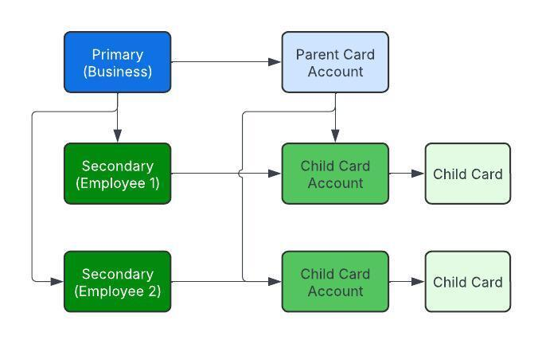

# Multi-card

## Introduction

Multi-Card experiences are designed to enhance the flexibility and control of card usage primarily for commercial programs spanning across:

- prepaid
- debit
- secured & unsecured charge cards
- revolving credit cards

Multi-cards enable a business to onboard once and create a single Parent card account, and then issue any number of Child cards which draw off of the same spend limit from the Parent card account, while also supporting individual controls at the Child card level.

Other providers may use different names for this functionality, such as "authorized users" or "parent-child cards"; Atelio sees these as specific use cases of cards and uses "Multi-Card Experiences" to describe the broad umbrella of issuing multiple cards against a single limit.

## Use Cases

Multi-Card Experiences are beneficial for various scenarios, including:

| Scenario | Description |
| --- | --- |
| Employee cards | Businesses may issue cards to individual employees of their company, each with their own specific spending limits, while maintaining an overall spend limit for the company across all cards. |
| Supplier payment cards | Businesses may issue cards to pay for specific vendors, imposing specific card controls to ensure safe spend with that vendor. |
| Expense management | Businesses may issue cards for specific purposes to place unique controls on spend for that purpose. This includes employee and supplier payment cards, but may also include department-based cards, project-based cards, etc. |
| Joint cards   (consumer use case) | Individuals may share a credit card with their spouse, allowing them to access the same spend limit through a card issued specifically for them. |
| Dependent cards (consumer use case) | Individuals may give their dependents (e.g. their child) access to spend against their own spend limit, with restrictions and controls to ensure their dependent uses the card wisely. |

## Entities and relationships

Multi-Card Experiences leverages Atelio's general card-related entities:

- Customers and businesses as the cardholders
- Card Accounts to manage limits and relationships between entities
- Cards as the representation of the instrument that can spend against an account.

Multi-Card Experiences introduces three new concepts between these entities:

| Concept           | Relationship                     | Description |
| ----------------- | -------------------------------- | ----------- |
| [Primary-Secondary](#primary-secondary) | between Customers and Businesses | Represents the relationship between who is ultimately responsible for the account and who has been delegated access to cards to spend. |
| [Parent-Child](#parent-child)      | between Card Accounts            | Represents the relationship between an overall spend limit that is shared among multiple cards, and the cards that share that limit. |
| [Rollups to aggregate](#rollups-to-aggregate) | all Child accounts of a Parent | When performing common operations like getting balances or transactions, the concept of rollups will allow the brand to differentiate between transactions or balances of an individual account versus the aggregated transactions or balances of the account plus all of its children. |

The following diagram is an example of the relationships between the entities where:

- The Primary is a Business.
- The Secondaries are employees of that business. 
- The Secondaries are created as Customer objects in the Atelio platform.

### Primary-Secondary

In Multi-Card experiences, businesses and customers can be classified as either _primary_ or _secondary_:

| Classification | Description |
| --- | --- |
| Primary | These are the main account holders who undergo full KYC or KYB processes. They bear ultimate financial responsibility for the accounts, and are responsible for all activity in the program, including transactions, statements, and repayments. Primaries have full access across all card(s). Primaries may be issued both Parent cards and Child cards. |
| Secondary | These are additional users who can be issued Child cards. They may undergo a lighter form of KYC, depending on the program's requirements. Secondaries are controlled by Primaries, meaning that the Primary has ultimate responsibility for the Secondary's spending. Typically, Secondaries only have access to their card(s) and cannot access the cards of other Primaries/Secondaries. Secondaries may only be issued Child cards. |

In a typical expense management use case, a business is onboarded as the Primary, and that business's employees are onboarded as Secondaries. 

- Any commercial entity that is onboarded will use Atelio's [Business object](https://docs.atelio.com/embedded/reference/businesses-1).
- Any individual entity that is onboarded, including employees of a business, will use Atelio's [Customer object](https://docs.atelio.com/embedded/reference/customers).

To onboard a:

| Type             | Pass parameter        | As        | To endpoint |
| ---------------- | --------------------- | --------- | ----------- |
| Primary Business | `account_holder_type` | `primary` | [create business](https://docs.atelio.com/embedded/reference/post_businesses) |
| Primary Customer | `account_holder_type` | `primary` | [create customer](https://docs.atelio.com/embedded/reference/post_customers) |
| Secondary Business | `account_holder_type`    `primary_id` | `secondary`    `business_id` of the Primary Business | [create business](https://docs.atelio.com/embedded/reference/post_businesses) |
| Secondary Customer | `account_holder_type`    `primary_id` | `secondary`    `customer_id` of the Primary Customer | [create customer](https://docs.atelio.com/embedded/reference/post_customers) |

### Parent-Child

The Parent-Child relationship between card account is a key concept in Multi-Card experiences:

| Account type | Description |
| --- | --- |
| Parent&nbsp;card&nbsp;account | - These accounts hold the overall spend limits and are responsible for repayments.   - These accounts cannot perform POS or e-commerce transactions themselves.   - These accounts serve as the financial backbone for Child cards.   - These accounts may only be issued to Primaries. |
| Child card account | - These accounts are issued to Primaries or Secondaries and can perform transactions.   - Each child card may have its own card controls, such as an independent spend limits.   - These cards draw on the spend limit of its associated Parent card account.   - These accounts can't spend more than their Parent's limit, even if the Child card's limit is set higher than the Parent.   - These accounts cannot receive repayments directly; all repayments are made to the Parent card account.   - These accounts may be issued to Primaries or Secondaries. |

In a typical expense management use case, a Parent card account is issued to the Primary business, and then Child card accounts are issued to employees who are onboarded as Secondary customers.

To create a Parent card, pass `is_parent` as `true` and pass the Primary business or customer ID to the `customer_id` or `business_id` parameter in the [create card](https://docs.atelio.com/embedded/reference/post_cards) endpoint. 

To create a Child card, pass `is_primary` as `false`, pass the Parent's card account id to the `parent_card_account_id` parameter, and pass the Secondary business or customer ID to the `customer_id` or `business_id` parameter in the [create card](https://docs.atelio.com/embedded/reference/post_cards) endpoint. 

A card account will automatically be created upon creation of the card.

### Rollups to Aggregate

Card programs will need to display transactions and balances for individual cards and for aggregations of parents and children. These mechanisms are different across balances and transactions.

When using the [get transactions](https://docs.atelio.com/embedded/reference/get_transactions) endpoint and filtering by `account_id` of a Parent card account, if you'd like to include the transactions of both the Parent card account and all of it's Child cards, you may pass the `include_child_transactions` parameter as `true` to include them.

To aggregate balances, you will need to get the list of individual balances across accounts and sum them. You can filter the [get accounts](https://docs.atelio.com/embedded/reference/get-accounts) endpoint using the `parent_account_id` parameter, passing in the id of the Parent card account. You will then also get the Parent card account using the [get account by id](https://docs.atelio.com/embedded/reference/get-accounts-by-id) endpoint. Then, you can find the available and current balances in the `balance` key of the response. Summing all of these together will give the rollup balance.

## Limits

Multi-Card Experiences exist to share an overarching Parent card spend limit across multiple cards while enabling unique limits and card controls for the Child cards. This concept applies regardless of what drives the Parent card account's limit:

| Card type | Spend limit |
|-----------|-------------|
| Prepaid   Debit   Secured Charge Cards | The Parent card account spend limit is determined by the funds held in the account backing the card.    For example, in secured card programs, the balance of the Security Deposit Account (SDA) drives the Parent card's credit limit. |
| Unsecured&nbsp;Charge&nbsp;Cards   Revolving&nbsp;Credit&nbsp;Cards | The Parent card account spend limit is determined by the result of an underwriting process. |

Child card accounts may be given additional spend controls that will apply solely to that Child card. 

For example, in the case of charge or credit cards, when creating the Child card, you may pass a `credit_limit` that will be that card's limit. Regardless of what that limit is set to, the spend across all Child cards may not exceed the Parent card's limit. 

To calculate a Child card's available to spend, you take the minimum of: 

- The Parent card's limit minus the outstanding rollup balance across all Child cards.
- The Child card's limit minus its outstanding balance.

#### Example

| Card         | Credit limit | Remarks |
|--------------|-------------:|---------|
| Parent card  | $10,000      | has two associated Child cards |
| Child card A |  $8,000      | |
| Child card B |  $7,000      | |

If Child card A spends $6,500, it will have $1,500 remaining available to spend ($8,000 limit minus $6,500 balance).

Child card B will now have $3,500 remaining to spend because Parent card's $10,000 limit minus $6,500 balance across all cards.

## Statements and Repayments

Only Parent card accounts support statements and repayments. At the end of the month, statement data will be provided for Parent card accounts representing the rollup of all transactions and balances, aggregating any repayments made at the Parent card level with transactions across all of its Child cards, and aggregating the balance across all of its Child cards.

Repayments may also only be made to the Parent card account. The funds used to repay the cards will be distributed to the Child cards using the program configuration (typically, they will be applied to transactions in chronological order, starting with the oldest transaction across all Child cards).

### Security Deposit Accounts and Clawbacks 

For secured charge cards, the security deposit account (SDA) serves as collateral for both the Parent card account and all associated Child card accounts. If a payment is missed or insufficient funds are available for repayment, clawbacks may be performed on both Parent and Child card accounts.

Clawbacks work as follows:

- The Parent card's security deposit account serves as collateral for all Child cards.
- Clawbacks can be processed on both Parent and Child card accounts.
- When a Child card account has unpaid balances, funds may be clawed back from the Parent's security deposit account.
- All clawbacks, whether for Parent or Child accounts, draw from the same security deposit account.

This ensures that the Primary account holder remains responsible for all spending across the program, while allowing for proper tracking and attribution of unpaid balances to the specific Child card accounts.

#### Clawback Reversals  

In certain situations, clawbacks may need to be reversed. This can occur when:

- A customer has overpaid their balance, resulting in excess funds being clawed back
- A clawback was processed in error and needs to be corrected
- Payment reconciliation reveals that a clawback amount was incorrect

When a clawback reversal is needed, the system can automatically process the reversal by transferring funds back from the credit card account to the security deposit account. The reversal process includes:

| Process                       | Description |
|-------------------------------|-------------|
| Automatic&nbsp;reversal&nbsp;processing | The system identifies clawbacks that are awaiting reversal and processes them automatically |
| Balance validation            | If the amount owed is zero or negative (indicating overpayment), the reversal may be completed without requiring a transfer |
| Transfer execution          | When a reversal transfer is needed, funds are moved from the credit card account back to the security deposit account |
| Status tracking      | Clawback records are updated with reversal status to maintain accurate transaction history |

Clawback reversals ensure that customers are not charged incorrectly and that security deposit account balances accurately reflect the true collateral position.

## Multi-Card API Flow

Multi-card experiences allow Brands with commercial card programs the ability to issue multiple cards (Virtual and Physical) for approved business entities against a singular business spending limit while allowing the flexibility of assigning individual card limits. Multi-card experiences are achieved through the creation of a "Parent card account" for the business entity with "Child Cards" anchored to the parent. This functionality is accessed by using parameters within existing API constructs. Child card limits are defined by deposits in an SDA or the result of an underwriting process.

Before you can issue child cards, brand customers (Businesses) need to complete onboarding inclusive of KYB and Beneficial Owner (BO) KYC. Once the business is established, brands can create and interact with child cards. The following outline of procedures serves as a guide for how Brands can begin leveraging multi-card experiences:

1. [Establish the business](https://docs.atelio.com/embedded/docs/multi-card#establish-the-business)
2. [Fund the SDA](https://docs.atelio.com/embedded/docs/multi-card#fund-the-sda)
3. [Establish parent card account](https://docs.atelio.com/embedded/docs/multi-card#establish-parent-card-account)
4. [Establish child card accounts](https://docs.atelio.com/embedded/docs/multi-card#establish-child-card-accounts)

### Establish the business

Brands can follow [the commercial card guide](https://docs.atelio.com/embedded/docs/issue-commercial-secured-charge-card) to get through steps 1 - 7

| Step | Endpoint | Remarks |
| --- | --- | --- |
| 1 | [Create a Business](https://docs.atelio.com/embedded/reference/post_businesses) | `account_holder_type` : \[primary\] to establish this business as the primary account holder for the parent card |
| 2 | [Create a credit application](https://docs.atelio.com/embedded/reference/post-commercial-credit-applications) |  |
| 3 | [Submit&nbsp;a&nbsp;credit&nbsp;application](https://docs.atelio.com/embedded/reference/post-commercial-credit-applications) |  |
| 4 | [Check application status](https://docs.atelio.com/embedded/reference/get-commercial-credit-applications-id) | When the application is approved, the SDA will automatically be created. Note the `security_deposit_account_id` from the response. |

### Fund the SDA

Link an external account, and fund the SDA.

| Step | Endpoint | Remarks |
| --- | --- | --- |
| 5 | [Link external bank account](https://docs.atelio.com/embedded/reference/post-accounts) | Link to an external bank account via Plaid. |
| 6 | [Fund the SDA](https://docs.atelio.com/embedded/reference/post-transfer) |  |

### Establish parent card account

| Step | Endpoint | Remarks |
| --- | --- | --- |
| 7 | [Create Parent Card](https://docs.atelio.com/embedded/reference/post_cards) | Set `"is_parent": true` in order to establish this account as the Parent Card |
| 8 | [Retrieve the Parent Card Account](https://docs.atelio.com/embedded/reference/get_cards) | `card_id` represents the \[Parent Card Account\]   Retain the Parent card account ID for future child card creation. |

### Establish child card accounts

| Step | Endpoint | Remarks |
| --- | --- | --- |
| 9 | [Create a customer](https://docs.atelio.com/embedded/reference/post_customers) | • `account_holder_type`: \[ secondary\]  • `primary_id`: UUID: Use the business\_ID  • For compliance purposes, the brand should ensure that the child card users provide (i) first name, last name (ii) DOB (iii) address (iv) either email or phone for OTP |
| 10 | [Perform CIP](https://docs.atelio.com/embedded/reference/post_verification_kyc) | • `program_id`: UUID: Program ID provided during setup  For commercial child cards, a full KYC is not required, but rather we run a CIP (Customer Identification Program). A CIP only does a basic verification on customer information. Please allow up to 3 minutes before attempting to [retrieve the CIP status](https://docs.atelio.com/embedded/reference/get_verification_kyc). |
| 11 | [Create&nbsp;a&nbsp;Child&nbsp;Card](https://docs.atelio.com/embedded/reference/post_cards) | • `parent_card_account_id`: UUID: Use the parent card account\_id from step (9)  • `customer_id`: UUID: Use the customer ID returned from step (10)  • `is_parent`: bool "\[true, false\]": set to False.  • `program_id`: provided during setup.  • `credit_limit`: `{integer in cents}` |

## Other API endpoints 

| Endpoint | Remarks |
| --- | --- |
| `Interact with a child card` |  |
| [Manage a child card](https://docs.atelio.com/embedded/docs/manage-card) | Manages card states, reissuance, and card account closure. |
| `Update a child card limit` | • `credit_limit`: `{integer in cents}`  • While credit limits can be set during initial creation requests, this endpoint can be used to update an existing card's limit. |
| `Manage transactions and pay balances` |  |
| [Retrieve transactions](https://docs.atelio.com/embedded/reference/get_transactions) | • `include_child_transactions`: boolean "\[true , false\]": Setting this to true will return all child transactions if the account is a parent account. This parameter requires `account_id` to be set.  • `account_id`: Use the parent account id from step (9) while also setting `include_child_transactions=true` to get all transactions for the Business. |
| [Make a payment](https://docs.atelio.com/embedded/reference/post-transfer) | • `Destination_account_id`: `{parent account ID}`: this is the account number from step (9).  • Repayments must be made to the Parent account ID, repayments to the child account ID can cause unpredictable behaviour in the presentment of balances.  • Atelio card programs require payment in full by the end of a statement |
