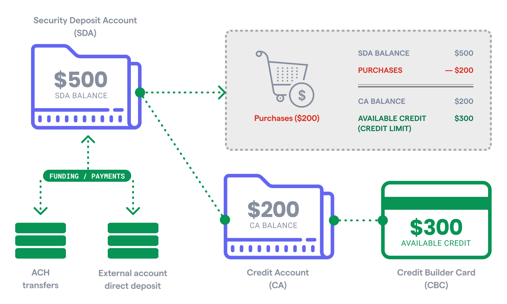

# Secured charge cards 

# Overview

Atelio offers secured charge cards for both consumers and businesses. These cards are paired with a security deposit account (SDA), where the balance effectively serves as the credit limit for the linked charge card(s). Repayments can be made from the SDA or any other bank account.

To enable spending, users must first fund the SDA, which starts with a zero balance. Funding options include ACH and direct deposit.

For commercial accounts, the SDA balance represents the total credit limit across all linked charge cards issued to the business.

## How it works

### Consumer

To issue a secured charge card and a security deposit account for a customer, you can use the [Cards API](https://docs.atelio.com/embedded/reference/cards), [Credit API](https://docs.atelio.com/embedded/reference/post-credit-applications) and [Customers API](https://docs.atelio.com/embedded/reference/post_customers) . Your application must first use the Customer API [to retrieve an existing customer](https://docs.atelio.com/embedded/reference/get_customers_id) or [create a new one](https://docs.atelio.com/embedded/reference/post_customers), then obtain their `customer_id`.

Once you have the `customer_id`, you can use the Credit API to create and submit a credit application. When the application is submitted, Atelio automatically starts the customer KYC process. The KYC process involves the same checks as the KYC checks initiated by the [StartKYC](https://docs.atelio.com/embedded/reference/post_verification_kyc) endpoint.

After a successful KYC, the credit application is moved to the `approved` state, and a webhook event (`credit.application.approved`) is triggered. You can also check the application state using the [GetCreditApplication](https://docs.atelio.com/embedded/docs/post-credit-applications) endpoint. Once the credit application is approved, you can issue a card using the [CreateCard](https://docs.atelio.com/embedded/reference/post_cards) endpoint.

### Commercial

To issue a secured charge card and a security deposit account for a business, use the [Business API](https://docs.atelio.com/embedded/reference/post_businesses) to [retrieve an existing business](https://docs.atelio.com/embedded/reference/get_business) or [create a new one](https://docs.atelio.com/embedded/reference/post_businesses), obtaining their business\_id.

Next, initiate KYB by making a request to the StartKYB endpoint, passing the `business_id` and `program_id` (associated with an Evolve-sponsored program) in the request body. Atelio will create a Persona inquiry and respond with the inquiry\_id.

Display the KYB widget within your UI using Persona's Embedded Integration for web or Mobile Integration for mobile, using the `inquiry_id` provided by Atelio.

After the user submits all required information, Atelio's Compliance team will review and decision the business. An approved (`kyb.verification.approved`) or rejected (`kyb.verification.rejected`) webhook will be sent to your application. Accounts and cards can only be issued to businesses that have passed KYB. Once KYB is complete, use the [Cards API](https://docs.atelio.com/embedded/reference/post_cards) to issue the secured charge card and security deposit account.

The graphic above illustrates the relationships and flow of funds between the:

- Consumer secured charge card
- Security deposit account
- Credit account
- External bank account
