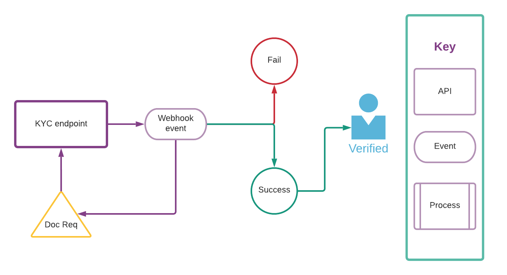

# KYC

## Introduction

KYC, a standard banking practice, is crucial in preventing identity theft, money laundering, fraud, and terrorism. Your understanding and implementation of this process, which involves verifying customer identities and understanding their transaction habits, are key to ensuring compliance with legal mandates and maintaining the integrity of the financial sector.

Once your customer has provided the information necessary to complete an onboarding flow, you must start the KYC process, which involves validating your customer's identity and documents and ensuring compliance with federal regulations.

### How KYC works

Using the [Customer](https://docs.atelio.com/embedded/docs/customer) object, you can perform a host of checks and screenings to ensure compliance programmatically. The full KYC process is shown below.



As part of the KYC check, you might receive a webhook event (`kyc.verification.document_required`) asking for documents to be uploaded for validation. This might happen, for example, when a customer's name does not match with the name in an SSN lookup. Refer to the [Uploading KYC documents](https://docs.atelio.com/embedded/docs/kyc-documentation) guide for details regarding how to upload documents.

### Government ID information

When using Persona for KYC verification, government ID information is captured and stored with the customer record. This includes:

| Parameter       | Description |
|-----------------|-------------|
| `id_type`       | The type of government ID, such as `dl` for driver's license or `passport`. |
| `id_number`     | The identification number on the government ID. |
| `id_expiration` | The expiration date of the ID in `YYYY-MM-DD` format. |
| `id_issuance`   | The issuance date of the ID in `YYYY-MM-DD` format. |

This information is automatically stored in the customer record when the KYC verification is successful. This data can be useful for regulatory compliance and future verification needs.

## KYC process flow

| Step | Description |
| --- | --- |
| 1\.&nbsp;Obtain&nbsp;a&nbsp;`customer_id` | Use the Customer API [to retrieve an existing customer](https://docs.atelio.com/embedded/reference/get_customers_id) or [create a new one](https://docs.atelio.com/embedded/reference/post_customers), then obtain their `customer_id`. |
| 2\. Start KYC process | Initiate the KYC process on a customer by calling the [StartKYC](https://docs.atelio.com/embedded/reference/post_verification_kyc) endpoint. For a [secured charge card program](https://docs.atelio.com/embedded/docs/secured-charge-card-overview), you'll use the [SubmitCreditApplication](https://docs.atelio.com/embedded/reference/credit-applications-submit) API to submit the credit application, which enables Atelio to automatically start the KYC process. |
| 3\. Use Atelio's products | After a KYC is successfully initialized, it will reach Atelio's automatic evaluation process. If the customer information provided is sufficient to fulfill KYC obligations, then the customer will be eligible for Atelio's financial products. To learn more, see [Atelio's evaluation process](https://docs.atelio.com/embedded/docs/kyc-state-machine#atelio-evaluation). |

### Idempotency

> 📘 **Note**
>
> The KYC endpoint is idempotent and repeated requests using the same `Idempotency-Key` within a 24 hour period will fail.

Once a customer has successfully passed the KYC process, no further KYC attempts are allowed. Any further call for KYC authentication responds with an error and returns the timestamp of the previously successful KYC process.

Idempotency is a Web API design principle that prevents you from running the same operation multiple times. Because a certain amount of intermittent failure is to be expected, you need a way to reconcile failed requests with a server, and idempotency provides a mechanism for that. Including an idempotency key makes POST requests idempotent, which prompts the API to do the record keeping required to prevent duplicate operations. You can safely retry requests that include an idempotency key as long as the second request occurs within 24 hours from when you first receive the key (keys expire after 24 hours).

Providing the `Idempotency-Key` string in the header is optional and example is shown below.

JSON

```json
{
   "Authorization": "<YOUR_AUTHORIZATION>",
   "Identity": "<YOUR_IDENTITY>",
   "Idempotency-Key": "dd6dcedd-2a11-4098-1223-876902123abc"
}
```

> 📘 **Note**
>
> Most of a customer's details can't be updated after they've passed KYC as the new information needs to be verified before the update can occur. If you need to update information for a customer that has passed KYC, contact Atelio directly.
>
> For details, see [Updating a customer](doc:managing-customers#updating-a-customer).

## Atelio evaluation

There are multiple possible outcomes of the automatic evaluation process.

| Outcome | Explanation |
| --- | --- |
| Passed | The customer information provided was sufficient to fulfill KYC obligations |
| More information needed | Additional information is required to complete the KYC process |
| Review required | Atelio must review the provided information for a final decision |
| Error | An error occurred during the KYC process |

> 📘 **KYC outcomes**
>
> More than 90% of successfully initialized KYC attempts are able to pass or reach a terminal state without additional action from users.

### Passed

When a KYC is passed, the state of the KYC will become `passed` and a `kyc.verification.success` webhook will be sent to any subscribed listeners. The customer will now be eligible for the financial products on the Atelio platform associated with the program ID for which they have completed KYC.

### More information needed

Sometimes a customer's information contains discrepancies or ambiguities and needs to be verified in other ways via document collection. This always results in a `document_required` state and an associated `kyc.verification.document_required` webhook being sent to any subscribed listeners. The customer has 14 days to provide the relevant information. After providing the information, the customer's KYC is returned back to Atelio's automatic evaluation process for reevaluation.

> 🚧 **KYC timeout**
>
> If the customer does not provide the relevant information within 30 days, the customer's KYC attempt expires and a `kyc.verification.timeout` webhook is sent to any subscribed listeners. A new KYC must be initialized for customers when this happens.

### Review required

Some KYC attempts require a manual review of the provided information to ensure compliance with KYC regulations. This is communicated via an `under_review` state and a `kyc.verification.under_review` webhook being sent to any subscribed listeners. The review occurs on Atelio's side and does not need to be actioned by the customer.

A review may result in a passing judgment, which transforms the state of the KYC to `passed` and sends a corresponding `kyc.verification.success` webhook. A review may also result in a failure judgment, which transforms the state of the KYC to `failed` and sends a corresponding `kyc.verification.failure` webhook. The latter indicates that a new KYC must be started.

### Error

At times, Atelio's systems may experience transient errors. This will be communicated via `kyc.verification.error` webhooks to any subscribed listeners. KYC attempts that experience errors should be retried. If the problem persists, escalation to Atelio support is suggested.

#### Error status codes

When Initializing a KYC, the expected HTTP response code is `201`. However, there is the possibility of error response codes as well. The main cases are `409`, `4XX excluding 409`, and `5XX`. The latter two can be handled in accordance with standard REST processes. The former `409` case indicates that a KYC is already initialized for the customer, and the [Retrieve KYC Status](https://docs.atelio.com/embedded/reference/get_verification_kyc) endpoint should be used to check on KYC status.
