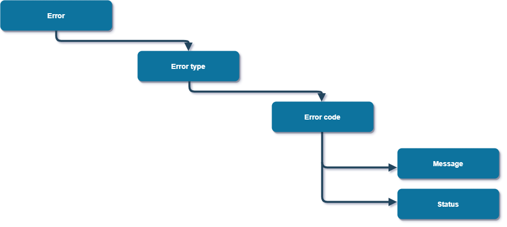

# Errors

## Overview 

It's frustrating when you receive an error. At Atelio, we provide standardized error messages that are informative and that help you to isolate and solve problems as quickly as possible.

In general, we use [HTTP Status Codes](https://en.wikipedia.org/wiki/List_of_HTTP_status_codes) to indicate the success or failure of request calls, but we also provide our own codes to aid in problem solving.



Every error has the same format consisting of four main parts:

| Error&nbsp;part | Description |
| --------------- | ----------- |
| [Type](https://docs.atelio.com/embedded/docs/errors#error-types) | The highest level grouping of errors. The type dictates the kind of action you should take. |
| [Code](https://docs.atelio.com/embedded/docs/errors#error-codes) | The second-level grouping of errors. Different errors with the same code may have a different message but have the same categorical cause. |
| Message | A verbose and informative description of why the error happened. |
| [Status](https://docs.atelio.com/embedded/docs/errors#error-statuses) | The [HTTP Status Codes](https://en.wikipedia.org/wiki/List_of_HTTP_status_codes) of the response. |

The following is an example of an error message.

JSON

```json
{
  "Message": "Card 940627e1-c5c6-4ebc-9ddf-6062a10dfa28 does not exist.",
  "Status": 404,
  "Code": "card_dne",
  "Type": "Request Error"
}
```

## Error types

Atelio organizes errors and error codes into high-level groups called types. These error types are useful because each type suggests a different method of tracing the origin of the problem.

> 📘 **Note**
>
> Some error types are not provided by the Atelio platform and we have no specific information regarding these types.

### Request error

Request errors can be resolved by the end user.

- `Cause:` These errors relate to a request to a server.
- `Resolution:` Fix the issue with the request that is detailed in the error message.

The following is an example of a request error.

JSON

```json
POST /api/v0.1/core/transfer
{
    "Message": "Missing Required Field(s): 'amount'",
    "Status": 400,
    "Code": "create_transfer_schema",
    "Type": "Request Error",
}
```

### Server error

As these errors can result in significant customer issues, contact our support team as soon as possible.

- `Cause:` These errors relate to issues with Atelio's internal servers.
- `Resolution:` Contact Atelio support.

The following is an example of a server error.

JSON

```json
POST /api/v0.1/core/transfer
{
   "Message": "Could not create Transfer. Contact Support",
   "Status": 500,
   "Code": "unknown_create_transfer",
   "Type": "Server Error",
}
```

### Process error

As these errors may take longer to resolve than server errors, contact our support team as soon as possible.

- `Cause:` These errors relate to the execution of a process at the backend.
- `Resolution:` Contact Atelio support.

The following is an example of a process error.

JSON

```json
POST /api/v0.1/core/transfer
{
    "Message": "Service has been disabled. Contact Support",
    "Status": 424,
    "Code": "service_disabled",
    "Type": "Process Error",
 }
```

## Error codes

Atelio has defined a set of error codes to help you understand the cause of an error. The error code is a category of causes. This means that two different error messages can have the same error code.

The following two examples of the `create_transfer_schema` error code are both for missing fields, but each has a different **Message** text.

**Amount error example**

JSON

```json
POST /api/v0.1/core/transfer
{
    "Message": "Missing Required Field(s): 'amount'",
    "Status": 400,
    "Code": "create_transfer_schema",
    "Type": "Request Error",
}
```

**Card ID error example**

JSON

```json
POST /api/v0.1/core/transfer
{
    "Message": "Missing Required Field(s): 'card_id'",
    "Status": 400,
    "Code": "create_transfer_schema",
    "Type": "Request Error",
}
```

As shown above, the resolution of both errors are different, but the reason for their error codes is the same.

When discussing errors on the forums or with support, it's important to use all of the error fields.

## Error code dictionary 

| [A](https://docs.atelio.com/embedded/docs/errors#a) | [B](https://docs.atelio.com/embedded/docs/errors#b) | [C](https://docs.atelio.com/embedded/docs/errors#c) | [D](https://docs.atelio.com/embedded/docs/errors#d) | [E](https://docs.atelio.com/embedded/docs/errors#e) | [G](https://docs.atelio.com/embedded/docs/errors#g) | [I](https://docs.atelio.com/embedded/docs/errors#i) | [K](https://docs.atelio.com/embedded/docs/errors#k) | [L](https://docs.atelio.com/embedded/docs/errors#l) | [M](https://docs.atelio.com/embedded/docs/errors#m) | [N](https://docs.atelio.com/embedded/docs/errors#n) | [P](https://docs.atelio.com/embedded/docs/errors#p) | [Q](https://docs.atelio.com/embedded/docs/errors#q) | [R](https://docs.atelio.com/embedded/docs/errors#r) | [S](https://docs.atelio.com/embedded/docs/errors#s) | [T](https://docs.atelio.com/embedded/docs/errors#t) | [U](https://docs.atelio.com/embedded/docs/errors#u) | [W](https://docs.atelio.com/embedded/docs/errors#w) |
| --- | --- | --- | --- | --- | --- | --- | --- | --- | --- | --- | --- | --- | --- | --- | --- | --- | --- |

#### A 

| Error code | Description |
| --- | --- |
| `account_data_err` | An issue writing data associated with the account being created. This may result in the account being created, but not yet being recorded in the system. |
| `acc_dne` | A reference to an account that does not exist in the Atelio system. |
| `account_dne` | A reference to an account that does not exist in the Atelio system. |
| `account_history_schema` | Error processing accounts history request. |
| `account_not_linked_error` | Account needs to finish linking with external vendor. |
| `account_patch_schema` | Schema on the patch account route is malformed. |
| `account_post_schema` | Schema on the account external/migrate account is malformed. |
| `activate_card_data` | An issue writing data associated with the card being activated. This may result in the card being active, but not yet activated in the Atelio system. |
| `apr_decline` | The APR specified does not permit this action. |
| `auth_err` | Unauthorized to access the relevant resources. |

#### B

| Error code | Description |
| --- | --- |
| `business_dne` | Business ID does not exist. |

#### C

| Error code | Description |
| --- | --- |
| `card_active` | Card is already activated. |
| `card_account_dne` | Card account does not exist in the Atelio System. |
| `card_fraud` | Card is closed due to a fraud investigation. |
| `card_program_dne` | Card program does not exist in the Atelio system. |
| `card_status_dne` | Card status does not exist in the Atelio system. |
| `closed_card` | Card is closed. |
| `create_account_schema` | Schema on the account being created route is malformed. |
| `create_card_account_data` | Unable to create a card account. |
| `create_card_data` | Problem writing data associated with the card being created. This may result in the card being created, but not yet recorded in the system. |
| `create_card_program` | Problem writing data associated with the card program being created. Program not found. |
| `create_card_schema` | Schema on the create card route is malformed. |
| `create_customer_schema` | Schema on the create customer route is malformed. |
| `create_dispute_error` | Error occurred while creating dispute. |
| `create_dispute_schema` | Schema on the create dispute route is malformed. |
| `create_hosted_schema` | Schema on the create hosted route is malformed. |
| `create_kyc_schema` | Schema on the create KYC route is malformed. |
| `create_more_schema` | Schema on the create more customer route is malformed. |
| `create_rest_data` | Unable to create new restriction. Contact Support. |
| `create_transfer_data` | Problem writing data associated with the transfer being created. This may result in the transfer being created, but not yet recorded in the system. |
| `create_transfer_schema` | Schema on the create transfer route is malformed. |
| `customer_bsa` | BSA does not exist for this customer. |
| `customer_dne` | Customer that does not exist in the Atelio system. |
| `customer_invalid_uuid4` | Invalid uuid for customer service. |

#### D

| Error code | Description |
| --- | --- |
| `data_err_rdc` | Error saving check data |
| `del_rest_data` | Unable to delete restriction. |
| `delete_customer_schema` | Schema on the delete customer route is malformed. |
| `delete_related_schema` | Schema on the delete related customer route is malformed. |
| `duplicate_account` | An account with these credentials already exists. |

#### E

| Error code | Description |
| --- | --- |
| `edit_account_schema` | Schema on the edit account route is malformed. |
| `edit_customer_schema` | Schema on the edit customer route is malformed. |
| `email_args_schema` | Invalid arguments passed for email statements |
| `email_error` | Unauthorized email domain attempt to approve a KYC. |
| `expired_card` | Card referenced has expired. |
| `ext_acc_unknown` | Could not query external accounts for account id. |

#### G

| Error code | Description |
| --- | --- |
| `get_customer_schema` | Schema on the get customer route is malformed. |
| `get_kyc_schema` | Schema on the KYC retrieval route is malformed. |

#### I

| Error code | Description |
| --- | --- |
| `idempotency_key_exists` | A request was made with this idempotency key in the past 24 hours. |
| `inactive_card` | Card referenced is no longer active. |
| `input_error` | Schema is malformed. |
| `insufficient_funds` | Not enough funds available in the account to execute the action. |
| `invalid_aac` | AAC is incorrect. |
| `invalid_account_id` | No access\_token found for this linked\_account\_id. |
| `invalid_account_status` | Cannot reinitialize account due to account verification status. |
| `invalid_amount` | Amount specified is not acceptable. |
| `invalid_bank_info` | Invalid bank information. |
| `invalid_bin` | BIN is invalid. |
| `invalid_card` | Invalid card provided. |
| `invalid_date` | Date in the field specified is invalid. |
| `invalid_parameter` | Parameter referenced in transfer is invalid. |
| `invalid_program` | Card program referenced is invalid. |
| `invalid_reference` | Object reference is incorrect. |
| `invalid_request` | Invalid request arguments. |
| `invalid_transfer_date` | Date selected for the transfer is not acceptable. |
| `invalid_transfer_status` | Unable to cancel the transfer. |

#### K

| Error code | Description |
| --- | --- |
| `kyc_customer` | A successfully KYC'd customer may not have their information changed. |
| `kyb_dne` | Business id has not passed KYB. |
| `kyc_dne` | KYC result could not be found. |
| `kyc_error` | An error occurred while initiating KYC. |
| `kyc_init_fail` | Failure in the initialization of the KYC process. Contact Support. |
| `kyc_reinit_fail` | Failure in the reinitialization of the KYC process. Contact Support. |
| `kyc_requests` | Not allowed to manually add additional KYC requests. |
| `kyc_retries` | Excessive KYC retries attempted. |
| `kyc_webhook_schema` | Schema in the KYC webhook route is malformed. |

#### L 

| Error code | Description |
| --- | --- |
| `large_amount` | Transfer amount is too high. |
| `linked_closed` | Linked account is closed. |
| `linked_dne` | External account does not exist. |
| `list_external_accounts_schema` | Schema on the list external account route is malformed. |
| `load_funds_dis` | Load Funds not enabled on this account. |

#### M

| Error code | Description |
| --- | --- |
| `max_cards` | Maximum number of cards for the given program has been reached. |
| `migrate_account_schema` | Schema on the migrate account route is malformed. |

#### N

| Error code | Description |
| --- | --- |
| `no_card_for_customer` | No cards for customer with this id. |
| `no_trans` | Card does not have any transactions. |
| `no_trans_set` | Card has no transactions for the given search criteria. |

#### P

| Error code | Description |
| --- | --- |
| `person_id_dup` | A person with this ID already exists. |
| `preactive_card` | Card has not yet been activated. |
| `processor_error` | Failed perform action with processor. |
| `program_not_configured` | Parent/Child card creation not supported by program\_id. |
| `program_mismatch` | Program ID must match parent card's program ID |
| `process_connection` | i2c connection timed out. |

#### Q

| Error code | Description |
| --- | --- |
| `query_params` | There are no accounts in this query set. |

#### R

| Error code | Description |
| --- | --- |
| `rest_dne` | The restriction reference does not exist. |
| `replace_rest_data` | Unable to replace restriction. Contact Support. |
| `restriction_types` | Missing restriction type. |
| `restriction_payload_schema` | Schema error for restrictions api. |
| `resource_conflict` | Error with corresponding resource while performing this action. |
| `request_err` | Could not fetch account. |
| `rdc_cred_err` | Remote Deposit Failure. |
| `rdc_process_err` | Check processing failed. |
| `rdc_schema` | Schema on the RDC is malformed. |
| `routing_invalid` | Routing number is invalid. |

#### S

| Error code | Description |
| --- | --- |
| `server_error` | Error while performing action on account. |
| `service_disabled` | Service not enabled for Debit/Prepaid Cards. |
| `statement_args_schema` | Invalid arguments passed when requesting statements. |
| `statement_dne` | Statement does not exist. |

#### T

| Error code | Description |
| --- | --- |
| `too_many_trans` | Max 250 transactions allowed. Reduce search scope. |
| `transfer_dne` | Transfer referenced does not exist in the Atelio system. |
| `transfer_ref_dne` | Transfer process referenced is not found. Similar to `transfer_dne`. |
| `token_exchange_post_schema` | Error validating Plaid tokens. |

#### U

| Error code | Description |
| --- | --- |
| `unknown` | Unknown processor error. Contact Support. |
| `unknown_activate_card` | Unknown error on the activate card route. |
| `unknown_create_account` | Unknown error on the create account route. |
| `unknown_create_card` | Unknown error on the create card route. |
| `unknown_create_customer` | Unknown error on the create customer route. |
| `unknown_create_hosted` | Unknown error on the create hosted flow route. |
| `unknown_create_more` | Unknown error on the create more customer route. |
| `unknown_create_transfer` | Unknown error on the create transfer route. |
| `unknown_customer_auth` | Unknown error with authorization. |
| `unknown_delete_account` | Unknown error on the delete account route. |
| `unknown_delete_customer` | Unknown error on the delete customer route. |
| `unknown_delete_related` | Unknown error on the delete related customer route. |
| `unknown_edit_account` | Unknown error on the edit account route. |
| `unknown_edit_customer` | Unknown error on the edit customer route. |
| `unknown_get_customer` | Unknown error on the get customer route. |
| `unknown_get_card_restr` | Unknown error on the get card restrictions route. |
| `unknown_get_card_status` | Unknown error on the get card status route. |
| `unknown_get_card` | Unknown error on the get card route. |
| `unknown_get_payment_history` | Unknown error on the get card payment history route. |
| `unknown_get_transfer` | Unknown error in the get transfer route. |
| `unknown_kyc_get` | Unknown error when retrieving KYC results. |
| `unknown_kyc_webhook` | Unknown error on the KYC webhook route. |
| `unknown_query_card_profile` | Unknown error on the get card profile route. |
| `unknown_rdc` | Unknown error on check deposit could not deposit check. |
| `unknown_reissue_card` | Unknown error on the re-issue card route. |
| `unknown_reset_card_pin` | Could not reset card pin. |
| `unknown_set_card_restr` | Unknown error on the set card restrictions route. |
| `unknown_spec_card` | Could not query external account. |
| `unknown_start_kyc` | Unknown error on the start KYC route. |
| `unknown_update_card_profile` | Unknown error on the update card profile route. |
| `unknown_update_card_status` | Unknown error on the update card status route. |
| `unknown_verify_card` | Unknown error on the verify card route. |
| `user_ref_dne` | User does not exist. |

#### W

| Error code | Description |
| --- | --- |
| `webhooks_err` | Webhook related error. |


## API statuses

The HTTP status is returned in the payload of the response to an API call. Response statuses fall into three categories:

- [2xx](https://docs.atelio.com/embedded/docs/errors#2xx-responses) \- a successful response.
- [4xx](https://docs.atelio.com/embedded/docs/errors#4xx-responses) \- a failed response due to the client's server.
- [5xx](https://docs.atelio.com/embedded/docs/errors#5xx-responses) \- a failed response due to Atelio's server.

### 2xx Responses

A 2xx status indicates a successful response. The requested action has been completed successfully.

The following are statuses within a 2xx response:

| Status | Description |
| --- | --- |
| `200` | Success. Data is returned to the user. Resources may have been edited or deleted. |
| `201` | Successful resource creation. This new resource can be referenced in subsequent requests. |

### 4xx Responses

A 4xx status indicates the failure of a request. Usually this indicates an issue with the client's request or something to do with the communication between the client and server. When related to a client request which we refer to as a Request Error, there may be an issue with a malformed schema or a reference to non existent resources as well as other possible reasons.

The following are statuses within a 4xx response:

| Status | Description |
| --- | --- |
| `400` | Failure - Bad Request. The request is malformed in some way. Typically, these are problems with the schema. |
| `403` | Failure - Forbidden. You are not authorized to access the resource that you are attempting to access. |
| `404` | Failure - Resource nonexistent. The resource currently being edited or deleted does not exist. Try to reference a different resource. |
| `424` | Failure - Resource reference. The inter-service resource reference has failed. This may be due to data inconsistencies or service liveliness. Contact support. |

### 5xx Responses

A 5xx status indicates a failure that is due to issues with Atelio's servers. Ideally, you would never encounter a 5xx error. For all 5xx errors, contact support.

The following are statuses within a 5xx response:

| Status | Description |
| --- | --- |
| `500` | Failure - Internal Server Error. The request created an internal error in the service. Some of these are unknown. Others are known, depending on the Atelio error code. |
| `503` | Failure - Service Unhealthy. The service is unavailable. |
| `504` | Failure - Gateway Timeout. The load balancing for the service is taking too long to process. This may be due to high traffic loads or other related outages. |


## Error examples

The following are `400` error code examples related to customer information.

### Required parameter is missing

The following parameters are required but are missing from the `POST` request payload:

- `dob`
- `first_name`
- `last_name`

The following is the response payload.

JSON

```json
{
    "dob": [\
        "Missing data for required field."\
    ],
    "names": {
            "first_name": [\
                "Missing data for required field."\
            ],
            "last_name": [\
                "Missing data for required field."\
            ]
      }
}
```

The following parameters are required but are missing from the `DELETE` request payload:

- `p_id`
- `target_type`
- `target_id`

The following is the response payload.

JSON

```json
{
    "Error": "Person id, target type, and target id are required."
}
```

### Incorrect format

The `date_added` parameter is not in the correct format. For example, `10-31-1999` is meant to be Oct. 31, 1999, but it should be submitted as `31-10-1999`.

The following is the response payload.

JSON

```json
{
    "names": {
                "date_added": [\
                "Not a valid date."\
            ]
     }
}
```

### Rule is violated

Only one legal name is allowed and will generate an error if the following are attempted:

- More than one legal name via `POST`
- Trying to add an additional legal name via `PATCH`
- Trying to remove a legal name via `PATCH` or `DELETE`

The following is the response payload.

JSON

```json
{
    "names": {
            "is_legal_name": [\
                "One legal name is required"\
            ]
     }
}
```

### Invalid person ID in a GET

The person's ID is invalid.

The following is the response payload.

JSON

```json
{
    "message": "The requested URL was not found on the server. If you entered the URL manually. Please check your spelling and try again."
}
```
