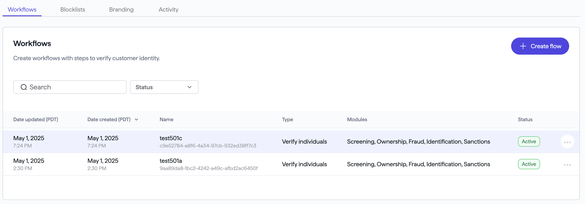
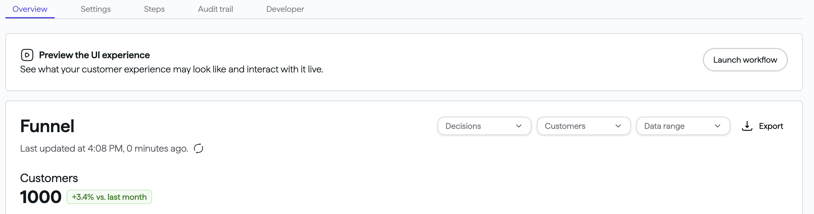
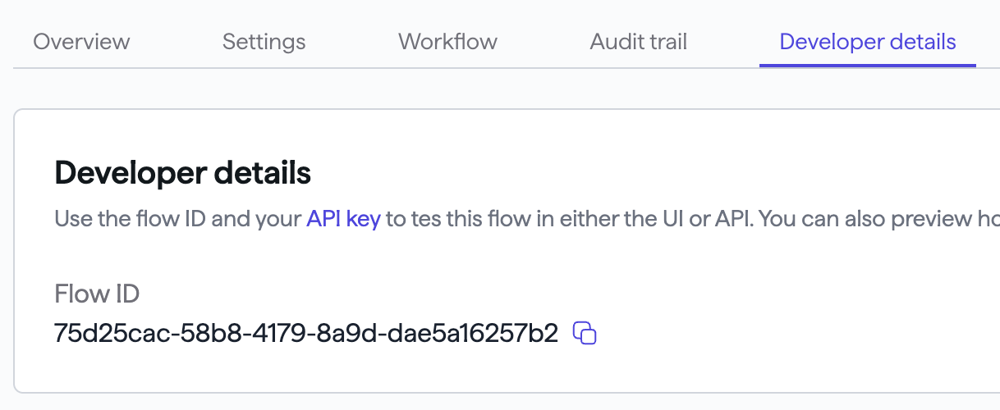
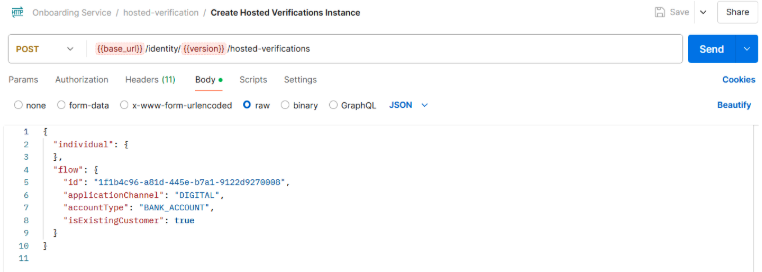

# Identity integration guide

## Introduction

Identity verification is a prerequisite for KYC and is integral to maintaining legal and ethical standards within the financial sector.

You can integrate identity using either of two methods:

- [Hosted flow](https://docs.atelio.com/embedded/docs/identity-integration-guide#hosted-flow)
- [Non-hosted flow](https://docs.atelio.com/embedded/docs/identity-integration-guide#non-hosted-flow)

### Hosted flow

The Hosted Flow is a fully managed identity verification experience that allows you to run a verification quickly and securely without building your own custom frontend. It offers several customization options to configure your own branding and desired workflow behavior. The hosted flow is ideal for teams seeking a low-code or no-code, configurable solution that reduces maintenance overhead while ensuring a consistent and compliant user experience.

You can initiate a hosted verification session programmatically via our [API](https://docs.atelio.com/embedded/reference/hosted-flowcreate) or directly via the [portal](https://identity.atelio.com/). Verification sessions can be integrated into your application through the following methods:

| Method       | Description |
| ------------ | ----------- |
| Redirect     | Once the hosted verification flow is completed, users are redirected back to their previous application. |
| Pop-ups      | Verification session is launched in a new window. |
| SMS or Email | Shareable link that can be sent via SMS or email. |
| QR Code      | A verification session link encoded in a QR code. _(Coming soon)_ |

The ability to customize your workflow and branding via an intuitive UI experience is available on our portal.

### Non-Hosted Flow

The Non-hosted flow gives you full control over the user experience by allowing your application to interact directly with Atelio’s identity verification APIs. This option is ideal for teams that want to keep the verification experience fully contained within their own web page or flow, while still leveraging Atelio’s secure verification backend.

Using the non-hosted flow, you can create and manage verification sessions as well as collect and update user information directly through our APIs

For details on requests, authentication, and response handling, see [Identity API endpoint reference](https://docs.atelio.com/embedded/reference/identity).

### End-to-end flow

Identity verification contains the following end-to-end flow for external developers:

1. [Create your API key](https://docs.atelio.com/embedded/docs/identity-integration-guide#create-your-api-key)
2. [HMAC signature](https://docs.atelio.com/embedded/docs/identity-integration-guide#hmac-signature)
3. [Create a workflow](https://docs.atelio.com/embedded/docs/identity-integration-guide#create-a-workflow)
4. [Start a hosted verification](https://docs.atelio.com/embedded/docs/identity-integration-guide#start-a-hosted-verification)

## Create your API key

To access the Identity Portal, you'll need to [log in](https://identity.atelio.com/) with your account and credentials.

An API key and secret are required to make API calls to the Identity platform. To get these required items, see [Quickstart](https://docs.atelio.com/embedded/docs/quickstart) .

## HMAC signature

To create the required HMAC signature for more security, see [HMAC signature](https://docs.atelio.com/embedded/docs/hmac-signature)

## Create a workflow

The workflow is used to configure what type of verification checks should be performed and how the visual experience should look. To create a workflow and get the Workflow ID, perform the following:

1. Log into the [Identity Portal](https://fintel-fe.vercel.app/home) .

2. Click on **Workflows** in the left navigation bar

3. Click on **Create Workflow** and then choose the **Verify Individuals** (default) workflow template

4. The _Customize your flow_ page contains the following main sections:
   - Workflow name
   - UI Settings
   - Default settings
5. Click **Create Flow**.

Once the workflow is created, navigate to the **Developer Details** tab to note the unique ID on this page, as this is used when creating verification requests

### Workflow name

Enter a unique name for your workflow.

Since this workflow name isn't visible to customers, name it anything that is helpful to you.

### UI settings

Choose either:

- [Atelio's UI](https://docs.atelio.com/embedded/docs/identity-integration-guide#atelios-ui)
- [Build your own](https://docs.atelio.com/embedded/docs/identity-integration-guide#build-your-own)

#### Atelio's UI

This option uses Atelio's branding, color themes, logos, and links to legal documentation.

This is the default option and requires the following:

1. Select which **Brand Styling** to use from the dropdown list.
2. Enter your **Redirect URL** of where you'd like the customer to be sent after completing Atelio's UI experience.
3. Select your [Default Settings](https://docs.atelio.com/embedded/docs/identity-integration-guide#default-settings) .

#### Build your own

This option lets you create your own branding experience and requires the following:

1. following the instructions in the **Create a branding** section. Note that you can also create the workflow in advance, and later change the branding to your own at a later date.
2. Select your [Default Settings](https://docs.atelio.com/embedded/docs/identity-integration-guide#default-settings) .

#### Default settings

Expand this section to see which options can be set:

| Whether or not to ...                                  | If this setting is turned off ... |
| ------------------------------------------------------ | --------------------------------- |
| ... use an OTP to verify ownership of the mobile phone | ... then a PIN will not be required, which might be a security risk. |
| ... require ID scan, selfie, and other documentation   | ... then a selfie won't be required and won't appear. |
| ... use a footer in the hosted view                    | ... then no footer is displayed.   The footer's "Types to display" (such as the Patriot Act and FDIC) is configured in the Branding configuration. |

## Start a hosted verification

The hosted verification initiates the process of having an individual go through the verification process. The hosted verification creation can be done in the following ways:

- [Via Portal](https://docs.atelio.com/embedded/docs/identity-integration-guide#via-portal)
- [Via API / Postman](https://docs.atelio.com/embedded/docs/identity-integration-guide#via-api-postman)

### Via Portal

You can start a hosted verification by using the Identity Portal UI as follows:

| Step| Screenshot |
| --- | ---------- |
| On the _Workflows_ page, click on the workflow whose verification process you want to view. That will open that workflow's _Funnel_ page. |  |
| On the _Funnel_ page, click the **Launch Workflow** button. |  |
| The page that opens contains the Hosted URL. Use the Hosted URL to integrate into your workflow, such as a redirect, shareable link, pop up new window, etc. |  |

### Via API / Postman

You can use Postman by manually enter the shared Postman request with the postman link.

| Step| Screenshot |
| --- | ---------- |
| Once the flow is created, it will have a unique flow ID, which is located on the Developer details page tab. Click the copy icon to the right of the Flow ID as it will be required to create a hosted verification via the API in the next step. |  |
| You can start a hosted verification by calling the [hosted-flowcreate](https://docs.atelio.com/embedded/reference/hosted-flowcreate) API as using the flow ID from the previous step. If the hosted verification request is successful, the response body returns a `hostedFlowUri` field. |  |
| This URI is the entry point for the customer undergoing verification Navigate to the `hostedFlowUri` as returned in the response body of the hosted verification creation and use it to integrate into your workflow, such as a redirect, shareable link, pop-up new window, etc. | The code on your _Body_ screen will differ. |
