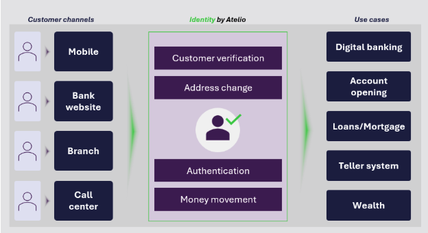

# Identity overview

## Introduction

Identity from Atelio will provide a future proof way to verify customers at every sensitive touchpoint. This includes:

- onboarding into new accounts
- moving money
- changing personal information

By tracking customer behavioral patterns through a single fraud platform, clients can better understand their customers across all channels and prevent account takeover.

Extending outside of a single customer, Atelio is able to protect clients by understanding a customer footprint across the Atelio network and prevent fraud in a way no other solution can.

Identity from Atelio has the main goal to unify siloed data into a centralized system to provide consistency across channels.

## Key benefits

| Identity differentiators | Description |
| --- | --- |
| **Accuracy** | Leverage multiple data points including our proprietary transactional data; and customer records data to accurately identify your users and detect fraud. |
| **Higher conversion** | Reduce friction in customer onboarding with pre-configured, adaptive identity verification journeys leading to faster approvals. |
| **Continuous optimization** | Rulesets and models are optimized for the highest automation and accuracy without fraud while maximizing conversion rates with minimal friction for low-risk customers. |
| **Outcome driven** | Unify user data for a transparent onboarding experience that builds trust and efficiency. |
| **Embedded case management** | Streamline manual reviews to reduce onboarding friction while supporting compliance with BSA regulatory requirements. |
| **Privacy-first design** | Secure customer data through our vault to prioritize user privacy and optimize data usage for seamless customer journeys. |
| **API or Hosted experience** | Use our APIs to access unparalleled levels of customization and flexibility, or quickly launch without extensive technical resources. |
| **Compliance** | Meets CIP and BSA compliance standards. |

## How it works

Identity works through the following steps:

| Module | Description |
| --- | --- |
| **Intelligent screening** | Leverage the FIS global protected network to block suspicious IPs, emails, IDs and other suspicious data sources. |
| **Device ownership & person authentication** | Verify a user’s control of key identity attributes, such as phone number, using One Time Passcodes. |
| **Fraud screening** | Perform behavioral analysis and identify both first-party fraud and synthetic IDs. |
| **Identification verification** | Verify and manage documents, such as Government ID and proof of ownership, with the additional verification of selfies (standard or with liveness check). |
| **Sanctions screening** | Adhere to industry compliance standards including Bank Secrecy Act (BSA) core identification requirements (ex. CIP) and sanctions screening. |

## Use cases

Identity from Atelio solves for use cases across key customer channels such as online, in-branch, mobile app and call centers.

| Use cases | Description |
| --- | --- |
| New&nbsp;customer&nbsp;verification | Verify new users, during:   - New account opening   - Credit card application   - Loan application   - Customer onboarding across all channels |
| Step-up verification   a.k.a. Risk-based verification   _(coming soon)_ | Is triggered when our system detects increased risk during the following user sessions:   - A user session   - High-risk transactions   - Sensitive account actions, such as password reset   - Regulatory or compliance requirements   - Tier or product upgrades when a user requests access to higher-value services |
| Customer updates   _(coming soon)_ | After the initial onboarding, and user verification, customer updates help maintain the account integrity and regulatory alignment when:   - Customer changes contact information   - Customer changes address   - Customer verifies new document   - There is a regulatory or compliance check |
