# Identity user guide

## Overview

This page outlines the following steps to explore the Atelio Identity sandbox environment and simulate the end-to-end verification experience:

1. [Sign up to the Identity Portal](https://docs.atelio.com/embedded/docs/identity-user-guide#sign-up-to-the-identity-portal)
2. [Create a workflow](https://docs.atelio.com/embedded/docs/identity-user-guide#create-a-workflow)
3. [Start a hosted verification](https://docs.atelio.com/embedded/docs/identity-user-guide#start-a-hosted-verification)
4. [Check the verification result](https://docs.atelio.com/embedded/docs/identity-user-guide#check-the-verification-result)

## Sign up to the Identity Portal

To access the Welcome Kit and to sign up to the portal, [sign up at the Identity Portal](https://www.atelio.com/get-identity).

For a team member to reach out to you about a particular product, don't hesitate to [Contact Us](https://www.atelio.com/contact-us).

> 📘 **Note about Brands**
>
> In order for people from the same company to be under the same brandID, they need to invite other users through the portal. The proper workflow is:
>
> 1. Each person from a company uses the signup page..
>
> 2. They then invite additional users from within the portal.
>
> Otherwise, everyone who uses the sign up page gets registered in separate brands.To ensure all team members within your company are part of the same brand, invite additional colleagues through the portal by navigating to the Users left-nav menu and then clicking the Invite Users button.

## Create a workflow

The workflow is used to configure what type of verification checks should be performed and how the visual experience should look. To create a workflow, do the following steps:

1. Log into the [Identity Portal](https://identity.atelio.com/).

2. Click on **Workflows** in the left navigation bar

3. Click on **Create Workflow** and then choose the **Verify Individuals** (default) workflow template

4. The _Customize your flow page_ contains three main sections:
1. Enter a name for your Workflow.
2. Select which UI experience to use:
      1. (default) Atelio's branding, color themes, logos, and links to legal documentation.
      2. Build your own.
3. Select which items to turn on for your default settings:
      1. Require an OTP to verify ownership.
      2. Require an ID scan and selfie for verification.
      3. Display information in the footer.
4. You can separately create your own branding experience by following the instructions in the **Create a branding** section. You can also create the workflow in advance, and change the branding to your own at a later date.
5. Click **Create Flow**.

## Start a hosted verification

The hosted verification allows you to see the outcomes that an individual would go through during the verification process.

| Step | Screenshot |
| ---- | ---------- |
| Open the workflow just created, then on the _Overview_ page, click **Launch Workflow**. |  |
| The sandbox environment allows you to simulate different verification outcomes using predefined signals, allowing you to test and explore the full range of possible scenarios. Select your desired outcome: - Application denied - Application approved - Application manual reviewed Then click **Continue**. | 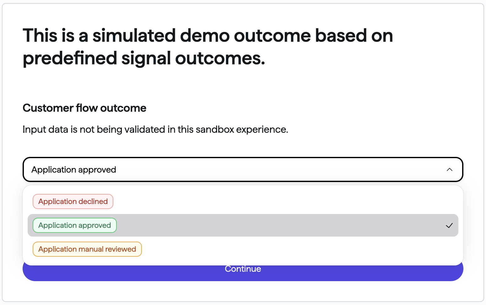 |
| Mock Bank is the name of the bank simulating the verification. To start, enter your email address and North American phone number. Then click **Continue**. | 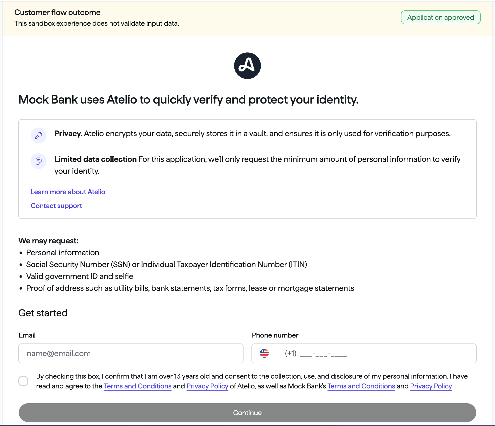 |
| Enter any six-digit number. Note: Two-factor authentication (OTP SMS) is turned off in the sandbox environment. Click **Confirm** and then **Confirm** again. | 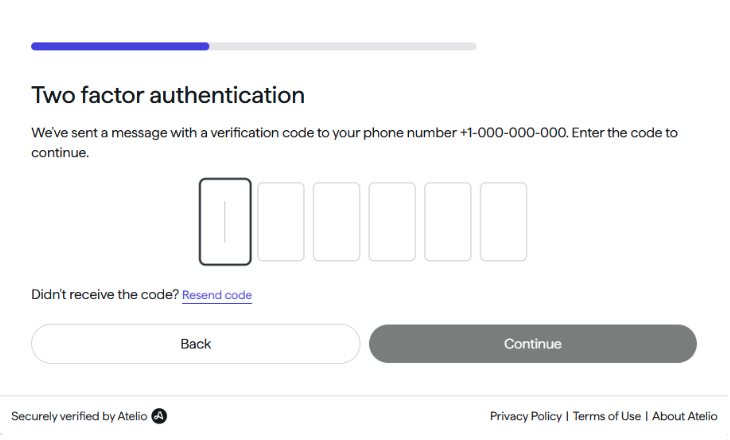 |
| On the _Provide your information_ page, enter sample data in the following fields: - Given name - Family name - Date of birth - Social Security Number Then click **Continue**. | 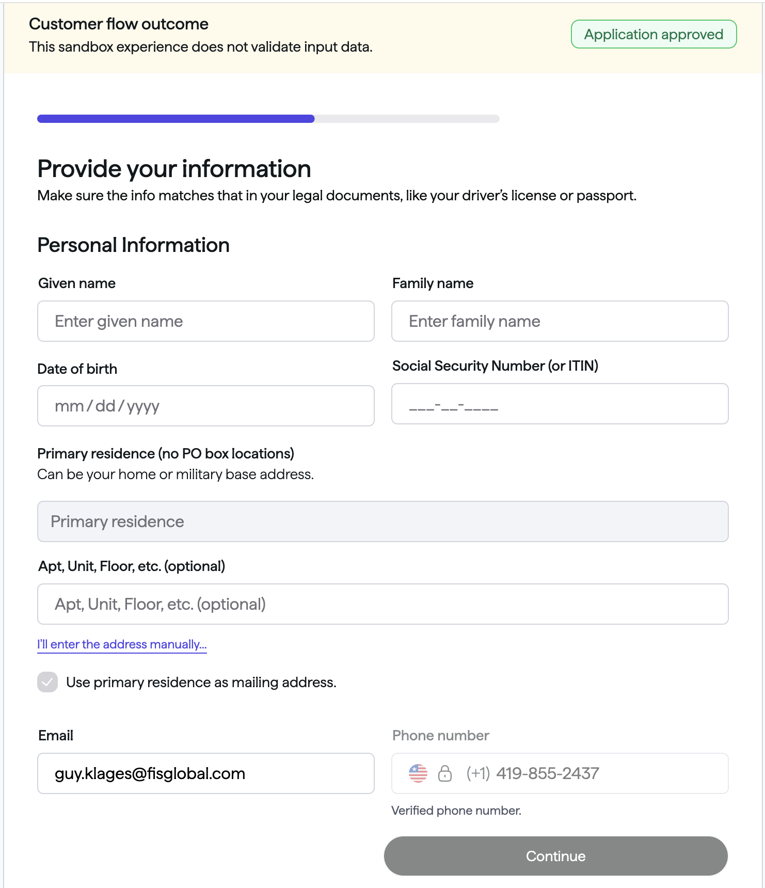 |
| On the _Identity Verification_ page, use your mobile phone's camera and point it at the QR code. That will open a _Capture or upload ID_ page on your mobile. On your mobile phone: - Click **Choose method** and then **Continue**. - Scroll down to agree. - Allow access to the camera. Then you are redirected to the website you entered when you created your workflow. | 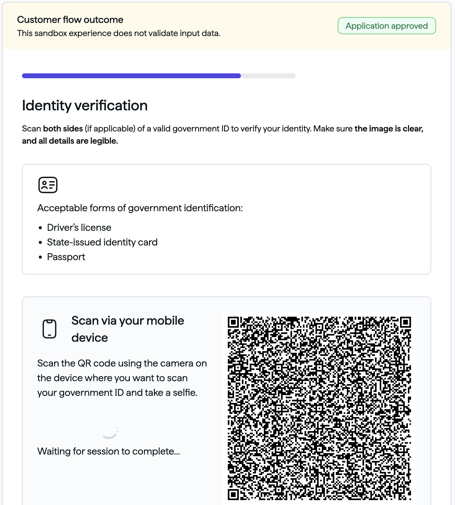 |
| Go back to your identity portal workflow to view the results. |  |

## Check the verification result

Once the hosted verification experience is completed, the transaction shows up in the Identity Portal.

### Verification requests

Go to **Workflows> Activity** to see verification requests by a customer of a brand.

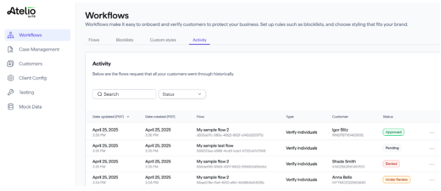

### Verification request details

Click on a verification request to see its details:

- Which modules were executed
- Which signals were gathered
- The status of each step (Approved, Pending, or Denied)

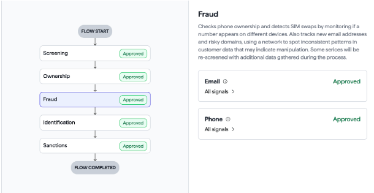

### Case alert

If a Case Alert is created during a verification, the transaction details will include a link to the relevant Alert.

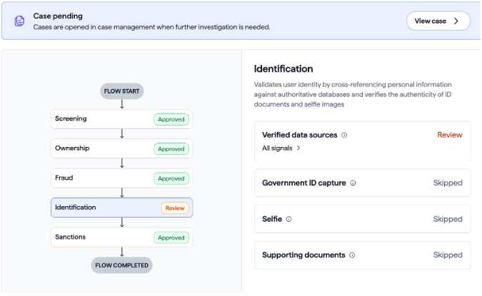

Clicking **View Case** opens the [Case Details page](https://docs.atelio.com/embedded/docs/identity-user-guide#case-details-page).

### Case Details page

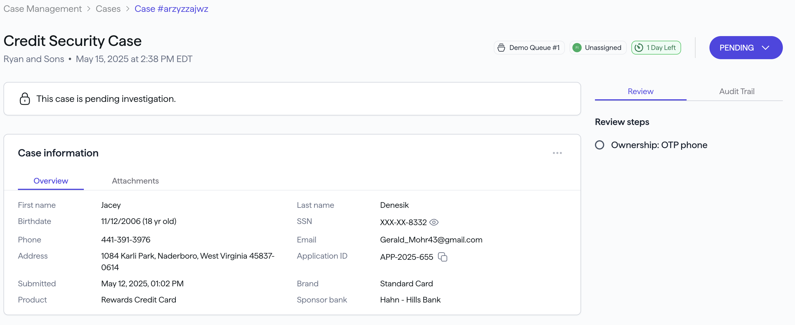

The upper-right dropdown displays the current case _status_:

- If _Pending_, your options are:

  - **Investigating** \- to change the status of the case to _Investigating_ .
- If _Investigating_, your options are:

  - **Update disposition** \- to approve, deny, or request more information.
  - **Re-assign** \- to assign the case to another investigator.

## Case Management

The _Case Management_ page contains the following sub-pages:

| Sub-page       | Description |
| -------------- | ----------- |
| Active cases   | All active cases, regardless of case owner. |
| Assigned to me | All cases assigned to me, regardless of status. |
| Recent cases   | A history of cases you recently viewed. |
| Closed cases   | A list of all cases that have been closed. |

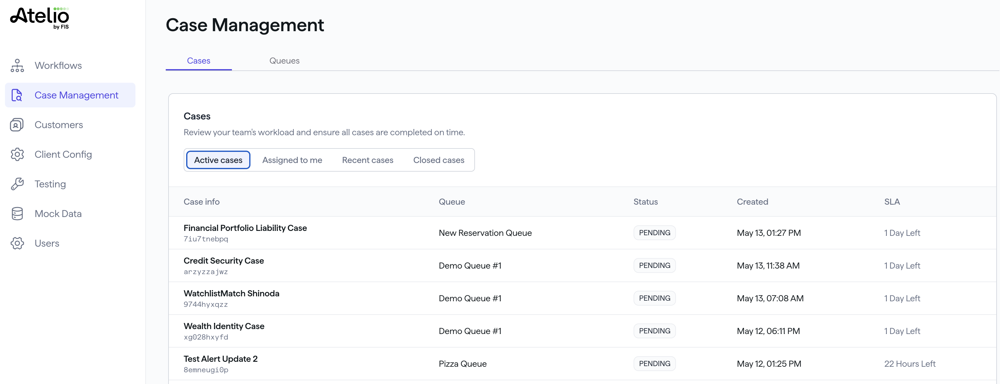

Clicking on a single case opens that case's details page:

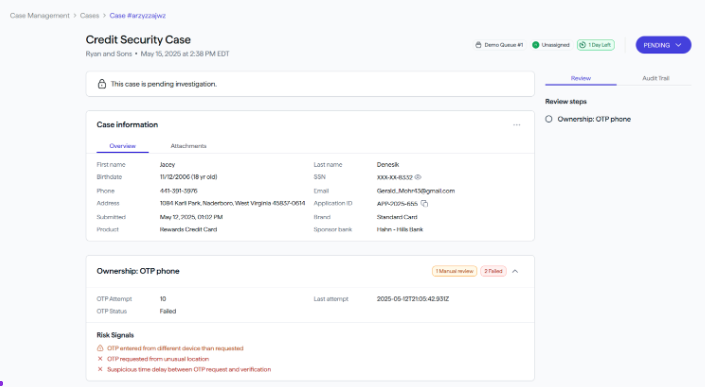

## Forms of identity accepted

The following table lists all forms of ID accepted in the United States.

Also, our Implemention team can configure for IDs that your organization allows.

| Issuing entity           | Acceptable forms of ID |
| ------------------------ | ---------------------- |
| US&nbsp;Department&nbsp;of&nbsp;Defense | Identification Card |
| US Department of State   | - B1 B2 Visa Border Crossing Card   - Identification Card   - Travel Document   - Visa |
| USCIS                    | - Permit   - Residence Card   - Permanent Resident Card   - Residence Document |
| Other                    | - Global Entry Card   - Green Card   - Nexus Card   - Passport   - Passport Card   - Residence Document   - Social Security Card   - Travel Document   - Veteran ID   - Work Permit |
