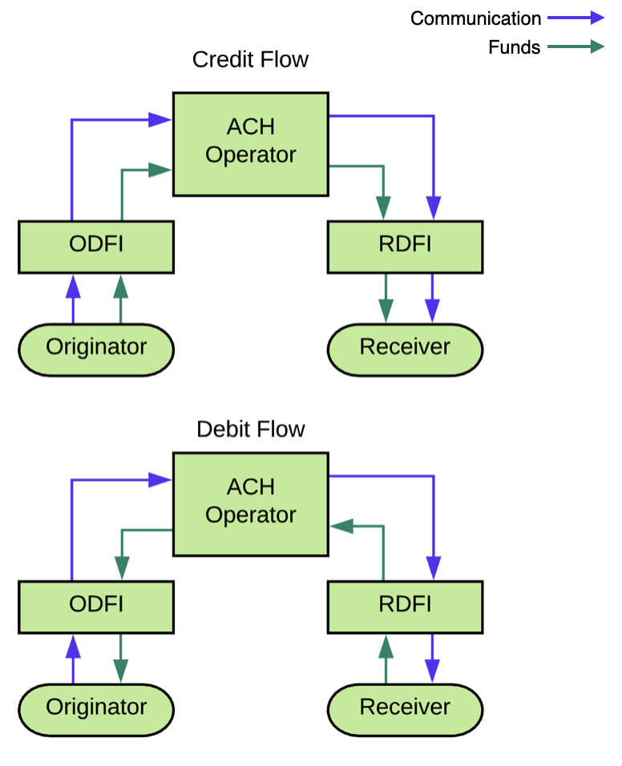

# ACH transfers overview

## Introduction

ACH is a method of transferring money electronically between banks without the need for paper checks, cards, or wire transfers. Common examples of ACH transfers include payroll systems which issue ACH credit transactions to pay employees by direct deposits, or utility providers which issue ACH debit transactions to request direct payments from the consumer's bank account.

The Atelio platform creates and transmits the ACH file formatted with appropriate parameters to the ACH operator. Prior to creating a transfer, we check the customer's originating account balance to ensure sufficient funds.

## How ACH transfers work

ACH transfer requests are sent from the bank acting as the ODFI and are received by the bank acting as the RDFI. Successful transfer requests move funds between an **originator account** at the ODFI and a **destination account** at the RDFI. The ODFI sends a batch of ACH files representing ACH requests to the ACH Operator. The ACH Operator then processes the requests and sends them to the appropriate RDFI. The RDFI credits or debits the receiver account.

Every transfer or attempted transfer is defined by its [ACH return code](https://docs.atelio.com/embedded/docs/ach-return-codes).

The diagram below illustrates this flow.

The Atelio platform handles the creation and transmission of the ACH file formatted with appropriate parameters to the ACH operator.

## ACH class code

Every ACH transaction is classified with a single, 3-letter, ACH class or SEC code. The SEC code is a mandatory parameter that identifies the transaction type in an ACH transfer request. It identifies the ACH file format and specifies the authorization method for the receiver account. SEC codes distinguish between consumer and commercial usage categories.

NACHA, the regulatory body governing the ACH network, maintains and provides the complete list of SEC codes.

Atelio supports the following SEC codes:

| Code  | Description |
| ----- | --- |
| `CCD` | Cash Concentration or Disbursement |
| `PPD` | Prearranged Payment and Deposit |
| `WEB` | Internet-Initiated Entry |

## Fund authorization

Following an ACH request made through our API, a settlement hold is placed on the originator account equal to the amount of the ACH transfer, before the transfer moves into a `completed` status. The table below summarizes the settlement windows.

| ACH Network | Hold Expiry |
| --- | --- |
| Standard ACH | 4 business days |
| Same-day ACH | 2 business days |

## ACH submission cut-off times

ACH transfers must be submitted before certain cut-off times to ensure that the transfers are included in the appropriate NACHA batch files. The table below summarizes the cut-off times depending on the network.

| ACH Network | Cut-off Time |
| --- | --- |
| Standard ACH Origination | 8:00 pm CT |
| Same-day ACH Origination | 10:00 am CT |

If `same_day` ACH transfers are sent between the above cut-off times, the transfer will be treated as a standard ACH transfer. The receiving bank will receive the transfer first thing the following morning, and it will be available to the receiver at the open of business.

If `same-day` ACH transfers are sent after the standard ACH cut-off, the transfer will process as a `same-day` ACH transfer on the following business day.

## ACH transfer state

Transfer status may be:

- `completed`
- `failed`
- `pending`
- `returned`

For more information, see [Transaction states](https://docs.atelio.com/embedded/docs/transaction-states).

A created transfer is `pending` and becomes `completed` after it posts.

If a transfer is `failed`, a `failure_reason` is shown.

After a transfer has `posted`, it might still be `returned`. This reversal can only ever happen after a transaction has already `completed`.

If a transfer is `returned`, in addition to the `failure_reason` there will also be an `ach_return_code`. These ACH return codes are standard and are described in [ACH return codes](https://docs.atelio.com/embedded/docs/ach-return-codes).

## Reversing transfers

Reversing a transaction after it has reached the ODFI can only be done under specific circumstances. A reversal must occur within 5 business days of the transaction and is only considered for the following reasons:

- The transaction was for the wrong amount.
- The provided account number was incorrect.
- The transaction is a duplicate.

For a complete specification and interactive examples, see [Creating a transfer](ref:post-transfer) in the Atelio API Reference.

## Funds availability when transferring from an external bank account

When funds are transferred from an external account to an account managed by Atelio, the funds are available as soon as the transfer arrives at Atelio. Timing is dependent on the external originating bank.
