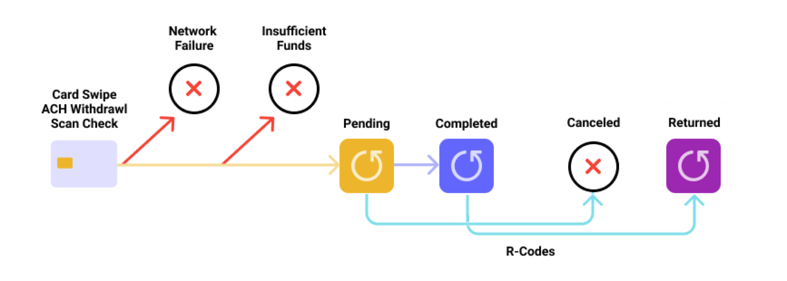

# Transactions overview

## Introduction

The [Transactions API](https://docs.atelio.com/embedded/reference/transactions) enables you to manage multi-settlement transactions and easily retrieve transaction details. 

The `transaction` object is a key component of the API. It contains a number of important attributes that apply to all types of payments, including card, ACH, RDC, and account payments. These attributes provide valuable information about the transaction, such as the payment amount, the date and time of the transaction, and the payment method used.

See the `details` object in the following table:

| Object    | Description |
| --------- | ----------- |
| `details` | Contains the attributes specific to a transaction type. For example:<br/>- The `details` object for an ACH transfer includes the `external_account_id`.<br/>- The `details` object for a card purchase includes the retailer's MCC.<br/>For information on the `details` object attributes for various transaction types, see [Payment types](doc:payment-types) |


## Transaction examples

### Single-settlement example

The following example shows the details that are associated with a specific transaction.

```json title="JSON"
{
    "transactions": [
        {
            "transaction_id": "b9b8da9a-5ff2-4e5c-84ee-587b7d092f6b",
            "bond_brand_id": "8ed5c9fe-581b-490a-9dcb-3302db235a4b",
            "customer_id": "6493109c-7cb5-4f21-9d19-d9c3901d452d",
            "account_id": "9dc86a8a-4c12-4107-84a8-e7cf6a76586f",
            "payment_type": "card",
            "transaction_type": "credit",
            "previous_transaction_id": null,
            "state": "pending",
            "amount": "5.30",
            "currency": "USD",
            "created_time": "2021-02-02T22:27:13+00:00",
            "updated_time": "2021-03-02T20:39:56+00:00",
            "balances": {
                "prior_balance": "68.83",
                "new_balance": "63.53"
            },
            "details": {
                "card_id": "71efc729-830f-455f-9525-281c19bb4bb4",
                "mcc": "3542",
                "mcc_description": "matrix dynamic eyeballs",
                "currency": "USD",
                "exchange_rate": "0.00",
                "merchant_id": "9le8DI5z8am54O3b",
                "merchant_name": "Baldwin, Wright and Martinez",
                "merchant_city": "New Nathanshire",
                "merchant_state": "Missouri",
                "merchant_country": "Colombia",
                "merchant_postal_code": "34100",
                "merchant_currency": "",
                "merchant_amount": "",
                "cardholder_presence": true,
                "statement_descriptor": "Target #4744",
                "arn": "000091556011",
                "fraud_rule_triggered": "spend_velocity"
            }
        },
        {
            "transaction_id": "6460856a-e431-4d5f-a6d2-deb87c01042f",
            "bond_brand_id": "4b3fab91-7b67-4300-95f7-437dacac5e78",
            "customer_id": "00b9a8ed-03b5-4ce4-a0dd-9bb47aefd2b0",
            "account_id": "9e5f7953-743d-46d0-88ae-dacc395e8030",
            "payment_type": "ach",
            "transaction_type": "credit",
            "previous_transaction_id": null,
            "state": "pending",
            "amount": "3.22",
            "currency": "USD",
            "created_time": "2021-01-17T06:37:44+00:00",
            "updated_time": "2021-03-04T01:09:46+00:00",
            "balances": {
                "prior_balance": "57.10",
                "new_balance": "53.88"
            },
            "details": {
                "card_id": "21775c4e-c74e-40e8-83ec-1e2c9781d587",
                "external_account_id": "d6517906-a318-43b5-849f-0b42032c0a1f",
                "class_code": "ppd",
                "direction": "credit",
                "network": "ach",
                "description": "Testing",
                "failure_reason": "Invalid ACH routing number",
                "return_code": "R13",
                "products": ["direct deposit", "payroll"]
            }
        }
    ]
}
```

### Multi-settlement example

Some transactions can have more than one settlement, such as the following:

| Item | Amount | Remarks | ISO 8583 |
| --- | --- | --- | --- |
| POS purchase | $35.93 | Available balance | 0100 |
| POS purchase | $30.49 | Current balance | 0220 |
| POS purchase | $5.44 | Current balance | 0220 |

Therefore, the overall financial impact is $30.49 + $5.44.

The API output shows the POS purchase complete with the following webhooks:

| Item | Amount | Remarks |
| --- | --- | --- |
| POS Purchase Pending | $35.93 |  |
| POS Purchase Completed | $30.49 | Contains a `settlements` array in `details` for the initial settlement. |
| POS Purchase Completed | $5.44 | Contains a `settlements` array in `details` for both settlements. |

#### Initial settlement payload

```json title="JSON"
{
   "transaction_id": "b07b0290-47ff-47a0-9e70-4668508a8018",
   "bond_brand_id": "c17c0500-afce-40a5-b3b4-bb77bea04417",
   "customer_id": "b3e83408-4d42-4cf6-a139-f41c73e402f8",
   "account_id": "21074045-07b0-4bca-819a-462c3bdb5c3b",
   "payment_type": "card",
   "transaction_type": "POS Purchase",
   "state": "completed",
   "description": "POS Purchase",
   "amount": "-30.49",
   "currency": "USD",
   "created_time": "2023-12-16T19:42:05.721337+00:00",
   "updated_time": "2023-12-19T10:54:42.704103+00:00",
   "details": {
       "mcc": "5977",
       "mcc_description": "Cosmetic Stores",
       "currency": "USD",
       "exchange_rate": "1.000000",
       "merchant_id": "000174030076999",
       "merchant_name": "Paypal *Sephora Usa",
       "merchant_city": "4029357733",
       "merchant_currency": "USD",
       "merchant_amount": "-35.93",
       "cardholder_presence": false,
       "statement_descriptor": "PAYPAL *SEPHORA USA   4029357733   USAPAYPAL   *SEPHORA USA",
       "products": ["COSMETICS", "BEAUTY"],
       "settlements": [\
            {\
                "settlement_date": "2024-12-16T03:47:27+00",\
                "amount": "-30.49"\
            }\
        ]
   },
   "balances": {}
}
```

#### Final settlement payload

```json title="JSON"
{
   "transaction_id": "b07b0290-47ff-47a0-9e70-4668508a8018",
   "bond_brand_id": "c17c0500-afce-40a5-b3b4-bb77bea04417",
   "customer_id": "b3e83408-4d42-4cf6-a139-f41c73e402f8",
   "account_id": "21074045-07b0-4bca-819a-462c3bdb5c3b",
   "payment_type": "card",
   "transaction_type": "POS Purchase",
   "state": "completed",
   "description": "POS Purchase",
   "amount": "-35.93",
   "currency": "USD",
   "created_time": "2023-12-16T19:42:05.721337+00:00",
   "updated_time": "2023-12-19T10:54:42.704103+00:00",
   "details": {
       "mcc": "5977",
       "mcc_description": "Cosmetic Stores",
       "currency": "USD",
       "exchange_rate": "1.000000",
       "merchant_id": "000174030076999",
       "merchant_name": "Paypal *Sephora Usa",
       "merchant_city": "4029357733",
       "merchant_currency": "USD",
       "merchant_amount": "-35.93",
       "cardholder_presence": false,
       "statement_descriptor": "PAYPAL *SEPHORA USA   4029357733   USAPAYPAL   *SEPHORA USA",
       "products": ["COSMETICS", "BEAUTY"],
       "settlements": [\
           {\
                "settlement_date": "2024-12-16T03:47:27+00",\
                "amount": "-30.49"\
            },\
           {\
                "settlement_date": "2024-12-18 21:11:49+00",\
                "amount": "-5.44"\
            },\
        ]
   },
   "balances": {}
}
```

## Attributes

The following table describes all possible `transactions` attributes. Many of these attributes are optional.

| Attribute           | Description |
| ------------------- | ----------- |
| `account_id`        | The UUID of the account. Each `customer_id` can have more than one `account_id` associated with it. |
| `amount`            | The value of the transaction in USD. |
| `balances`          | Note that the current names are misleading, and will be changed in a future version. <br/>`prior_balance`— the "current" balance which includes all completed transactions but not pending transactions.<br/>`new_balance`— the "available" balance which includes all transactions, pending and completed. |
| `bond_brand_id`     | The UUID of your brand. |
| `created_time`      | The time the transaction is initiated. If the user swipes a card at a POS terminal, this timestamp displays the time at the POS. |
| `currency`          | The currency used in the transaction.<br/>Currently only USD is supported. |
| `customer_id`       | The UUID for your customer. |
| `exchange_rate`     | The conversion rate used for the transaction. |
| `merchant_amount`   | The original value of the transaction before an currency conversions. |
| `merchant_currency` | ISO currency for the transaction, for example USD. |
| `payment_type`      | Type of payment made. Valid values; `card`, `ach`, `rdc`, `account`.<br/>For details, see [Payment Types](doc:payment-types). |
| `state`             | Varies, based on `payment_type`.<br/>For details, see [Transaction states](doc:transaction-states). |
| `transaction_id`    | Unique ID for a Atelio transaction. |
| `transaction_type`  | Varies, based on the `payment_type`. |
| `updated_time`      | The time the transaction was updated. |


## Lifecycle

Understanding the lifecycle of a transaction is just as important as knowing that a transaction has actually occurred. Whatever your role, it can be critical to know the exact state a transaction is in or the states it has been through. Atelio provides full status and details of a transaction at every stage of its lifecycle.

### Transaction state lifecycle

Atelio transactions typically have the following states across all payment types, with the exception of card-to-card transactions that can only have a `complete` state.



### Transaction states

The states of a transaction and their descriptions are shown in the table below.

| Transaction state | Definition | Card | Account to Account | ACH |
| ----------------- | ---------- |:----:|:------------------:|:---:|
| `cancelled` | The transaction has been cancelled or voided. This may be due to: <br/>- the customer canceling the process <br/>- an ACH transfer not being correctly defined <br/>- certain infrequent types of declines that may occur at physical POS locations or ATMs | ✅ | ✅ | ✅ |
| `completed` | The transaction has finalized, posted, and funds have been debited or credited from the receiver account. | ✅ | ✅ | ✅ |
| `declined`  | Declined transactions are usually caused by insufficient funds, use of a frozen account, or if there are limitations on the merchant categories for using the card. | ✅ |  |  |
| `failed`    | Transaction error based on network failure or a process timeout. |  |  | ✅ |
| `pending`   | The transaction is pending a money movement and is currently being processed. | ✅ |  | ✅ |
| `returned`  | The transaction has been reversed, either by the customer or by the bank after it completed. | ✅ |  | ✅ |
| `start`     | A transaction starts from a card swipe, online purchase, a check scan, or an ACH transfer. | ✅ | ✅ | ✅ |

### Transaction state example

```json title="JSON"
{
    "transaction_id": "94ab1902-2406-4894-99cf-9888e62e1288",
    "bond_brand_id": "123456abcdef",
    "customer_id": "1234567abcdef",
    "account_id": "12345678abcdef",
    "payment_type": "card",
    "transaction_type": "POS Purchase",
    "state": "Pending",
    "amount": "-2.00",
    "currency": "USD",
    "created_time": "2021-03-16T16:17:39.578198+00:00",
    "updated_time": "2021-03-16T16:16:57",
    "details": {
        "card_id": "abcdef1234567890",
        "mcc": "5942",
        "mcc_description": "Book Stores",
        "currency": "USD",
        "merchant_id": "784959000762203",
        "merchant_name": "Amazon.com               Amzn.com/billWAUSA",
        "merchant_city": "Amzn.com/bill",
        "merchant_state": "WA",
        "merchant_postal_code": "34100",
        "merchant_currency": "USD",
        "merchant_amount": "-2.00",
        "exchange_rate": "1.00",
        "cardholder_presence": false,
        "statement_descriptor": "Pre-Auth Transaction-POS Signature Purchase"
    }
}
```
