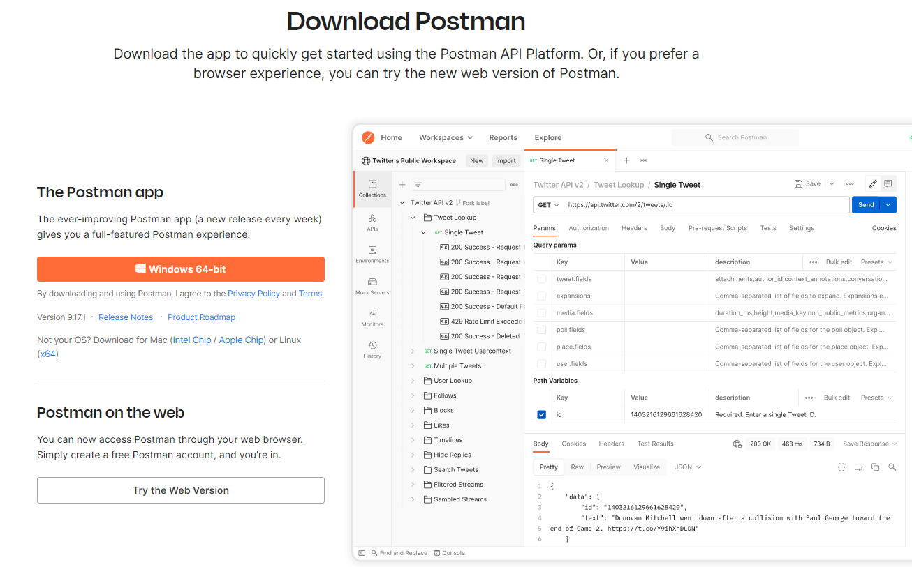
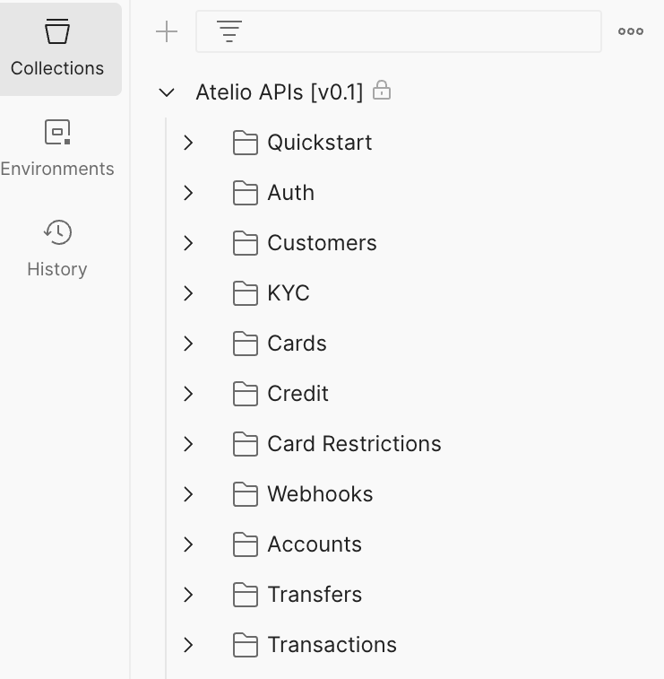
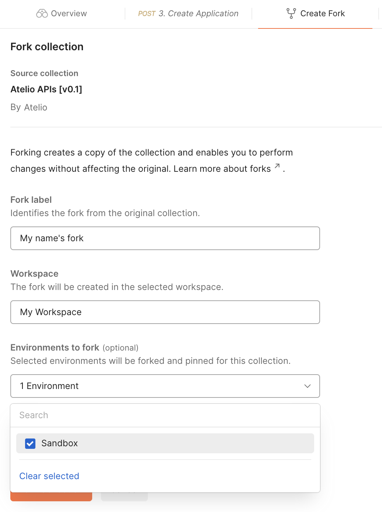
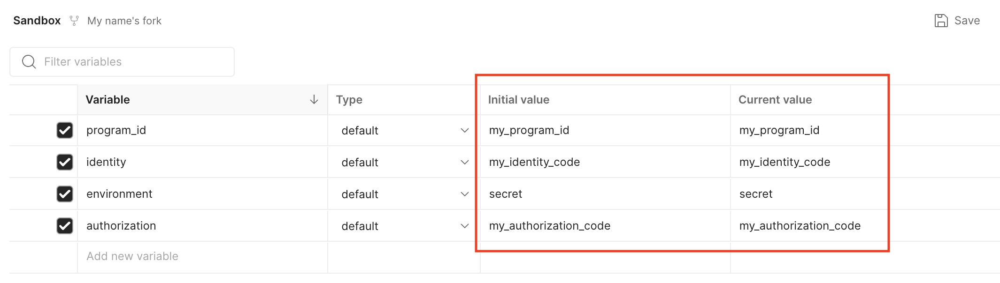
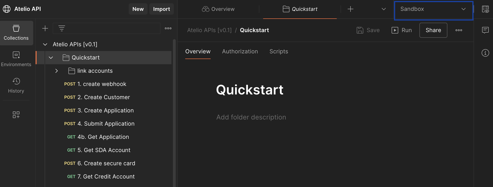

# Postman

The Atelio platform APIs can be run in Postman two ways:

- In a web browser
- In a standalone application

[▶ Run Postman in a web browser](https://www.postman.com/fidelity-information-services/bond-api/collection/tl91mz6/atelio-apis-v0-1)

## Installing Postman

The standalone Postman application is available on a variety of platforms. Visit [Postman](https://www.postman.com/) to choose your platform.

**To install Postman**:

1. Go to [Postman downloads](http://www.postman.com/downloads/).
2. Download the required version.
3. After your download is complete, run the downloaded file to install Postman.

## Import the Atelio collection

|  |  |
| --- | --- |
| 1. Click [Atelio Postman API overview](https://www.postman.com/ateliodev/workspace/atelio-api/overview) to open the Atelio API collection in a Postman browser.        2\. Expand the collection to navigate to your desired API.        3\. While hovering over the **Send** button, click the **Create a fork** button to import that API to your own workspace.               For more information, see the Postman documentation on [importing data](https://learning.postman.com/docs/postman/collections/importing-and-exporting-data/#importing-data-into-postman). |  |

## Configure your Postman

To configure your Postman environment, do the following:

1. [Fork an environment](#fork-an-environment)
2. [Set API keys](#set-api-keys)

### Fork an environment

|  |  |
| --- | --- |
| To fork a copy of our Sandbox environment in the Public Workspace:  1\. Right-click the collection name, such as **Atelio APIs\[v0.1\]** 2\. Select **Create a fork**. |  |
| In the _Create Fork_ tab, enter the following fields:  - **Fork label** \- (defaults with your name)     - **Workspace** \- (defaults to _My Workspace_)     - **Environments to fork** \- Select **Sandbox** from the dropdown list                                                                    Then click **Fork collection**. |  |

After you've forked your copy, you can enter your API identity and authorization tokens in your workspace.

> 📘 **Note**
>
> If you are using Postman with our Production environment, enter your Production credentials you received from Atelio instead of your Sandbox credentials.

### Set API keys

You will need to set your auth keys as variables in the environment you forked. You can set the variables in the headers in the environment tab within the postman collection

| Variable | Description |
| --- | --- |
| `identity` | An authentication identifier used by Atelio API authentication service. Primarily this is used to identify which organization a request originates from. Found in **Developers** \> **API keys** in [Atelio Portal](https://portal.atelio.com/). |
| `authorization` | The API key associated to the `identity`. |
| `program_id` | Test program ID found in the **Developers** tab in [Atelio Portal](https://portal.atelio.com/). |

> 📘 **Important**
>
> Copy and paste your **identity key** and your **authorization key** into both fields:
>
> - Initial value
> - Current value

## Best practices

- For secret management, see [Postman Vault](https://learning.postman.com/docs/sending-requests/postman-vault/postman-vault-secrets).

## Execute requests

1. Select the required environment.
2. Select a request to execute.
3. If required, you may need to enter or update some of the request bodies.
4. Click **Send**.

When necessary, our collections define variables that are needed for downstream requests.

