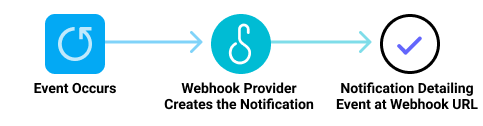
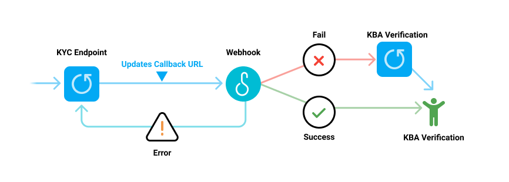

# Webhooks

## Introduction

A Webhook, sometimes referred to as an “HTTP callback,” is a way to enable server-to-server communication. Webhooks are asynchronous by nature and facilitate communication between two different software systems, allowing each system to push state or status changes from one system to the other. Webhooks are essential for keeping your system up-to-date with the latest status and events from the Atelio platform. In the Atelio platform, these include events, such as when your customer’s bank confirms a payment, a customer disputes a charge, or a recurring payment succeeds.

### Webhook advantages

Even though a lot of states can be returned in the API response (and/or polling requests) to an API, webhooks offer a number of advantages. When using a polling request to an API, your system must keep polling a request to check for new data. For example, suppose you need to get the results of a KYC to know whether or not the customer has passed.

To do so, you must set up a polling request to check periodically if the `customer_id` has passed KYC. This may result in a lot of HTTP requests as you are waiting for the status to change. Instead, your system can listen for the `kyc.verification.success` event. Your system is updated the moment that customer has passed KYC, without needing to set up polling. Relying on synchronous responses is also not infallible as the request can be dropped in transit.

Updating your system from webhook events ensures that you have the correct state synchronized with your system.

### Pull vs Push model 

In the “pull” model, where you’re pulling information via the KYC endpoint, the timing of the polling intervals can be difficult to optimize. Polling too fast and you’re wasting resources, too far apart and you’re slow to get updates.

Webhooks, use a “push” model. An event triggers information to be automatically pushed from one system to another. Your application can passively wait for notifications to be sent to you.

The following diagram shows a webhook flow.

## Are webhook transmissions secure?

Making a webhook transmission secure is different from making an API call secure. This is because a webhook might be configured as a publicly accessible URL. Therefore, whenever there is a communication that hits the URL, it is important to ensure that the information truly came from the expected sender. Atelio authenticates transmissions by checking a unique string that is issued to you when you set up the webhook event subscription - this is your "secret code". For details, see [Signature verification](doc:signatures#signature-verification).

## How do I set up a webhook?   

In simple steps:

1. Get the webhook URL from the application you want to send data to.

2. Use that URL in the webhook section of the application you want to receive data from.

3. Subscribe to the types of events you want the application to notify you about.

In the following diagram you can see how Atelio implements a webhook to request and receive the results of a customer's KYC check.

For more details, see [Webhook events and subscriptions](https://docs.atelio.com/embedded/docs/event-subscriptions) and [Accepting webhook requests](https://docs.atelio.com/embedded/docs/signatures).

For a complete specification and interactive examples, see [Webhooks](ref:post_webhooks) in the Atelio API Reference.

## Testing webhooks  

The following sites provide tools for testing your webhooks:

- [Request bin](https://requestbin.com/)
- [Webhook Site](https://webhook.site/)
- [Request Catcher](https://requestcatcher.com/)

