# Pay by Bank app overview

## == _Beta_ ==

## Introduction

Pay by bank is a payment method that allows customers to make or take payments directly from their bank accounts in a safe, secure, and private way -- without entering their credit card or debit card number and without entering their bank routing or account numbers.

### Key benefits

Pay by Bank eliminates the need for credit cards or manual account entry. The method is gaining traction in both consumer-to-business (C2B) scenarios, such as bill payments (users making payments), and business-to-business (B2B) use cases, including refunds and disbursements (taking payments) due to its features.

Our focus here is on leveraging the Pay by Bank product to enable users to make payments.

| Pay by Bank feature | Description |
| ------------------- | ----------- |
| **Cost efficiency** | Processing fees are significantly lower compared to traditional card payments, such as $0.10 for ACH vs. 2-4% per card transaction. |
| **Security**        | Users avoid sharing sensitive card or bank details outside the banking portal, minimizing fraud risk. |
| **Fewer steps**     | Single-use and 1-click repeat payment experience. No need for card details. |
| **Business value**  | Reduces payment processing costs for sticky-bank payments, with no need to store payments credentials -- making this attractive for merchants. Increases security, authentication, and verification via user-permissions for their users. |
| **Faster ACH**      | Same-day ACH processing. Atelio can also provide faster next-day ACH settlement with risk reserve and controls for trusted use cases. |
| **Anti-fraud tools**  | Anti-fraud tools include entity and transactions screening and monitoring. |
| **Account switching** | Customers can choose at any time to switch which bank account to pay from. |
| **API support**       | Customers can use their Refunds API for processing cancelled payments and related refunds as well as the Transactions API for payment status updates. |
| **Event monitoring**  | Customers can use Event Monitoring to enable a wide array of analytics. |
| **UX&nbsp;design&nbsp;templates** | Customers can tailor payment communications and QR code driven experiences with our design templates. |
| **Robust help**       | Customers receive Tier-2 user support as well as access to self-serve documentation and sandbox widgets. |
| **Compliant**         | Meets NACHA and Banking compliance standards. |

### How it works

The way Pay by Bank works can be summarized into three steps:

| Step                                 | Description |
| ------------------------------------ | --- |
| 1\.&nbsp;Choose&nbsp;your&nbsp;bank&nbsp;and&nbsp;account | The payer selects "Pay by Bank" as the payment option at checkout. Through an open banking interface, they securely authenticate and link their bank account by logging into their banking portal. |
| 2. Authorize the payment         | The payer saves their account for future payments and authorizes the current payment, which ensures security and transparency. |
| 3\. Process the payment          | The payment moves directly from the payer's bank account to the merchant’s account, using ACH with regular or same-day processing. We can settle faster for trusted transactions. |

### Use cases

Pay by Bank transactions are safer, more secure, and more private than physically entering bank details and account details as well as saving them in the receiver’s system; so, the following use cases would benefit greatly by using Pay by Bank:

| User | Description |
| --- | --- |
| Consumer | Paying large dollar transactions, such as: • rent • utility bills • phone bills • internet and wi-fi bills • real-estate payments, such as closing costs and down payments • any other large purchase |
| Merchant | Billers, Brands, Payment facilitators, and Property Management companies promote Pay by Bank to: • save on interchange costs associated with card payments • increase payment stickiness • reduce payment disruptions due to card expiration • get an opportunity to study the customer’s cash flow patterns • avoid the risk and security complications of storing the payer’s payment credentials |

## Payment flow

To illustrate the Pay by Bank payment flow, let's look at an example of paying a medical bill from a Chase bank account. There are three main scenarios:

- [First-time usage](https://docs.atelio.com/embedded/docs/pay-by-bank-app-overview#first-time-usage)
- [After first-time usage](https://docs.atelio.com/embedded/docs/pay-by-bank-app-overview#after-first-time-usage)
- [Settings widget](https://docs.atelio.com/embedded/docs/pay-by-bank-app-overview#settings-widget)

### First-time usage

The first time you use Pay by Bank, you'll see the following steps and screens:

<table class="fixedFourColumn">
  <thead>
    <tr>
      <th>Pay by Bank</th>
      <th>Start linking your account</th>
      <th>Choose bank</th>
      <th>Search for bank</th>
    </tr>
  </thead>
  <tbody>
    <tr>
      <td> 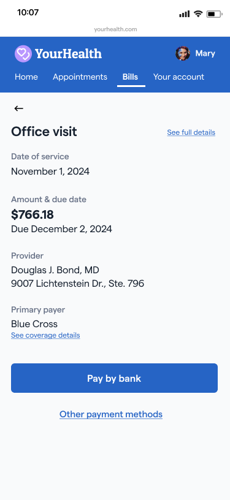 </td>
      <td> 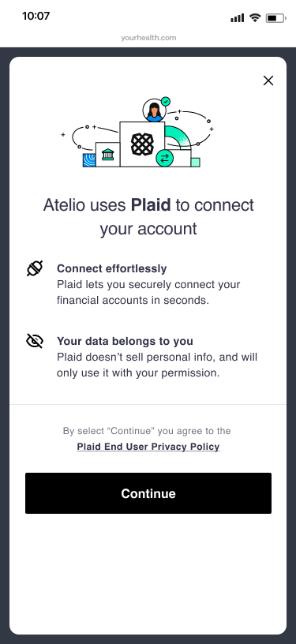 </td>
      <td> 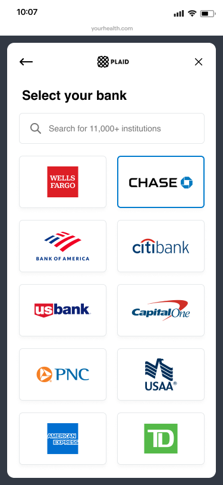 </td>
      <td> 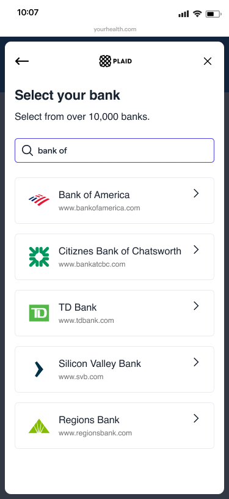 </td>
    </tr>
    <tr>
      <td>Consumer selects <b>Pay by Bank</b> as their preferred payment option, which invokes the Atelio Pay by Bank widget.</td>
      <td>Consumer begins to link the bank account of their choice.    </td>
      <td>Consumer selects their preferred bank.    </td>
      <td>Consumer can also type in their bank name in the search box.     </td>
    </tr>
  </tbody>
</table>

_... continuing the first-time payment flow ..._

<table class="fixedFourColumn">
  <thead>
    <tr>
      <th>Chase log in</th>
      <th>Bank UI</th>
      <th>Successful link</th>
      <th></th>
    </tr>
  </thead>
  <tbody>
    <tr>
      <td> 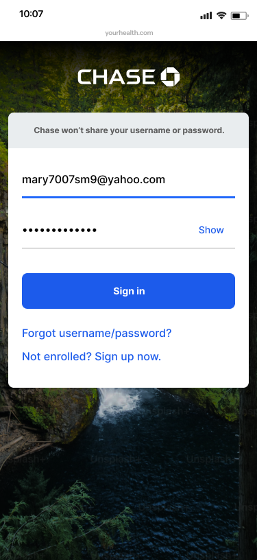 </td>
      <td> 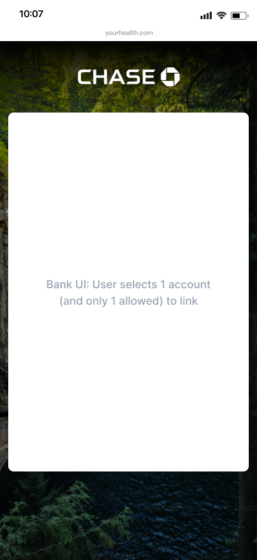 </td>
      <td> 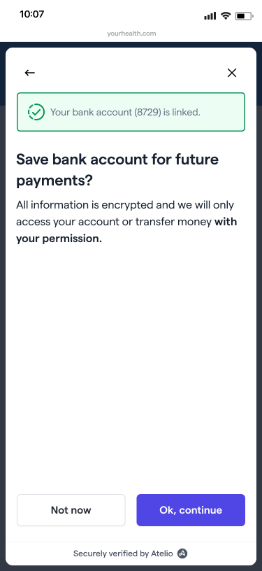 </td>
      <td>  </td>
    </tr>
    <tr>
      <td>Consumer enters their username and password and then selects the <b>Sign in</b> button. </td>
      <td>Consumer selects which account to use.    </td>
      <td>Plaid has successfully linked your bank account to your Atelio account. </td>
      <td> </td>
    </tr>
  </tbody>
</table>

_... continuing the first-time payment flow ..._

<table class="fixedFourColumn">
  <thead>
    <tr>
      <th>Use for future payments?</th>
      <th>Confirm your payment</th>
      <th>Submitted successfully</th>
      <th>Payment in progress</th>
    </tr>
  </thead>
  <tbody>
    <tr>
      <td> 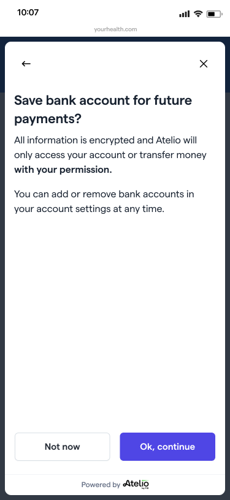 </td>
      <td> 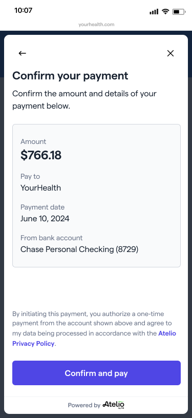 </td>
      <td> 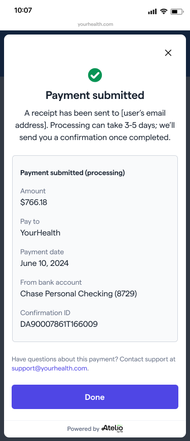 </td>
      <td> 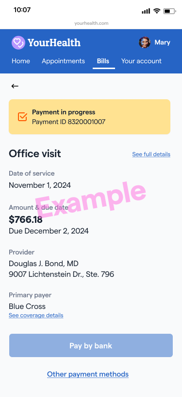 </td>
    </tr>
    <tr>
      <td>Consumer is given the option to save their payment information for future purchases.   <b>←</b> goes to the _Select a different &nbsp;&nbsp;&nbsp;&nbsp;&nbsp;account?_ page.   <b>x</b> &nbsp;&nbsp;goes to the _Cancel this &nbsp;&nbsp;&nbsp;&nbsp;&nbsp;payment?_ page. </td>
      <td>Consumer confirms payment.    </td>
      <td>Consumer receives confirmation of payment submission. </td>
      <td>Consumer sees the status of their payment at any time. </td>
    </tr>
  </tbody>
</table>

### After first-time usage

If you've used Pay by Bank before and saved your account earlier, then you have already entered all the needed information and your flow only has the following steps.

<table class="fixedFourColumn">
  <thead>
    <tr>
      <th>Service provider?</th>
      <th>Confirm your payment</th>
      <th>Payment submitted</th>
      <th></th>
    </tr>
  </thead>
  <tbody>
    <tr>
      <td> 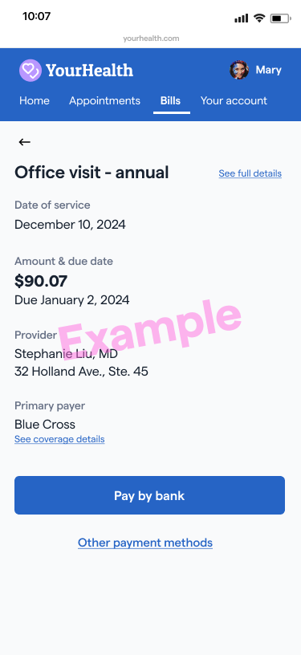 </td>
      <td> 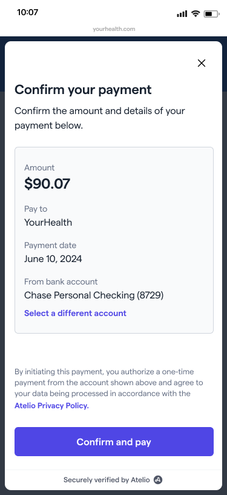 </td>
      <td> 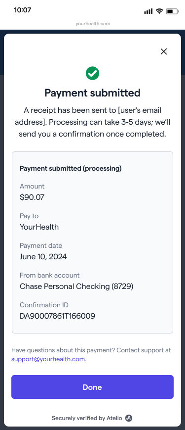 </td>
      <td> </td>
    </tr>
    <tr>
      <td>Consumer selects <b>Pay by Bank</b> as their preferred payment option, which invokes the Atelio Pay by Bank widget. </td>
      <td>Consumer confirms payment.    </td>
      <td>Consumer receives confirmation of payment submission. </td>
      <td> </td>
    </tr>
  </tbody>
</table>

### Settings widget

The _Settings widget_ is also called _Pay by Bank Wallet_ since it contains your linked and saved bank accounts.

You can link an account in your Pay by Bank wallet or setting page at any time, even before your first Pay by Bank payment.

<table class="fixedFourColumn">
  <thead>
    <tr>
      <th>Your account</th>
      <th>Pay by Bank settings</th>
      <th></th>
      <th></th>
    </tr>
  </thead>
  <tbody>
    <tr>
      <td> 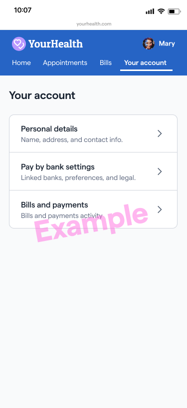 </td>
      <td> 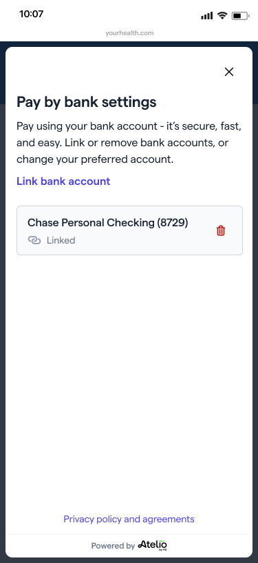 </td>
      <td> </td>
      <td> </td>
    </tr>
    <tr>
      <td>This page lets you manage your account at any time. </td>
      <td>This page lists the account linked to your Pay by Bank Wallet.    This page lets you manage your account at any time. </td>
      <td> </td>
      <td> </td>
    </tr>
  </tbody>
</table>

## Disputes 

Pay by bank payments have a lower risk of fraud or unrecognized payments because the customer must authenticate the payment in their banking app and the flow has other fraud protection measures included. In case of disputes or unrecognized payments that need to be reversed, you can use our Refunds functionality to execute this action.

## == _Beta_ ==
