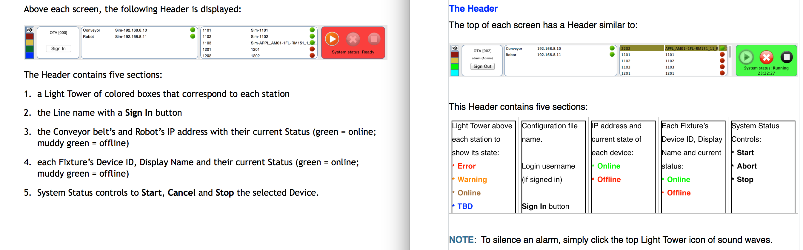
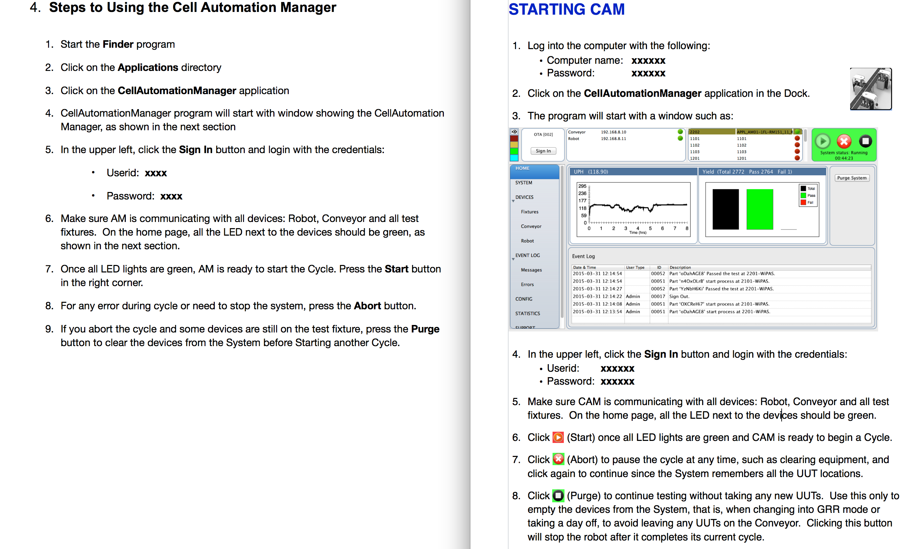
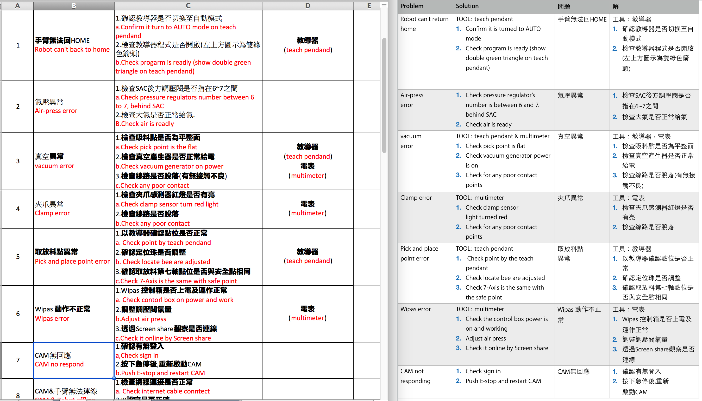
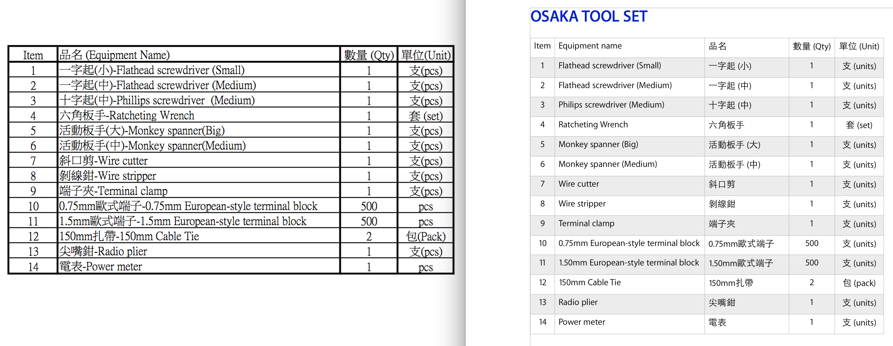
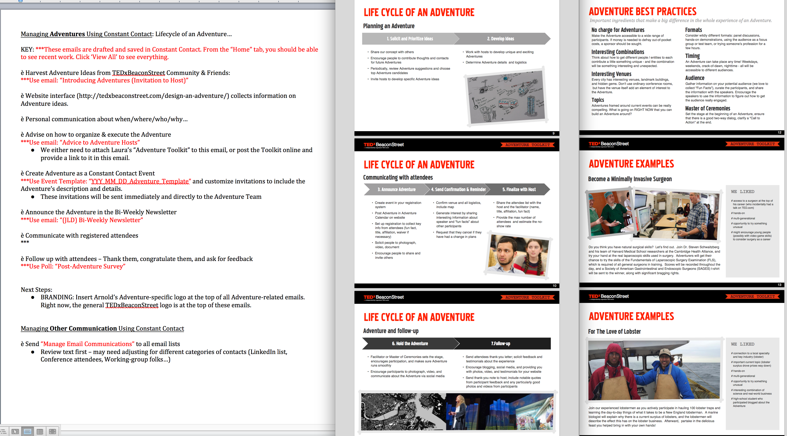

# BEFORE and AFTER UX items I improved

## Nium

### Revamped the information architecture and reduced dev pages by 36%

| Before (May 2024) | After (July 2025) |
|-------------------|-------------------|
| PROBLEM:   Short pages were hastily written by engineers who used more pages than needed     Total of 50 pages| MY SOLUTION:   I revamped and streamlined the information architecture to improve the flow and group related topics.     Total of 32 pages |
|  |  |

### Doubled the number of people onboarded with 75% fewer issues

| Before (Oct 2022) | After (Dec 2022) |
|-------------------|------------------|
| PROBLEM:   New clients were unable to onboard themselves due to the unclear method to them–-and even to Nium.     Each region (AU, EU, HK, SG, UK, US) contains five very complex spreadsheets describing various steps of onboarding for various client types and situations: | MY SOLUTION:   I created **[sections of customers with sub-pages](https://docs.nium.com/docs/onboarding)** for common onboarding steps and for region-specific parameter and example pages.     Immediately saw twice as many customers onboarded and only a quarter of the Helpdesk requests for onboarding |
|  |  |

## Couchbase 

In 2017, I converted their original layout (left side) to a color-coded table (right side) while keeping the same text.

During my interview, I was given 30 minutes to improve their website's page (left side) to be more readable and easier to understand (right side).

## Apple

In 2016, I improved Apple's developer guides for the robots assembling iPads and created more guides for troubleshooting, configuring, and maintaining.

## TEDx Adventures

In 2013, TEDxBeaconStreet wanted their Adventures guidebook (left side) to have a newer and refreshed look while improving their wording (right side).

