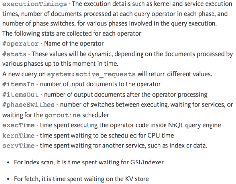
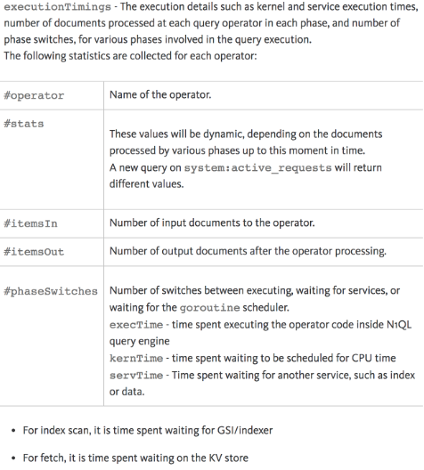
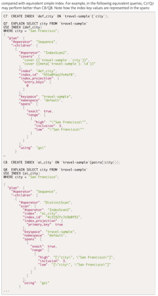
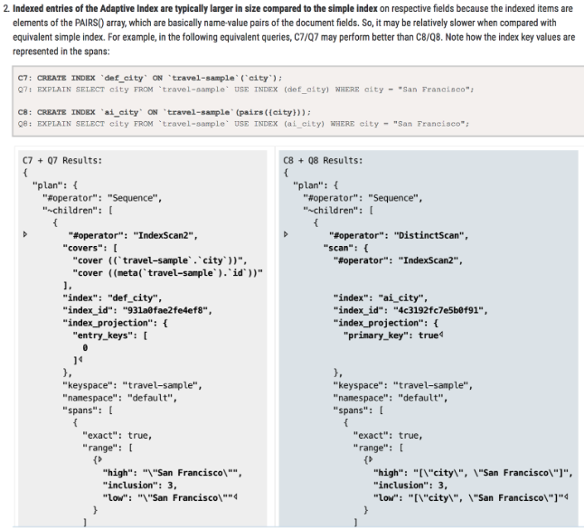

# Before and After 

This page lists UX/UI items I improved whose impact wasn't measured but did make items more readable and less error-prone.

For a list of items that had a measurable impact, see the **[most impactful UX/UI items I solved](./most-impactful-ux-ui-consulting.md)** page.

## Couchbase

### Reserved words table

| Before (Apr 2018) | After (May 2018) |
|-------------------|------------------|
| Couchbase's reserved words were listed horizontally. | I moved the words to be listed vertically with space between initial letters. |
|  |  |

### Color-coded system table

| Before (Jan 2018) | After (Feb 2018) |
|-------------------|------------------|
| PROBLEM:   Couchbase's website contained a description of the system tables in a way that wasn't easy to read nor scan. | MY SOLUTION:   I converted their original layout to a color-coded table while keeping the same text. |
|  |  |

### MNQ settings

| Before (Aug 2017) | After (Aug 2017) |
|-------------------|------------------|
| PROBLEM:   The original text on Couchbase's website was a hard-to-read wall of text. | MY SOLUTION:   I moved the text into a table. |
|  |  |

### A tale of two code blocks

| Before (May 2017) | After (May 2017) |
|-------------------|------------------|
| PROBLEM:   The original text on Couchbase's site required a lot of scrolling up and down to compare the two code versions, and the changes weren't evident. | MY SOLUTION:   I placed the code blocks side by side and bolded the changed lines. |
|  |  |

### Interview challenge

| Before (Apr 2017) | After (Apr 2017) |
|-------------------|------------------|
| During my Couchbase interview, my interviewer gave me 30 minutes to improve a website's page to be more readable and easier to understand. | I replaced the original wall of text with a graph and tables that show the concepts more clearly. |
|  |  |

## Apple

Apple's developer guides for the robots assembling iPads (left side) needed clarification and elaboration (right side) for their assembly line in China.

### User guide CAM header

| Before (Apr 2016) | After (May 2016) |
|-------------------|------------------|
| PROBLEM:   The previous writer numbered the items, even though they weren't steps. | MY SOLUTION:   I moved the text into five columns to be near the five sections they were describing. |
|  |  |

### Quickstart CAM

| Before (Apr 2016) | After (May 2016) |
|-------------------|------------------|
| PROBLEM:   It listed unnecessary steps while not having enough detail. | MY SOLUTION:   I removed the unnecessary steps, added screenshots to clarify the descriptions, and elaborated some steps. |
 |  |

### Troubleshooting robot

| Before (Apr 2016) | After (May 2016) |
|-------------------|------------------|
| PROBLEM:   The previous writer intermixed English and Chinese, which is hard to read. | MY SOLUTION:   I moved the two languages into separate columns for easy scanning. |
|  |  |

### System admin tool set

| Before (Apr 2016) | After (May 2016) |
|-------------------|------------------|
| PROBLEM:   English and Chinese were intermixed and hard-to-read. | MY SOLUTION:   I moved the two languages into separate columns for easy scanning. |
 |  |

## TEDx Adventures

In 2013, TEDxBeaconStreet wanted their Adventures guidebook (left side) to have a newer and refreshed look while improving their wording (right side).

### Background

| Before (Apr 2012) | After (May 2012) |
|-------------------|------------------|
| TEDxBeaconStreet wanted their Adventures guidebook to have a newer and refreshed look while improving their wording. | I summarized the text by year to show the progression. |
|  |  |

### Rules

| Before (Apr 2012) | After (May 2012) |
|-------------------|------------------|
| TEDxBeaconStreet wanted their Adventures guidebook to have a newer and refreshed look while improving their wording. | Instead of numbered rules, I wanted short, easy-to-remember two-word phrases with a brief description. Adding photos felt warmer than a gray box. | 
|  |  | 

### Lifecycle

| Before (Apr 2012) | After (May 2012) |
|-------------------|------------------|
| Some TEDxBeaconStreet pages were simply notes of ideas that they wanted conveyed. | I took those notes and wrote about them in the same style as the other Adventure guidebook pages. | 
|  |  |

