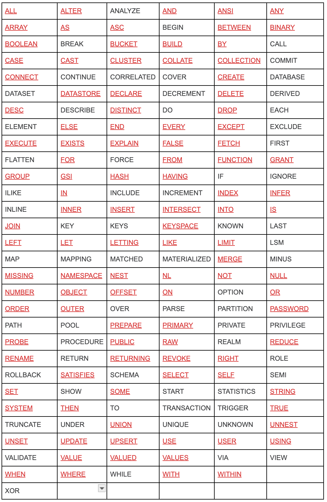
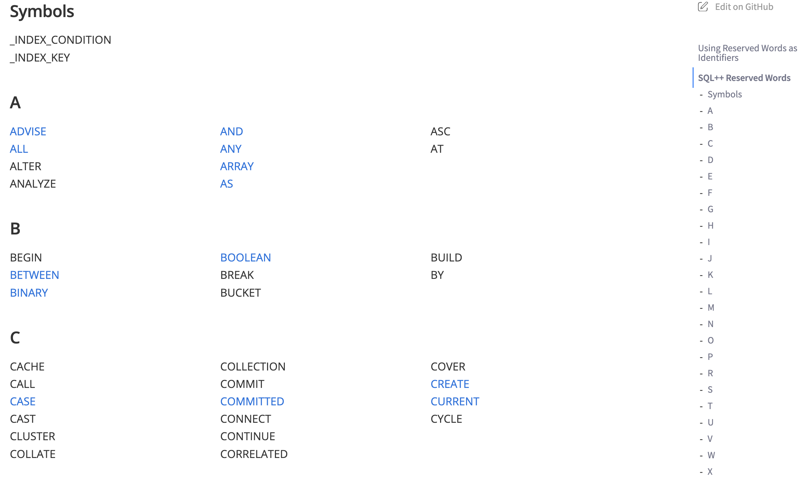
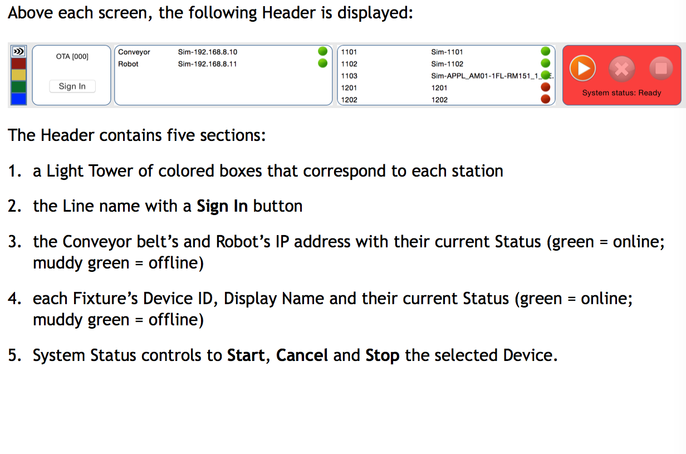
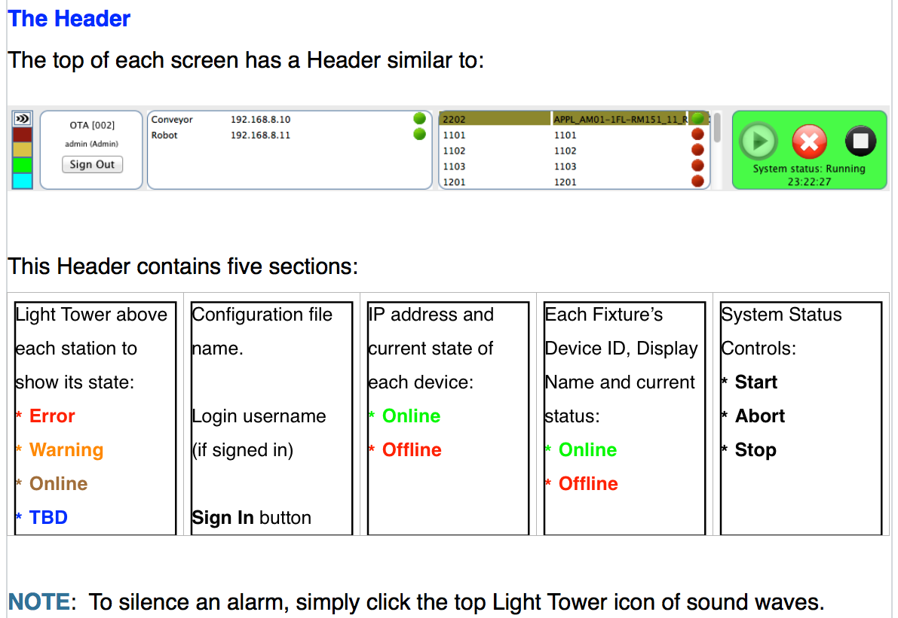
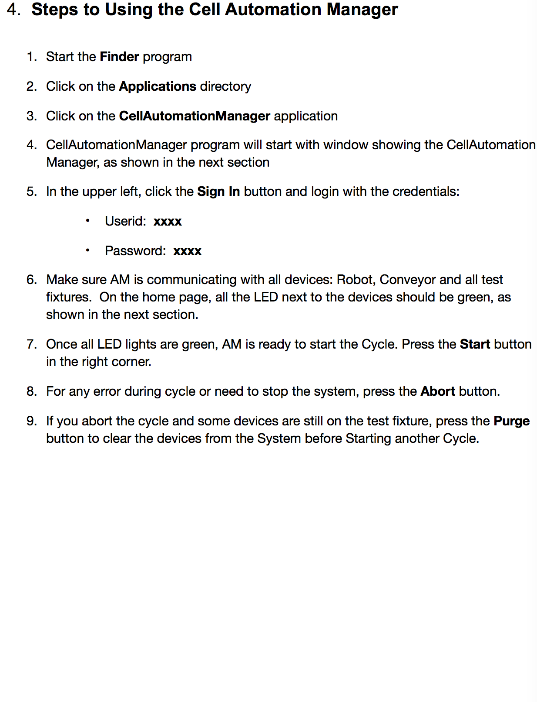
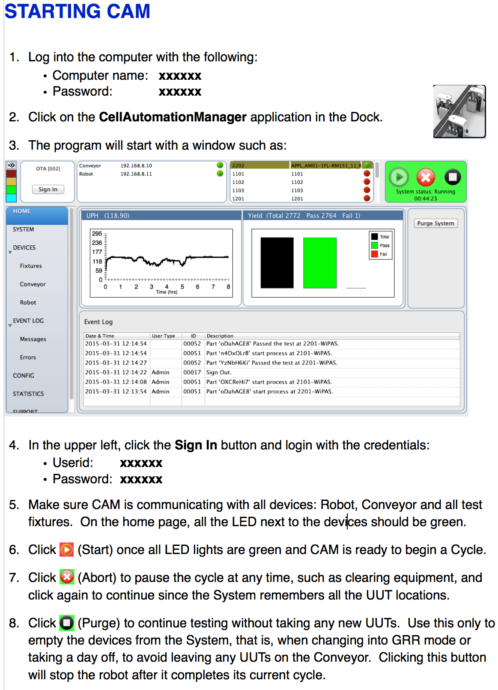
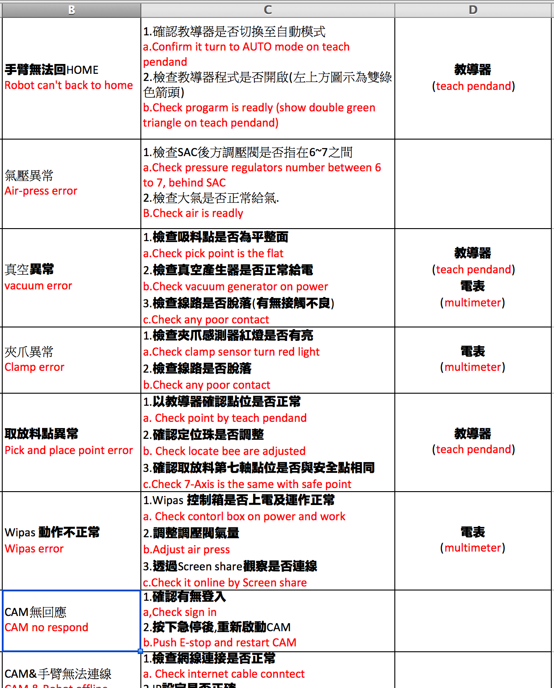
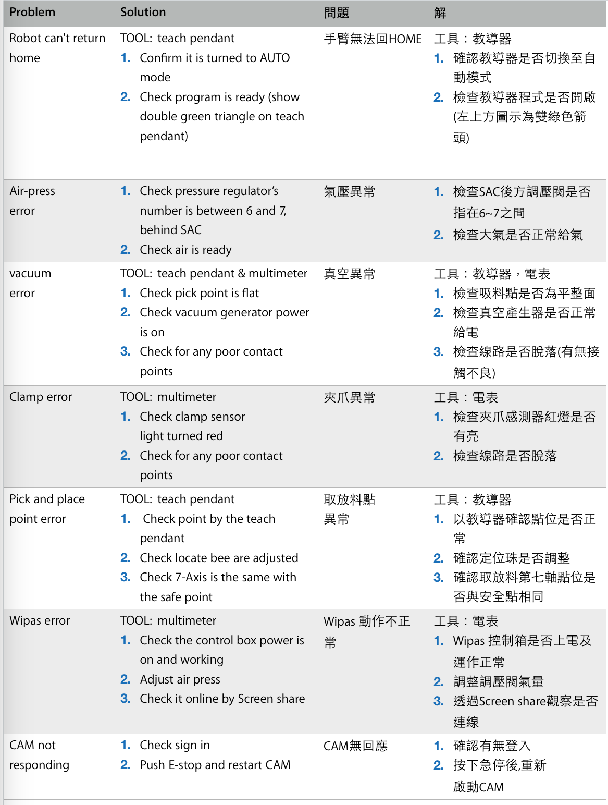
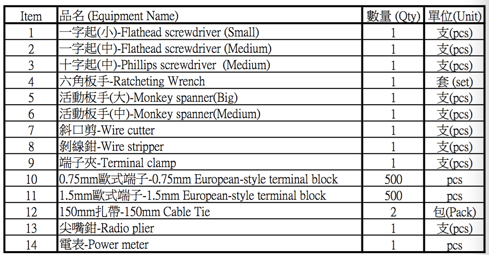
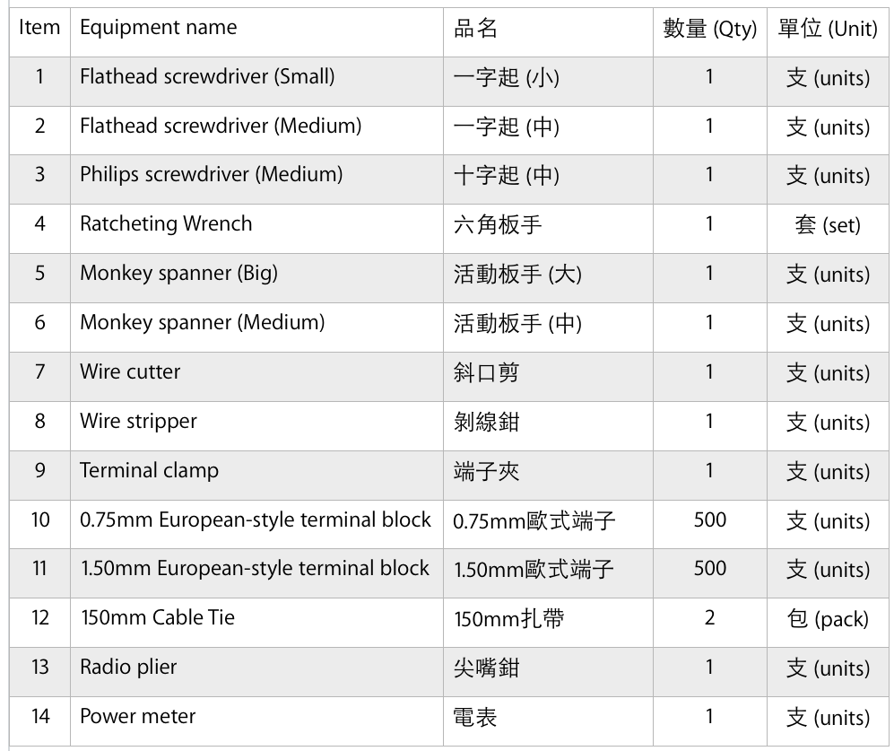

# BEFORE and AFTER UX items I improved

## Nium

### Information architecture

| Before (May 2024) | After (July 2025) |
|-------------------|-------------------|
| PROBLEM:   Short pages were hastily written by engineers who used more pages than needed     Total of 50 pages| MY SOLUTION:   I revamped and streamlined the information architecture to improve the flow and group related topics.     Total of 32 pages -- a reduction of 36% |
|  |  |

### Onboarding

| Before (Oct 2022) | After (Dec 2022) |
|-------------------|------------------|
| PROBLEM:   New clients were unable to onboard themselves due to the unclear method to them–-and even to Nium.     Each region (AU, EU, HK, SG, UK, US) contains five very complex spreadsheets describing various steps of onboarding for various client types and situations: | MY SOLUTION:   I created **[sections of customers with sub-pages](https://docs.nium.com/docs/onboarding)** for common onboarding steps and for region-specific parameter and example pages.     Immediately saw twice as many customers onboarded with 75% fewer Helpdesk requests. |
|  |  |

## Couchbase 

### Reserved words table

| Before (Apr 2018) | After (May 2018) |
|-------------------|------------------|
| Their list of reserved words fit on a single page. | Many words were added and needed a new way to display them. |
|  |  |

### Color-coded system table

| Before (Jan 2018) | After (Feb 2018) |
|-------------------|------------------|
| Their website contained a description of the system tables in a way that wasn't easy to read nor scan. | I converted their original layout to a color-coded table while keeping the same text. |
|  |  |

### Interview challenge

| Before (Apr 2017) | After (Apr 2017) |
|-------------------|------------------|
| During my interview, I was given 30 minutes to improve their website's page to be more readable and easier to understand. | I quickly made a graph and tables to show the concepts more clearly than the original "wall of text". |
|  |  |

## Apple

Apple's developer guides for the robots assembling iPads (left side) needed clarification and elaboration (right side) for their assembly line in China.

### User guide CAM header

| Before (Apr 2016) | After (May 2016) |
|-------------------|------------------|
| Items were numbered, even though they weren't steps. | I moved the text into five columns to be near the five sections they were describing. |
|  |  |

### Quickstart CAM

| Before (Apr 2016) | After (May 2016) |
|-------------------|------------------|
| It listed unnecessary steps while not having enought detail. | I removed unnecessary steps, added screenshots to clarify the descriptions, and elaborated some steps. |
 |  |

### Troubleshooting robot

| Before (Apr 2016) | After (May 2016) |
|-------------------|------------------|
| English and Chinese were intermixed and hard-to-read. | I moved the two languages into separate columns for easy scanning. |
|  |  |

### System admin tool set

| Before (Apr 2016) | After (May 2016) |
|-------------------|------------------|
| English and Chinese were intermixed and hard-to-read. | I moved the two languages into separate columns for easy scanning. |
 |  |

## TEDx Adventures

In 2013, TEDxBeaconStreet wanted their Adventures guidebook (left side) to have a newer and refreshed look while improving their wording (right side).

### Background

| Before (Apr 2012) | After (May 2012) |
|-------------------|------------------|
| TEDxBeaconStreet wanted their Adventures guidebook to have a newer and refreshed look while improving their wording. | I summarized the text by year to show the progression. |
|  |  |

### Rules

| Before (Apr 2012) | After (May 2012) |
|-------------------|------------------|
| TEDxBeaconStreet wanted their Adventures guidebook to have a newer and refreshed look while improving their wording. | Instead of numbered rules, I wanted short, easy-to-remember two-word phrases with a brief description. Adding photos felt warmer than a gray box. | 
|  |  | 

### Lifecycle

| Before (Apr 2012) | After (May 2012) |
|-------------------|------------------|
| Some TEDxBeaconStreet pages were simply notes of ideas that they wanted conveyed. | I took those notes and wrote about them in the same style as the other Adventure guidebook pages. | 
|  |  |

## Pristine

### Text-to-table

| Before (May 2008) | After (May 2008) |
|-------------------|------------------|
| Given text for translation. | I reduced cost by removing the repeated phrases and made the section easier-to-read by converting it into a table. |
|  |  |

## HP

### Localization languages

| Before (Jan 2007) | After (May 2007) |
|-------------------|------------------|
| Hewlett-Packard's translation division used an Excel table to track which languages a project have been translated into and then reviewed for accuracy. I thought it was odd they used the standard ISO 2-letter language code on the X-axis while using their internal 3-letter languge code on the Y-axis. | After changing the 3-letter code to the 2-letter code, I noticed that a language wasn't reviewed yet--a mistake that the responsible project manager didn't notice either! |
|  |  |
| | This resulted in a 20% drop in PM/Vendor mistakes and time. |
