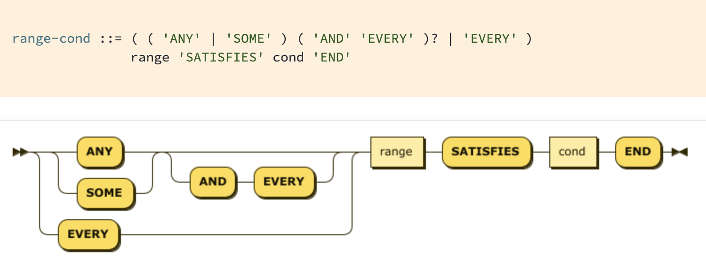
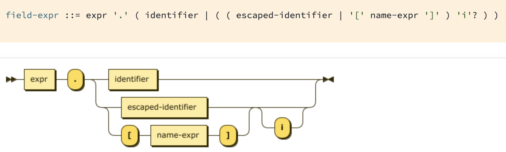

# Diagrams and illustrations

## Visio diagrams

### ADP

Diagram of the Comprehensive Outsourcing Services (COS) tax inquiry process

### Talk Group

Flowchart of their textbook creation process.

## Railroad diagrams

### Couchbase

## CorelDraw freehand

### NMT

Diagram of NMT's shipping routes in Asia, Australia, and New Zealand.

