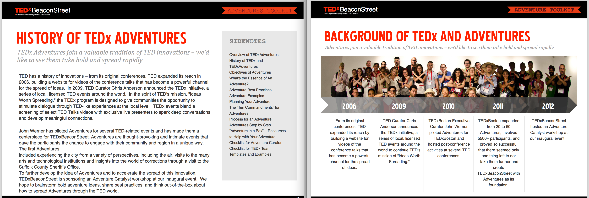
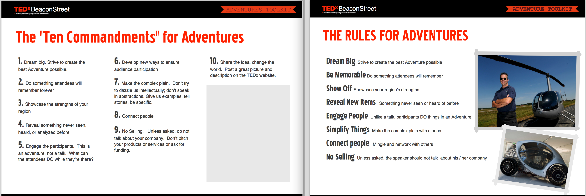

# Five favorite samples

## Developer guides

| Company   | Page link | Description |
|-----------|-----------|-------------|
| Nium      | **[Onboarding](https://docs.nium.com/docs/onboarding)** | Fintech onboarding varies by region and customer type. |
| Couchbase | **[Adaptive indexing](https://docs.couchbase.com/server/current/n1ql/n1ql-language-reference/adaptive-indexing.html)** | This database index type works on all or specified fields of a document. |

## BEFORE and AFTER

### Couchbase 

Their original layout (left side) was hard to read, so I converted it to a color-coded table (right side) while keeping the same text.

During my interview, I was given 20 minutes to improve their website's page (left side) to be more readable and easier to understand (right side).

### TEDx Adventures

TEDxBeaconStreet wanted their Adventures guidebook (left side) to have a newer and refreshed look while improving their wording (right side).

## Diagrams and illustrations

### ADP

Diagram of the Comprehensive Outsourcing Services tax inquiry process

### Talk Group

Flowchart of their textbook creation process.

### NMT

Diagram of NMT's shipping routes in Asia, Australia, and New Zealand.

