# Five favorite samples

## Technical blogs

| Post title                       | Brief description |
|----------------------------------|-------------------|
| **[Gmail agent for job auto-replies](https://guyklages.com/blog/gmail-agent-for-job-auto-replies)** | How I automated customized replies to the many recruiter emails I receive daily. |

## Developer guides

| Guide details | Brief description |
|---------------|-------------------|
| **[Streamlined onboarding](./most-impactful-tech-writing.md#70-more--70-fewer)** | Nium's customers couldn't self-onboard until I documented the process. |
| **[Adaptive indexing](https://docs.couchbase.com/server/current/n1ql/n1ql-language-reference/adaptive-indexing.html)** | Couchbase's new database index type works on all or specified fields of a document. |

## Before and After

### Couchbase

#### Color-coded system table

| Before (Jan 2018) | After (Feb 2018) |
|-------------------|------------------|
| Their website contained a description of the system tables in a way that wasn't easy to read nor scan. | I converted their original layout to a color-coded table while keeping the same text. |
| 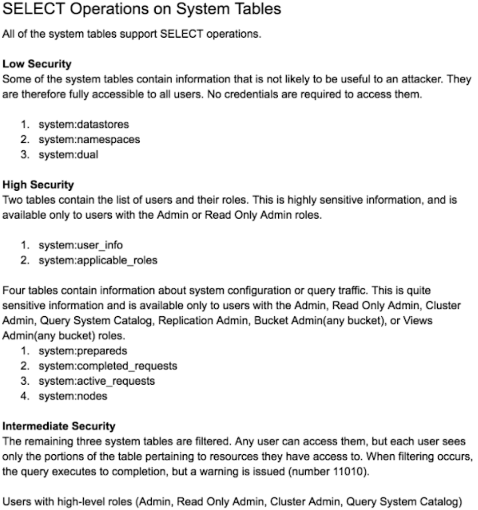 | 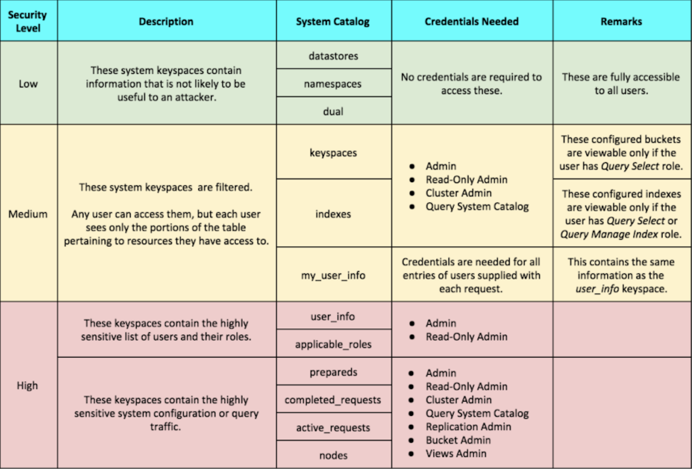 |

#### Interview challenge

| Before (Apr 2017) | After (Apr 2017) |
|-------------------|------------------|
| During my Couchbase interview, the manager gave me 30 minutes to improve their website's page to be more readable and easier to understand. | I quickly made a graph and tables to show the concepts more clearly than the original wall of text. |
| 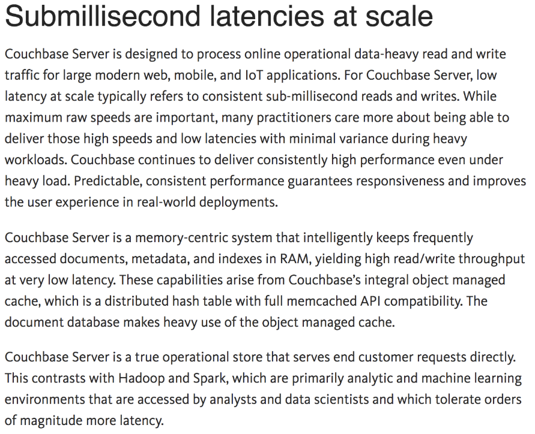 | 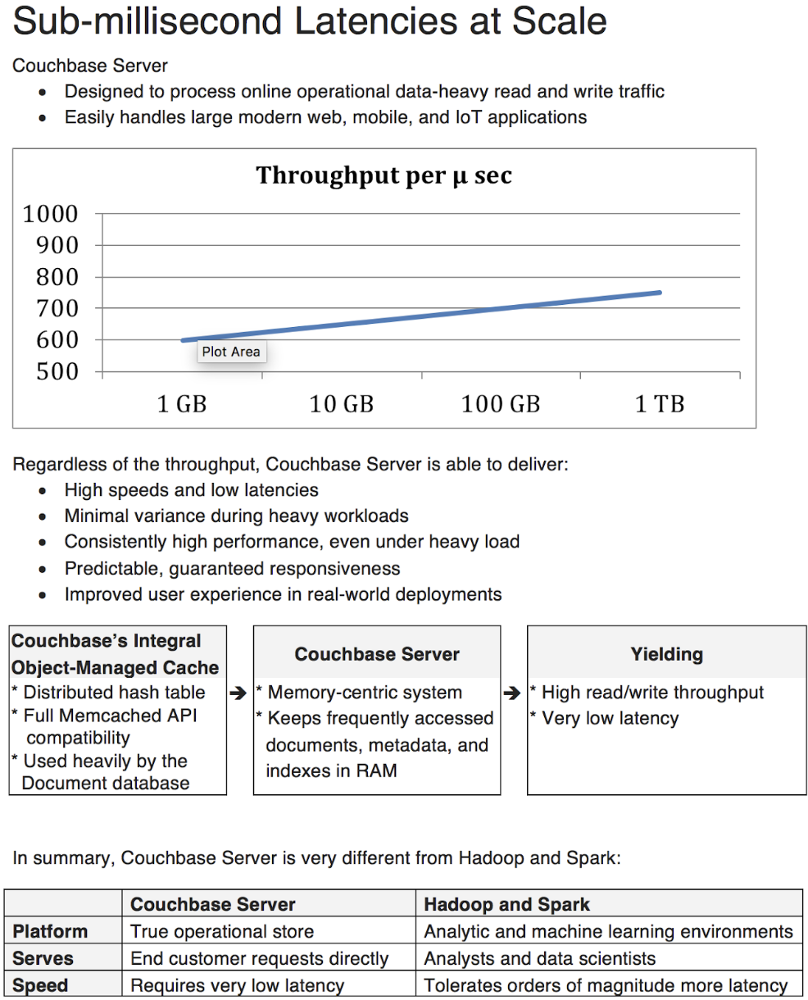 |

### TEDx Adventures

#### Background

| Before (Apr 2012) | After (May 2012) |
|-------------------|------------------|
| TEDxBeaconStreet wanted their Adventures guidebook to have a newer and refreshed look while improving their wording. | I summarized the text by year to show the progression. |
| 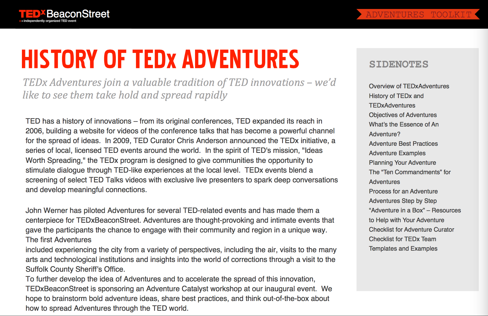 | 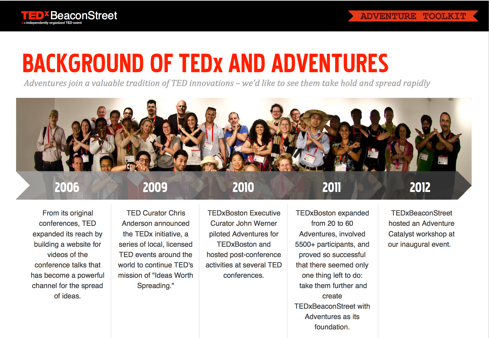 |

#### Rules

| Before (Apr 2012) | After (May 2012) |
|-------------------|------------------|
| TEDxBeaconStreet wanted their Adventures guidebook to have a newer and refreshed look while improving their wording. | I replaced the religious-sounding words with neutral "Rules", dropped the numbers, and reduced each rule to a two-word title with supporting text. |
| 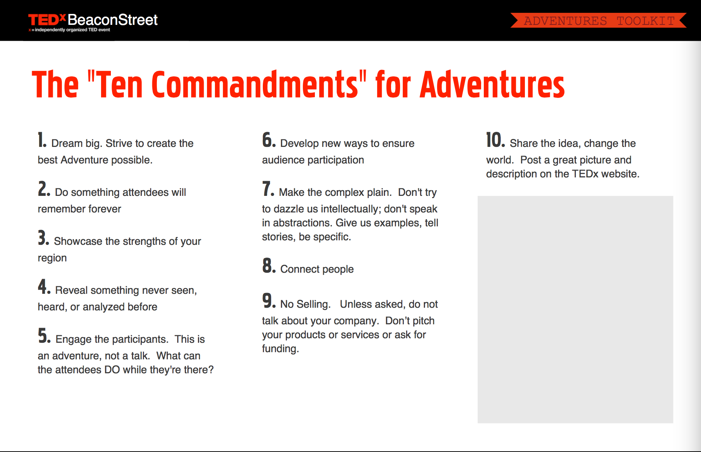 | 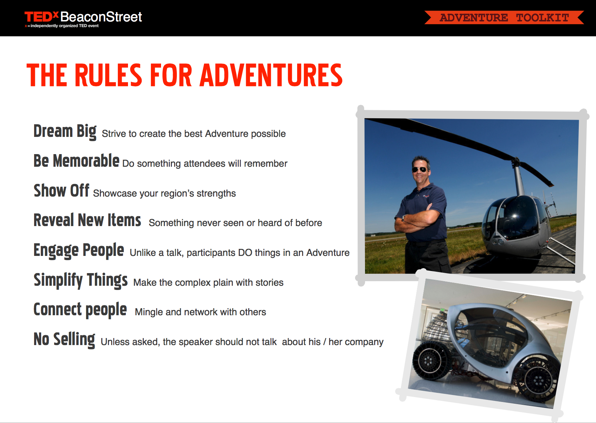 |

#### Lifecycle

| Before (Apr 2012) | After (May 2012) |
|-------------------|------------------|
| Some TEDxBeaconStreet pages were simply notes of ideas that they wanted conveyed. | I took those notes and wrote about them in the same style as the other Adventure guidebook pages. | 
| 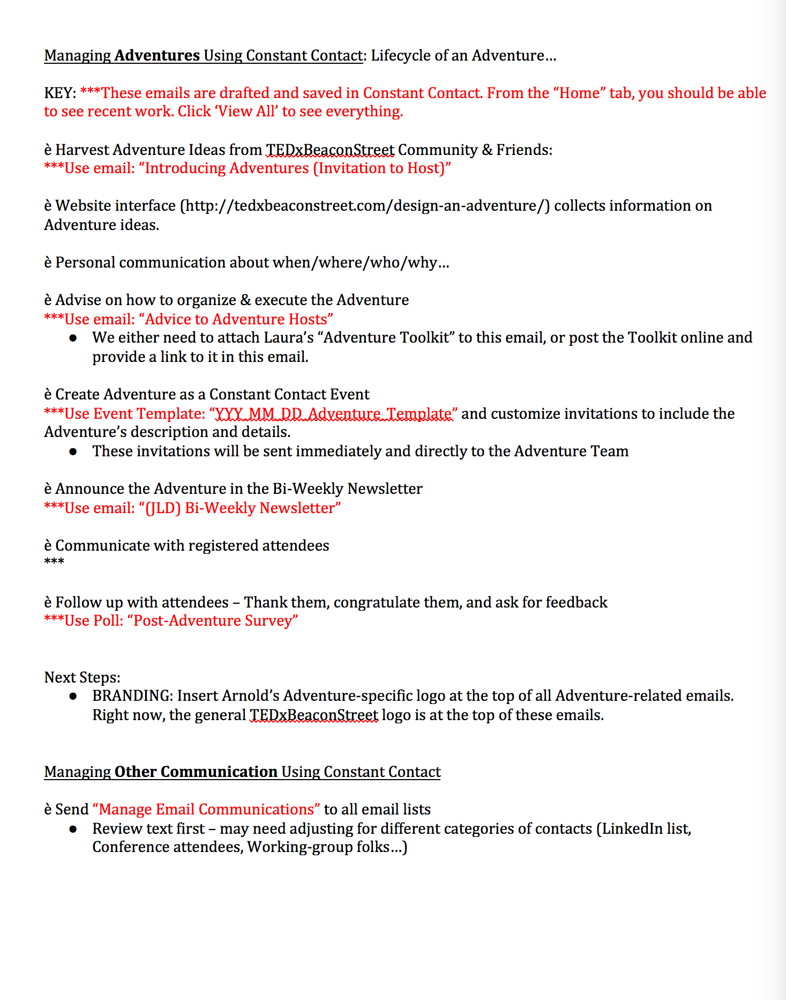 | 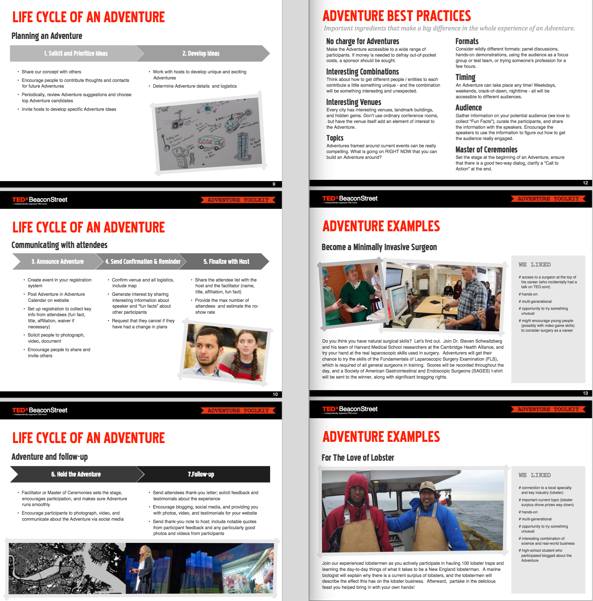 |

## Diagrams and illustrations

### ADP

Diagram of the Comprehensive Outsourcing Services (COS) tax inquiry process

### Talk Group

Flowchart of their textbook creation process.

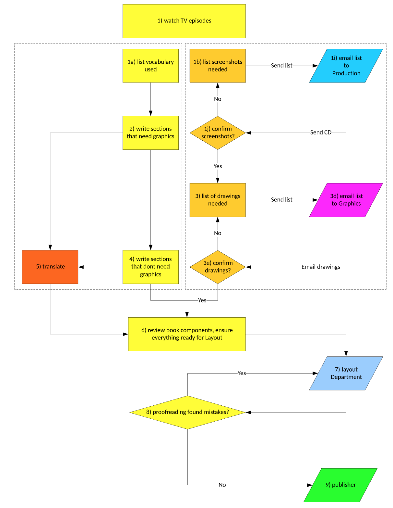

### NMT

Diagram of NMT's shipping routes in Asia, Australia, and New Zealand.

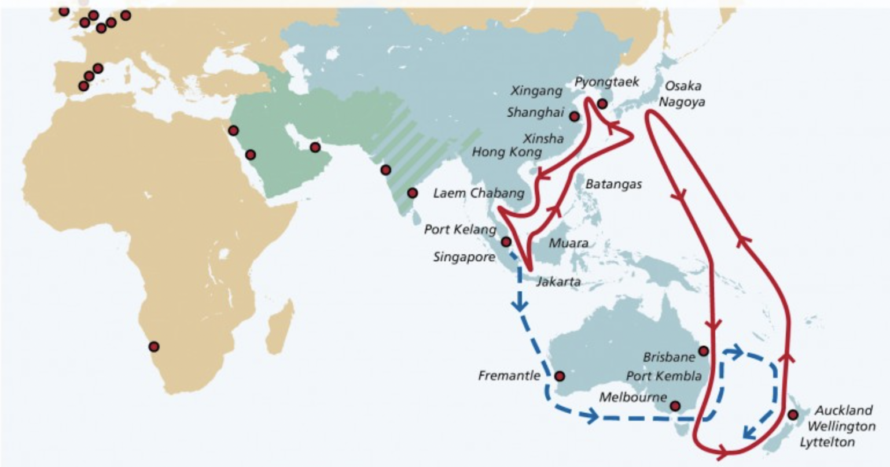