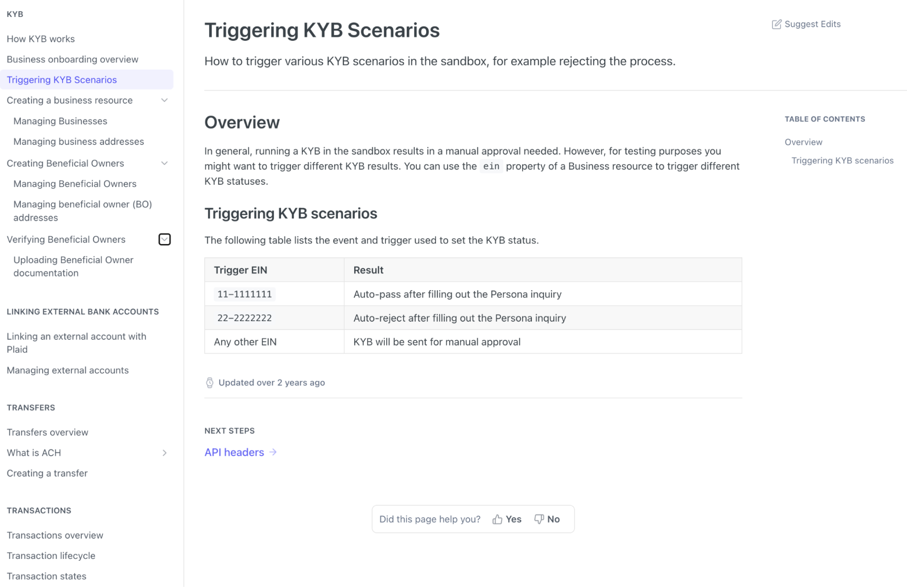
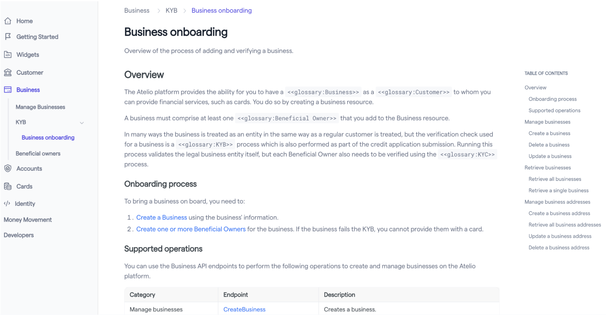
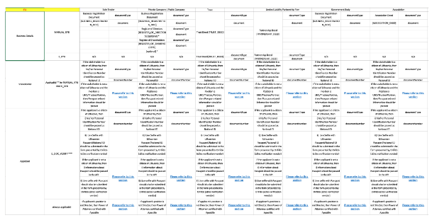
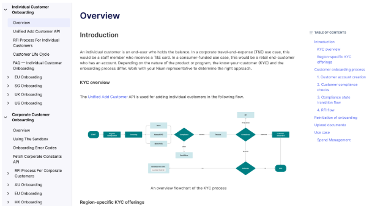
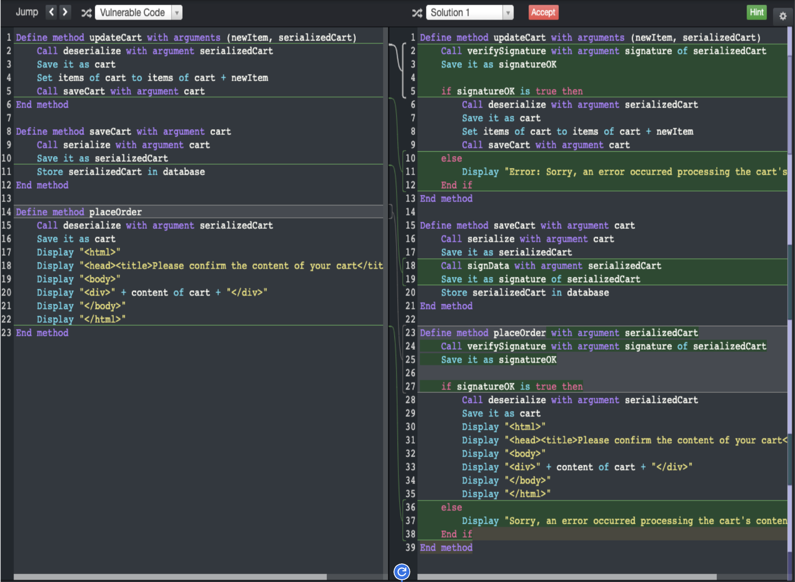
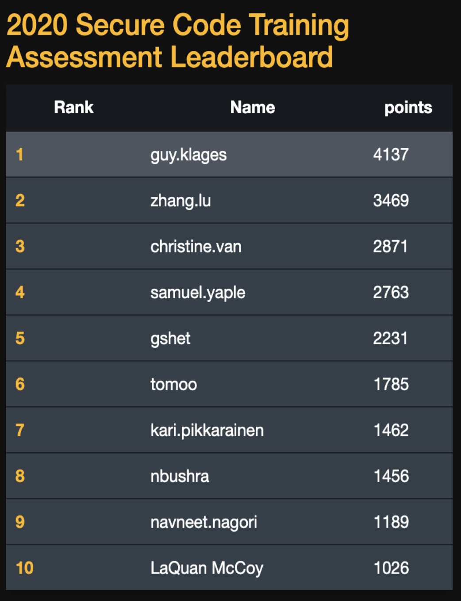

# Hardest problems I've solved

## Technical writing

### 36% page reduction from new IA

#### <mark>Nium -- Revamped the information architecture, reduced dev pages by 36%, and made navigation easier</mark>

| Before (May 2024) | After (July 2025) |
|-------------------|-------------------|
| PROBLEM:   Short pages were hastily written by engineers who used more pages than needed     Total of 50 pages| MY SOLUTION:   I revamped and streamlined the information architecture to improve the flow and group related topics.     Total of 32 pages |
|  |  |

### 2x onboarding with 75% fewer issues

#### <mark> Nium -- Doubled the number of people onboarded per month with 75% fewer issues </mark>

| Before (Oct 2022) | After (Dec 2022) |
|-------------------|------------------|
| PROBLEM:   New clients were unable to onboard themselves due to the unclear method to them–-and even to Nium.     Each region (AU, EU, HK, SG, UK, US) contains five very complex spreadsheets describing various steps of onboarding for various client types and situations: | MY SOLUTION:   I created **[sections of customers with sub-pages](https://docs.nium.com/docs/onboarding)** for common onboarding steps and for region-specific parameter and example pages.     Immediately saw twice as many customers onboarded and only a quarter of the Helpdesk requests for onboarding |
|  |  |

### Placed #1 in a cybersecurity challenge

#### <mark> Yahoo -- Among 2,733 Python developers, I was ranked as #1 in the Cybersecurity Code Warrior Challenge </mark>

| Before (May 2020) | After (May 2020) |
|-------------------|------------------|
| PROBLEM:   1. Find the 28 vulnerability types in 28 separate Python programs.   2. Then choose the best fix to block the vulnerability among 4 choices.   3. Incorrect guesses = fewer points.     I had never taken a cybersecurity course but had read many articles related to it. | MY SOLUTION:   - Since there was no time limit on the vulnerability questions, I had plenty of time to read and understand the code.   - I was able to imagine what might cause a problem and then how to block it. |
|  |  |
| | I was #1 among 2,733 developers ...   ... two weeks later, I was #42 among 7,624 |

### 30% fewer obsolete pages; automated reminders

#### <mark> Yahoo -- Reduced obsolete pages by 30% and added automation to reduce further </mark>

| Before (May 2019) | After (Dec 2019) |
|-------------------|------------------|
| PROBLEM:   Too&nbsp;many&nbsp;obsolete&nbsp;and&nbsp;disorganized&nbsp;document&nbsp;pages.   - Going to have an audit on all documentation pages.   - Most in Confluence, needing to be in Markdown.   - Many pages were obsolete but not clear which ones.   - Many pages were not in easily discoverable places.   - Many related pages/topics could be combined.   - Moving forward, how to prevent "stale" pages? | MY SOLUTION:   Implement reminders to review unmodified pages of a specified number of days.   - I reviewed pages with SMEs, archived obsolete pages, merged similar pages, organized them by product, and migrated them to Markdown in Yahoo's Git repo.   - I suggested a system of three tags on every page:   &nbsp;&nbsp;&nbsp;&nbsp;-`Owner`   &nbsp;&nbsp;&nbsp;&nbsp;-`LastModified`   &nbsp;&nbsp;&nbsp;&nbsp;-`DaysTillStale`   - A daily script looks for pages that haven't been edited in that page's time limit and sends an email to the owner of that page to review it (or the owner's manager). |
| | - Total number of pages reduced by 30%.   - Automated a timely reminder to page owners. |

### 0 help from engineers

#### <mark> Couchbase -- Needed a Linux install but no engineer was available to help </mark>

| Before (Apr 2018) | After (Apr 2018) |
|-------------------|------------------|
| PROBLEM:   Need&nbsp;to&nbsp;document&nbsp;features&nbsp;before&nbsp;testing&nbsp;is&nbsp;done.   - Couchbase Server v6.0 was still being coded.   - Less than half of v6.0 had completed QA testing.   - Documentation was needed for an event.   - There wasn't an installed instance I could use. | MY SOLUTION:   Install the Alpha version to use it and document it.     _(it was like installing Linux in 1996 before Google)_     1.  Find an unused server I could reformat.   2.  Download and install Ubuntu 18.0.   3.  Find, download, and install dependency files.   4.  Find, download, and compile CB v6.0 source code.   5.  Run Couchbase Server and create queries that use the new ANSI indexing and other new features. |
| | I was able to document pre-QA features in time for an event without help from the software developers. |

### 80% time saved on writing process

#### <mark> Couchbase -- Reduced the writing time of a new feature from 4-6 weeks to 4-5 days </mark>

| Before (Mar 2017) | After (Aug 2017) |
|-------------------|------------------|
| PROBLEM:   Turnaround&nbsp;time&nbsp;to&nbsp;add&nbsp;features&nbsp;took&nbsp;way&nbsp;too&nbsp;long.   1.  Writers authored a feature in Oxygen. (2-3d)   2.  Webpage staged for engineer review. (2-3h)   3.  Engineers eventually gave feedback. (3-5d)   4.  Webpage updated. (1-2d)     Time for iteration: 6-13d   x 2-4 iterations (going to Step 2)   ===============   Total of 4 - 6 _weeks_ per feature | MY SOLUTION:   Google Docs for synchronous writing/editing.   1. I authored a single feature in Google Docs and shared it with all engineers involved. (2-3d)   2. While engineers discussed how the feature will be finalized, I started on the next feature.   3. After the engineers finalized a feature's text, I imported it in Oxygen & staged it only _once_. (2-3h)   ===============   Total of 4 - 5 _days_ per feature | 
| | Average Saving:  5 weeks → 1 week = 80% time saved |

### 30% fewer helpdesk tickets

#### <mark> Couchbase -- Reduced the number of helpdesk tickets by 30% per week </mark>

| Before (Mar 2017) | After (Aug 2017) |
|-------------------|------------------|
| PROBLEM:   Customer&nbsp;Support&nbsp;had&nbsp;200+&nbsp;tickets&nbsp;to&nbsp;get&nbsp;through.   The existing documentation:   - didn't have examples   - didn't explain in-depth enough | MY SOLUTION:   I added:   - many examples with Couchbase's sample database   - elaborated explanations on many concepts in much more detail |
| | Helpdesk said the number of support tickets noticebly reduced by 30% each week. |

## Software development
