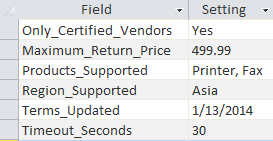
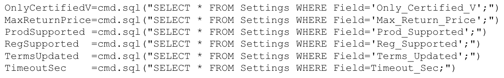
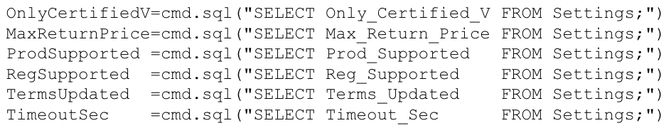

# Hardest software engineering problems

## DB saved 50% time, effort

#### ADP Payroll (Seattle) -- <mark> Made a database to automate reports; saved >50% of the employees' time and effort </mark>

| Before (Mar 2009) | After (Aug 2009) |
|-------------------|------------------|
| PROBLEM:   Payroll Specialists had very manual and labor-intensive reports to create.     They had everything in various spreadsheets and documents, which took a long time to sift through when compiling data needed for weekly reports. | MY SOLUTION:   Use a database to unify and create reports.     1. I created a Microsoft Access database to connect all of their spreadsheets and documents into one cohesive place.   2. I made reports that ran automatically on the schedule they needed them. |
| | This new system freed up at least 50% of their time which allowed them to do other things. |

## 88% drop in helpdesk queue

#### Microsoft (Shanghai) -- <mark> Redesigned their Helpdesk system that resulted in decimating their call queue </mark>

| Before (Feb 2003) | After (Mar 2003) |
|-------------------|------------------|
| PROBLEM:   Daily&nbsp;call&nbsp;queue&nbsp;of&nbsp;120+&nbsp;customers&nbsp;never&nbsp;reduced.     Each day, the director _randomly_ chose a _single_ time zone of North American customers to be called.     Microsoft’s policy:   1. Call the customer's _home_.   2. If no answer, call their _office_.   - But only on _another_ day.   3. If the 2nd call wasn’t answered, the case was _closed_ as “unanswered”. | MY SOLUTION:   Call customers' preferred number at preferred time.     1. I was hired to manage a call center where staff would write down customers' issues for Microsoft Engineers to reply; instead, I saw many issues I knew the answer to and solved most of them while the customers were on the phone.     2. I redesigned their website and system to:   - Use customers preferred phone number and time.   Sort USA calls by customers’ preferred time based on their time zone. |
|  | RESULTS:   - Queue reduced from 120 to 10 calls in 2 weeks.   - Duplicate and repeated calls reduced to 0.   - Customer satisfaction skyrocketed due to me solving most of their questions on the phone.

## 12x faster warranty website

#### HP (Mt. View) -- <mark> Redesigned their database tables; website ran about 12x faster </mark>

| Before (May 2001) | After (Aug 2001) |
|-------------------|------------------|
| PROBLEM:   Web application ran very slow.     Lead Engineer optimized the database table for _humans_:        His code that queried the database:      `SELECT *` needs 2 network trips (1 for field list + 1 for field)   `WHERE` clause requires scanning the whole table | MY SOLUTION:   I re-designed the database table and code.     I optimized the database table for _computers_:                I re-wrote his code as:        |
| | RESULT:   My code ran about 12 times faster. |

## 40% increase in productivity

#### Bridgestone -- <mark> Redesigned their label printing system; freed up staff's time by 40-50% </mark>

| Before (May 1999) | After (May 1999) |
|-------------------|------------------|
| PROBLEM:   Staff didn't have enough time to do everything needed.     1. Staff would print the labels needed for a single part of a particular batch.  (5 min)     2. Staff would wait 15 - 20 minutes until that part finished before printing labels for the next part because their SQL application would print only one part at a time.     3. Staff would go back to Step 1, repeating the long wait times throughout the day. | MY SOLUTION:   Change how their SQL Server application operates to select and print labels of all steps of a batch at a single time.     I re-designed their software to print the labels of all steps of a given batch at a single time, so the staff were available to do other things while all the needed labels printed on their own. |
| | RESULTS:   The staff's waiting time (40 - 50% of the day) became productive time on other tasks |

## 0 wrong orders + time saved

#### Pueblo Grocery -- <mark> Created a database product ordering system that resulted in no more wrong orders and 25% time saved </mark>

| Before (Mar 1999) | After (Apr 1999) |
|-------------------|------------------|
| PROBLEM:   There were so many wrong orders.     Staff would walk up and down aisles to count the number of each item on the shelves as well as the number in the storage room to determine when and how much to re-order.  (1 - 2 hours every day) | MY SOLUTION:   Use&nbsp;a&nbsp;database&nbsp;to&nbsp;streamline&nbsp;their&nbsp;ordering&nbsp;process.     1. I created a SQL database that received item information directly from their pricing guns and check-out registers.     2. I wrote queries and reports to show how often each item was being bought and when to order more of each item. |
| | RESULTS:   - no more wrong orders   - 25% saved of staff's daily time |

## $1 million per month saved

#### Mall landlord -- <mark> Ran database queries to uncover a 1% discrepency in monthly rent totals </mark>

| Before (Aug 1998) | After (Sep 1998) |
|-------------------|------------------|
| SITUATION:   The landlord of a mall billed his renting stores and shops every month. Over $100 million each month.     Seeing 9-digit numbers made me think about things I've seen in various movies, so I wondered if these numbers were accurate since a tiny amount off would be easily missed and probably nobody would notice. | MY SOLUTION:   I made SQL queries to confirm the monthly totals that were coming out of their Siteseer application. |
| | RESULT:   The numbers were, in fact, off by 1%, which equated to a little more than $1 million dollars each month. |

## Law contracts that reuse text

#### Law firm -- <mark> Created DITA-like database to reuse paragraphs of text in multiple contracts </mark>

| Before (Mar 1998) | After (Apr 1998) |
|-------------------|------------------|
| PROBLEM:   Law firm made dozens of contracts daily and needed an easier way to create new contracts by reusing existing paragraphs in other contracts. They were spending way too much time copying-and-pasting. And they wanted to be able to reuse paragraphs in any order in their new contracts.     And they needed a solution that used only their existing software: Microsoft Office.     A. Using MS Word, paralegals would search for paragraphs of text that their firm had written in other contracts to copy and paste them into a new contract.     B. This was very time-consuming and tedious.     C. They didn't have a central place for all paragraphs that were commonly reused in their client contracts. | MY SOLUTION:   Per their budget, I created a Microsoft Access database to store all of their contract paragraphs and made a form mechanism to add paragraphs to a new contract that allowed them to rearrange the paragraphs.     I created a database with four tables:   - _Paragraph_Type_ for the category and use cases   -&nbsp;_Paragraph_Text_&nbsp;for&nbsp;the&nbsp;text,&nbsp;keywords,&nbsp;and&nbsp;Paragraph_Type   - _Contract_Type_ for the different contract categories   - _Contract_Template_ of the commonly used contracts pre-filled with common paragraphs     I made a mechanism that shows a blank form where the lawyer would choose from dropdown lists the paragraph types and paragraphs of text, searchable by keywords, and movable (up or down) within the new contract.     I made queries to find specific paragraphs.     I made reports that were contracts with all of their front matter followed by their desired paragraphs followed by the legal disclaimers at the end. |
| | RESULT:   I created something similar to DITA three years before IBM. The law firm loved their new contract-creation system. |

## Company reorg Visualization

#### Applied Materials (Santa Clara) -- <mark> Displayed dynamically how different company reorganization scenarios would affect the whole </mark>

| Before (Aug 1997) | After (Sep 1997) |
|-------------------|------------------|
| PROBLEM:   The company wanted to predict how different reorg scenarios would affect productivity:   - How would each help or harm AMAT?   - What type of imbalances would be created?   - What type of skill gaps would be formed?   - How would each affect HR and dept budgets?     Based on Performance Reviews (Powerpoint decks):   - Strengths and Weaknesses in each person & dept   - Skill sets and which ones were needed   - Personality types and teams worked with     Based&nbsp;on&nbsp;Compensation&nbsp;Packages&nbsp;(PeopleSoft&nbsp;DB):   - Salary and Bonus types   - Department-specific Perks | MY SOLUTION:   A dynamically rendered webpage table created from an Access database with VB code and PeopleSoft.     1. The user would list which departments would report to new managers/departments in a proposed reorg.     2. My application generated a table spanning 3 screens horizontally and 4 screens vertically to summarize how each Category of each Department would be affected in the proposed reorg (color-coded for items gained/lost). |
| | RESULT:   An amazing modeling tool ahead of its time. |

## 1,000s of duplicates in prod

#### Komodo Toys (Hong Kong) -- <mark> Removed 1,000s of duplicate records while database was in production </mark>

| Before (Mar 1997) | After (Apr 1997) |
|-------------------|------------------|
| PROBLEM:   There were 10,000's of duplicate addresses in a 100,000+ row SQL database due to being entered slightly differently.     3,000 - 5000 records are added every day, 24/7.     3 - 5 people always using 1 MS Access database.     Hong Kong customers enter addresses differently:   - Sometimes adding their complex’s name, or not   - Writing the complex's name above or below the street name   - Sometimes adding postal code, or not   - Sometimes abbreviating different words  &nbsp;&nbsp;&nbsp;&nbsp;&nbsp;- District / Dst / Dstct / D.  &nbsp;&nbsp;&nbsp;&nbsp;&nbsp;- Complex / Cmplx / Cmpx  &nbsp;&nbsp;&nbsp;&nbsp;&nbsp;- Phase / Building / Bldg / Suite / Ste   - Sometime using different number formats  &nbsp;&nbsp;&nbsp;&nbsp;&nbsp;- Roman (I, II, III, etc.)  &nbsp;&nbsp;&nbsp;&nbsp;&nbsp;- English (1, 2, 3, etc.)  &nbsp;&nbsp;&nbsp;&nbsp;&nbsp;- Chinese (一，二，三, etc.) | MY SOLUTION:   Make every address field a dropdown list in order to make a unique key by concatenating the distinctive fields.     Make every address field a dropdown list:   - _District_&nbsp;&nbsp;&nbsp;&nbsp;&nbsp;&nbsp;&nbsp;&nbsp; (Tsimshatsui, Mongkok, etc.)   - _Complex_&nbsp;&nbsp;&nbsp;&nbsp;&nbsp; (The Red Dragon, etc.)   - _Section_&nbsp;&nbsp;&nbsp;&nbsp;&nbsp;&nbsp;&nbsp; (Phase, Building, Bldg., etc.)   - _Room_&nbsp;&nbsp;&nbsp;&nbsp;&nbsp;&nbsp;&nbsp;&nbsp;&nbsp;&nbsp; (Suite, Ste., #, Number, No., etc.)   - _Number_&nbsp;&nbsp;&nbsp;&nbsp;&nbsp;&nbsp; (6, 06, VI, 六)     Add a field that is a concatenation of key fields.   - District, Street, Room Numbers, etc.     Query the new concatenated field for duplicates.   - Delete the duplicates.     Add a Unique Key restraint on the new key field.   - To prevent the entering of duplicate records. |
| | RESULTS:   Desired duplicate-free list with < 5 minutes of downtime. |

## 3 dept unified with a database

#### Lung Electronics (Hong Kong) -- <mark> Unified the Marketing, Testing, and Sales departments with a database </mark>

| Before (Mar 1996) | After (Apr 1997) |
|-------------------|------------------|
| SITUATION:   - 1,000's of products sourced from Taiwan.   - 10 PMs tracked their products their own way.   -&nbsp;PMs&nbsp;swapped&nbsp;products&nbsp;every&nbsp;month&nbsp;to&nbsp;avoid&nbsp;fraud.   - Products needed to be tested for quality.   - Sales people sold products in Europe.     PROBLEM:   PMs and Sales people spent many days each month learning new products that were organized differently. | MY SOLUTION:   Combine all products into a unified database to normalize how all products are organized.     - Product-switching took only a few minutes.   - Easier to track who managed which products when.   - Easier to sell since all data was available in real-time.   - Faster to track which ones needed testing, which were being tested, which passed, and which failed. |
| | RESULTS:   When a visiting Oracle engineer saw what I created (especially the table headers change specs to match the selected product), he was stunned and said, "I didn't know Access could do that!" |

## Removed virus before common

#### Interbase Solutions (Santa Clara) -- <mark> Removed a virus before the concept of a computer virus was common knowledge </mark>

| Before (May 1988) | After (May 1988) |
|-------------------|------------------|
| PROBLEM:   Windows 2.0 installation would stop after 3 minutes. | MY SOLUTION:   I removed an unknown virus the four consultants with Masters degrees couldn't diagnose.     I ran the installation; it stopped after 3 min.     Days earlier at school, I had talked with fellow computer nerds about a new thing called a "virus" and had borrowed their Norton Utilities software.     There was, in fact, a virus on the customer's install disk, which I removed and finished the installation in 40 min. |
|  | RESULTS:   - Client's wife said, "I was doubtful when I saw your shoebox of floppy disks, but you fixed something four other $100/hr men with Masters degrees couldn't do after a few hours--good job!"   - I had already stated $12/hr. |
