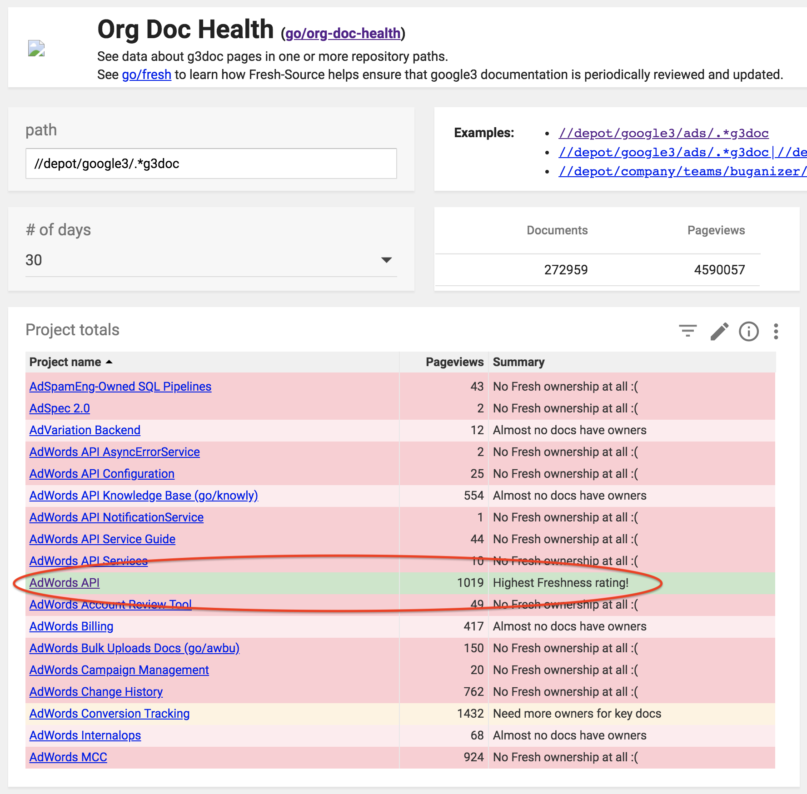

# Most impactful automating

### Overview

| Automated item                                                                                                | Year | Company |
|---------------------------------------------------------------------------------------------------------------|------|---------|
| [Syncing of auth statuses for dozens of cloud services](#syncing-authorization-statuses)                      | 2025 | Atelio    _San Francisco, CA_  |
| [Reduced obsolete pages by 40% and added automation to prevent obsolete pages](#prevention-on-obsolete-pages) | 2019 | Yahoo    _Sunnyvale, CA_  |
| [Made a database to automate reports; saved >50% of the employees' time and effort](#db-saved-50-time-effort) | 2009 | ADP Payroll    _Seattle, WA_  |
| [Automated their label printing system; freed up 75% of staff's time](#75-increase-in-productivity)           | 1999 | Bridgestone    _Bloomington, IL_  |

## Automated

### Syncing authorization statuses

#### Atelio (San Francisco, CA) -- <mark> Synced the authorization status for dozens of cloud services across AWS, Azure, and GCP </mark>

| Before (Aug 2025) | After (Sep 2025) |
|-------------------|------------------|
| PROBLEM:   Documentation pages show the current authorization status (GovCloud, DefRAMP) for dozens of cloud services, and since these statuses change daily, it's a huge manual effort to maintain. | MY SOLUTION:   I wrote a TypeScript script to automate the collection and updating of these many services.    For a few weeks, I manually ran my script daily, then the DevOps team folded it into the pipeline. |

### Prevention of obsolete pages

#### Yahoo (Sunnyvale, CA) –– <mark> Reduced obsolete pages by 40% and added automation to prevent obsolete pages in the future</mark>

| Before (May 2019) | After (Dec 2019) |
|-------------------|------------------|
| PROBLEM:   Too&nbsp;many&nbsp;obsolete&nbsp;and&nbsp;disorganized&nbsp;document&nbsp;pages.   - Going to have an audit on all documentation pages.   - Most in Confluence, needing to be in Markdown.   - Many pages were obsolete but not clear which ones.   - Many pages were not in easily discoverable places.   - Many related pages/topics belong together.   - Moving forward, how to prevent "stale" pages? | MY SOLUTION:   Implement reminders to review unmodified pages of a specified number of days.   - I reviewed pages with SMEs   - Archived obsolete pages   - Merged similar pages   - Organized pages by product   - Migrated them to Markdown in Yahoo's GitHub   - I suggested a system of tags on every page:   &nbsp;&nbsp;&nbsp;&nbsp;-`Owner`, `LastModified`, `DaysTillStale`   - A daily script looks for pages that nobody has edited in that page's time limit and sends an email to the owner (or owner's manager) of that page to review it. |
| Originally had 1,439 pages   I revamped to 849 pages | RESULTS:   - Total number of pages reduced by 40%.   - Automated a timely reminder for page owners to review. |

### DB saved 50% time, effort

#### ADP Payroll (Seattle, WA) –– <mark> Made a database to automate reports; saved >50% of the employees' time and effort </mark>

| Before (Mar 2009) | After (Aug 2009) |
|-------------------|------------------|
| PROBLEM:   Payroll Specialists had very manual and labor-intensive reports to create.     They had everything in various spreadsheets and documents, which took a long time to sift through when compiling data needed for weekly reports. | MY SOLUTION:   Use a database to unify and create reports.     1. I created a Microsoft Access database to connect all of their spreadsheets and documents into one cohesive place.   2. I made reports that ran automatically on the schedule they needed them. |
| What used to take 8 hours, now took 4 hours. | RESULTS:   This new system freed up at least 50% of their time which allowed them to do other things. |

### 75% increase in productivity

#### Bridgestone (Bloomington, IL) –– <mark> Automated their label printing system; freed up 75% of staff's time </mark>

<!-- May 1999 - May 1999 -->

| Before | After |
|--------|-------|
| PROBLEM:   Staff didn't have enough time to do everything needed.     1. Staff would print the labels needed for a single part of a particular batch.  (5 min)     2. Staff would wait (15 min) until that part finished before printing labels for the next part because their SQL application would print only one part at a time.     3. Staff would go back to Step 1, repeating the long wait times throughout the day. | MY SOLUTION:   Change how their SQL Server application operates to select and print labels of all steps of a batch at a single time.     I re-designed their software to print all labels of all steps of a given batch at a single time, so the staff were available to do other things while all the needed labels printed on their own. |
| 15 of every 20 min were waiting (75%)| RESULTS:   The staff's waiting time (75% of the day) became productive time on other tasks |

## Simplified

Some things can't be fully automated, but they can be vastly simplified or mostly automated.

### 69% fewer pages via new IA

#### Atelio of FIS Global (San Francisco, CA) –– <mark> Revamped information architecture (IA), reduced dev pages and navigation by 69% </mark>

| Before (May 2024) | After (July 2025) |
|-------------------|-------------------|
| PROBLEM:   - Pages were hastily written by engineers   - Pages were one-fourth to one-half of a screen each   - 104 pages (three levels deep) in the left-nav   - Google Analytics showed customers clicking through many pages before the one they needed     Total of 104 pages| MY SOLUTION:   - I combined pages that had been artificially split   - I revamped and streamlined the IA to improve the flow   - The number of customer clicks dropped dramatically     [Total of 32 pages](https://guyklages.com/docs/atelio/getting-started/client-config) |
|  |  |
| (my 32 pg) / (inherited 104 pg) = 31% of the original | RESULTS:   69% fewer pages and customer clicks to find data. |

### 56% fewer pages

#### Google (Mt. View, CA) –– <mark> A dept added doc pages for 5 years without checking for "freshness" and needed to be revamped </mark>

| Before (May 2018) | After (Nov 2018) |
|-------------------|------------------|
| PROBLEM:   Over 5 years, there were many writers    Each time, a new Confluence page was added instead of updating existing ones    10-20 links were added on every page as a way to "reuse" content    Nobody knew how many pages there were    The rest of the company used Markdown and g3docs | MY SOLUTION:   Four phases that must be done in that order because you can't safely restructure or change links until you know the full scope of what exists and what points to it.    1. **Audit** I started by mapping the entire corpus into a spreadsheet: every page, which pages it linked to, and which pages linked to it, making a real inventory. Confluence's last-modified metadata told me who owned or last edited each page, so I knew how to contact the right SME for questions. I then read every page for accuracy, clarity, and completeness, made minor corrections as I went, and clicked through every single link to confirm it worked and record its destination in the spreadsheet.    2. **Triage** This step was partly done during the Audit step and partly after. Each document needed to be assigned one of four categories:   &nbsp;&nbsp;A) Keep as-is   &nbsp;&nbsp;B) Update   &nbsp;&nbsp;C) Merge with other content   &nbsp;&nbsp;D) Retire (obsolete)   This process also exposed documentation gaps where users didn't have enough information to complete important tasks.    3. **Restructure** Only now I started rebuilding the pages in Markdown with better structure (headers, bullets, tables, diagrams instead of dense paragraphs) and mark it "Done" in the tracker spreadsheet. I deliberately didn't try to reorganize the IA mid-audit because combining and reordering pages only became possible after I could see the whole, now-leaner corpus with the obsolete pages already removed.    4. **Link preservation** Before any page went live in its new form, I set up redirects from every old URL to its new location and maintained a URL mapping table tracking the changes. That table did two jobs:   &nbsp;&nbsp;A) it preserved existing deep links so nothing broke   &nbsp;&nbsp;B) it prevented slug collisions, making sure a newly restructured page's URL didn't   &nbsp;&nbsp;&nbsp;accidentally reuse a slug that an old, still-redirecting page needed.   I've relied on the same redirect-and-mapping discipline on smaller projects too, like a URL naming convention overhaul at Nium. The scale was different, but the failure mode it prevents is the same. |
| 173 &nbsp;&nbsp;&nbsp; final pages   ----   386 &nbsp;&nbsp; original pages    = 44%  | RESULTS:   56% fewer pages and #1 dept.    |

### 80% time saved on writing

#### Couchbase (Santa Clara, CA) –– <mark> Reduced the writing process of a new feature from 4-6 weeks to 4-5 days </mark>

| Before (Mar 2017) | After (Aug 2017) |
|-------------------|------------------|
| PROBLEM:   Turnaround&nbsp;time&nbsp;to&nbsp;add&nbsp;features&nbsp;took&nbsp;way&nbsp;too&nbsp;long.   1.  Writers authored a feature in Oxygen. (2-3d)   2.  Webpage staged for engineer review. (2-3h)   3.  Engineers eventually gave feedback. (3-5d)   4.  Webpage updated. (1-2d)     Time for iteration: 6-13d   x 2-4 iterations (going to Step 2)   ========================   Total of 4 - 6 _weeks_ per feature | MY SOLUTION:   Google Docs for synchronous writing/editing.   1. I authored a single feature in Google Docs and shared it with all engineers involved. (2-3d)   2. While engineers discussed how the feature will be finalized, I started on the next feature.   3. After the engineers finalized a feature's text, I imported it in Oxygen and staged it only _once_. (2-3h)   ======================   Total of 4 - 5 _days_ per feature | 
| | RESULTS:   Average time saved:  5 weeks → 1 week (80%) |

### Saved 85% of translation

#### Pristine (Taipei) –– <mark> Improved readability while saving 85% on translation costs by converting paragraphs to a table </mark>

| Before (May 2008) | After (May 2008) |
|-------------------|------------------|
| I was given text for translation. | I reduced the translation cost by removing the repeated phrases while making it easier-to-read by converting the paragraphs into a table. |
|  |  |
| | RESULTS:   By reducing the number of words, translation costs reduced by 85%. |