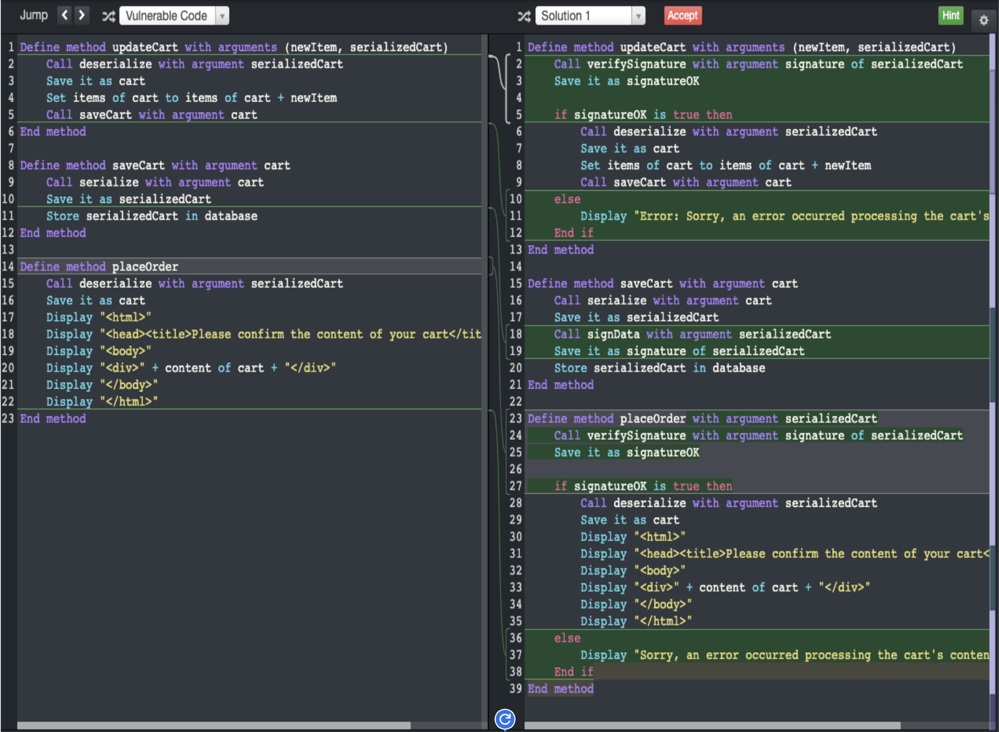
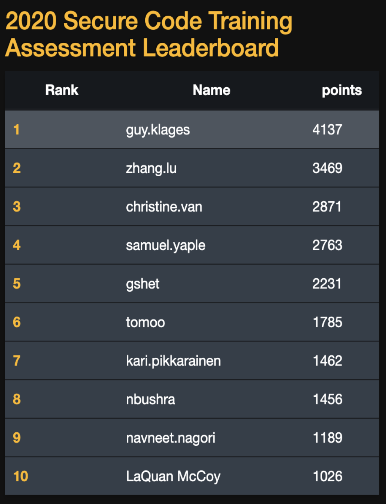
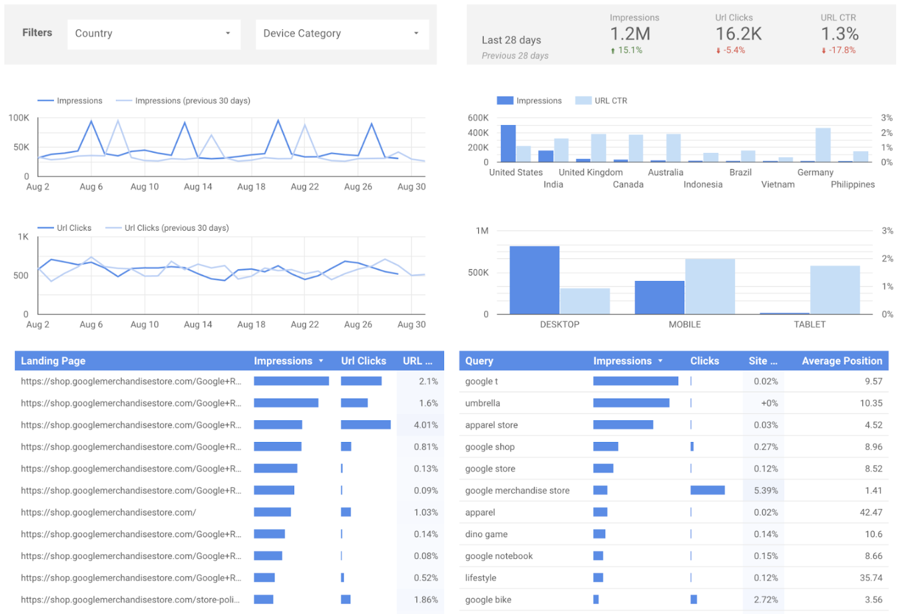

# Most impactful technical writing

## Overview

| Accomplishment  | Year | Company |
|-----------------|------|---------|
| - [Used AI to save 99% of the time it would've taken me](#used-ai-to-save-99-of-time)   - [69% fewer pages from changing the Information Architecture](#69-fewer-pages-via-new-ia)  | 2025 | Atelio of FIS Global    _Seattle, WA_  |
| - [2x the clarity from elaboration + 101 new pages added](#2x-clarity--101-new-pages)   - [70% more customers onboarded + 70% fewer helpdesk tickets filed](#70-more--70-fewer)  | 2023 | Nium    _San Francisco, CA_  |
| - [#1 cybersecurity coder in Secure Code Warrior Challenge in Python](#1-cybersecurity-coder)   - [40% fewer pages from IA changes and removal of obsolete pages](#40-fewer-pages)  | 2020 | Yahoo    _Sunnyvale, CA_  |
| - [#1 dept (company-wide) in documentation "freshness"](#1-dept-in-documention)   - [Defragmented 5 year-old documentation set](#defragmented-5yo-doc-set)  | 2018 | Google    _Mt. View, CA_  |
| - [0 help from engineers to install a non-compiled beta version of software](#0-help-from-engineers)   - [80% time saved on the writing process of a new feature](#80-time-saved-on-writing)   - [30% fewer helpdesk tickets due to improved documentation](#30-fewer-helpdesk-tickets)   - [I solved the opposite priorities of 2 VPs with data](#2-vps-of-opposite-priorities) | 2017 | Couchbase    _Santa Clara, CA_  |
| - [50% less time to create clinical trials due to fewer errors](#50-less-time--fewer-errors)   - [1/3rd the time to edit and eDC clinical trial questionnaire](#13rd-the-time-to-edit-edc) | 2012 | VA Medical Center     _Boston, MA_  |
| - [#1 in a Green Environment Campaign for my ideas that save 20-30% of paper](#1-in-a-green-campaign) | 2008 | Hewlett-Packard    _Singapore_  |

## Used AI to save 99% of time

#### Atelio of FIS Global (Seattle, WA) –– <mark> I used AI to create a 1st draft of a dev guide from Slack messages in 1% of the time </mark>

| Before (Sep 2025) | After (Sep 2025)  |
|-------------------|-------------------|
| PROBLEM:   Over two weeks of multiple daily group Slack messages, ten fintech PMs and SMEs were discussing and gradually deciding the specs, functionalities, details, and limitations of a new mobile app financial tool.    After they gradually solved or finalized different aspects of the new product, they then asked me to write a developer guide based on their dozens of decisions. | MY SOLUTION:   The Promptless AI tool reviewed all those conversations and listed only the decided functionality that was agreed upon during those weeks--within 10 minutes. 
| That task would've taken me 3 days    _(3 days of 8 hours = 1,440 minutes)_    (Promptless' 10 min) / (my 1440 min) = 1% | RESULTS:   Promptless AI created the first draft in 1% of the time it would've taken me.    Then, I just needed to re-order the paragraphs in a logical way, clean up the formatting (convert some text to tables and diagrams), and match our company voice. |

## 69% fewer pages via new IA

#### Atelio of FIS Global (Seattle, WA) –– <mark> Revamped information architecture (IA), reduced dev pages and navigation by 69% </mark>

| Before (May 2024) | After (July 2025) |
|-------------------|-------------------|
| PROBLEM:   - Pages were hastily written by engineers   - Pages were one-fourth to one-half of a screen each   - 104 pages (three levels deep) in the left-nav   - Google Analytics showed customers clicking through many pages before the one they needed     Total of 104 pages| MY SOLUTION:   - I combined pages that had been artifically split   - I revamped and streamlined the IA to improve the flow   - The number of customer clicks dropped dramatically     [Total of 32 pages](https://guyklages.com/docs/atelio/getting-started/client-config) |
|  |  |
| (my 32 pg) / (inherited 104 pg) = 31% of the original | RESULTS:   69% fewer pages than there were originally |

## 2x clarity + 101 new pages

#### Nium (San Francisco, CA) –– <mark> Revamped pages to double the clarity while adding 101 new pages </mark>

| Before (May 2023) | After (July 2023) |
|-------------------|-------------------|
| PROBLEM:   Pages&nbsp;were&nbsp;hastily&nbsp;and&nbsp;sparsely&nbsp;written&nbsp;by&nbsp;engineers just to have "something" documented about their products:     [Payins (1)](https://mpdocs.nium.com/payout-payin/pay-in---key-concepts)   [Payouts (14)](https://mpdocs.nium.com/payout-payin/Payout)   [Verify (2)](https://mpdocs.nium.com/payout-payin/account-verification--confirmation-of-payee-) | SOLUTION:   I&nbsp;revamped&nbsp;and&nbsp;organized&nbsp;the&nbsp;pages&nbsp;with&nbsp;many&nbsp;more&nbsp;details and related concepts as well as adding 101 new pages:     [Payins (11)](https://docs.nium.com/docs/payins)&nbsp;&nbsp;&nbsp;&nbsp;&nbsp;&nbsp;&nbsp;&nbsp;&nbsp;[Foreign exchange (5)](https://docs.nium.com/docs/foreign-exchange)&nbsp;&nbsp;&nbsp;&nbsp;&nbsp;&nbsp;&nbsp;&nbsp;[Use cases (5)](https://docs.nium.com/docs/use-cases)   [Payouts (23)](https://docs.nium.com/docs/payouts)&nbsp;&nbsp;&nbsp;&nbsp;&nbsp;[Transactions (7)](https://docs.nium.com/docs/transactions)&nbsp;&nbsp;&nbsp;&nbsp;&nbsp;&nbsp;&nbsp;&nbsp;&nbsp;&nbsp;&nbsp;&nbsp;&nbsp;&nbsp;&nbsp;&nbsp;&nbsp;[Fees and limits (3)](https://docs.nium.com/docs/fees-and-limits)   [Cards (24)](https://docs.nium.com/docs/cards)&nbsp;&nbsp;&nbsp;&nbsp;&nbsp;&nbsp;&nbsp;&nbsp;&nbsp;[Reports (17)](https://docs.nium.com/docs/reports)&nbsp;&nbsp;&nbsp;&nbsp;&nbsp;&nbsp;&nbsp;&nbsp;&nbsp;&nbsp;&nbsp;&nbsp;&nbsp;&nbsp;&nbsp;&nbsp;&nbsp;&nbsp;&nbsp;&nbsp;&nbsp;&nbsp;&nbsp;[Nium portal (4)](https://docs.nium.com/docs/nium-portal)   [Verify (4)](https://docs.nium.com/docs/verify)&nbsp;&nbsp;&nbsp;&nbsp;&nbsp;&nbsp;&nbsp;&nbsp;&nbsp;&nbsp;&nbsp;[Open banking (5)](https://docs.nium.com/docs/open-banking)&nbsp;&nbsp;&nbsp;&nbsp;&nbsp;&nbsp;&nbsp;&nbsp;&nbsp;&nbsp;&nbsp;&nbsp;&nbsp;&nbsp;[Developers (31)](https://docs.nium.com/docs/developers)  |
|  |  |
| Originally was&nbsp;&nbsp;1+14+2&nbsp;&nbsp;= 17 pages   I revamped to 11+23+4 = 38 pages | RESULTS:   More than doubled the clarity of existing pages while adding 101 pages of new products |

## 70% more + 70% fewer

#### Nium (San Francisco, CA) –– <mark> 70% more customers onboarded while 70% fewer helpdesk onboarding tickets </mark>

| Before (Oct 2022) | After (Dec 2022) |
|-------------------|------------------|
| PROBLEM:   New clients were unable to onboard themselves due to the unclear method to them–-and even to Nium.     By law, there are different rules for each client type: Association, Govt body, LLC, Partnership, Private company, Public company, Sole trader, Trust    By law, there are different rules for each region: AU, EU, HK, SG, UK, US     Nium had many complex spreadsheets that contained most (not all) of the onboarding steps and needed documents. | MY SOLUTION:   I spent two weeks reading and digesting Nium's many spreadsheets to fully understand the commonalities and differences between the client type vs region permutations.    Then I created **[a clear onboarding process (still used today)](https://docs.nium.com/docs/onboarding)** divided into customer type, common onboarding steps, and region-specific steps with parameter and example pages.     Immediately many customers were able to onboard and there were hardly any Helpdesk requests for onboarding. And Nium still uses the onboarding steps I created. |
|  |  |
| For every 10 who tried to onboard:   - 2 (20%) were successful   - 8 (80%) filed helpdesk tickets.      | RESULTS:   For every 10 who tried to onboard:   - 9 (90%) were successful   - 1 (10%) filed a helpdesk ticket    Successful onboarding rose from 20% to 90% (70% more)   while helpdesk tickets reduced from 80% to 10% (70% fewer) |

## #1 cybersecurity coder

#### Yahoo (Sunnyvale, CA) –– <mark> For two weeks, I ranked as #1 in the python cybersecurity Secure Code Warrior Challenge </mark>

| Before (May 2020) | After (May 2020) |
|-------------------|------------------|
| PROBLEM:   1. Find the 28 vulnerability types in 28 separate Python programs.   2. Then choose the best fix to block the vulnerability among 4 choices.   3. Incorrect guesses = fewer points.     I had never taken a cybersecurity course but read many articles on it. | MY SOLUTION:   - Since there was no time limit on the vulnerability questions, I had plenty of time to read and understand the code.   - I was able to imagine what might cause a problem and then how to block it. |
|  |  |
| The [Secure Code Warrior Challenge](https://www.securecodewarrior.com) covered OWASP Top 10 categories including injection flaws (such as SQL Injection), broken access control, and cryptographic failures, mapped across dozens of specific CWE-level vulnerability types (such as CWE-532), logging failures, and insecure design flaws. | RESULTS:   I was #1 among 2,733 coders   ... _two weeks later_ ...   I was #42 among 7,624 coders |

## 40% fewer pages

#### Yahoo (Sunnyvale, CA) –– <mark> Reduced obsolete pages by 40% and added automation to prevent obsolete pages </mark>

| Before (May 2019) | After (Dec 2019) |
|-------------------|------------------|
| PROBLEM:   Too&nbsp;many&nbsp;obsolete&nbsp;and&nbsp;disorganized&nbsp;document&nbsp;pages.   - Going to have an audit on all documentation pages.   - Most in Confluence, needing to be in Markdown.   - Many pages were obsolete but not clear which ones.   - Many pages were not in easily discoverable places.   - Many related pages/topics belong together.   - Moving forward, how to prevent "stale" pages? | MY SOLUTION:   Implement reminders to review unmodified pages of a specified number of days.   - I reviewed pages with SMEs   - Archived obsolete pages   - Merged similar pages   - Organized pages by product   - Migrated them to Markdown in Yahoo's GitHub   - I suggested a system of tags on every page:   &nbsp;&nbsp;&nbsp;&nbsp;-`Owner`, `LastModified`, `DaysTillStale`   - A daily script looks for pages that haven't been edited in that page's time limit and sends an email to the owner (or owner's manager) of that page to review it. |
| Originally had 1,439 pages   I revamped to 849 pages | RESULTS:   - Total number of pages reduced by 40%.   - Automated a timely reminder for page owners to review. |

## #1 dept in documentation

#### Google (Mt. View, CA) –– <mark> The AdWords API dept needed to improve the "freshness" of their internal documentation pages </mark>

| Before (May 2018) | After (Nov 2018) |
|-------------------|------------------|
| PROBLEM:   300+ Confluence documentation pages hadn't been updated in years, so many pages:   - had outdated information   - pointed to obsolete pages   - or pointed to the wrong page | MY SOLUTION:   I gathered the latest information, updated pages, combined similar pages, and archived obsolete pages.     100% of the AdWords API documentation pages were correct and were modified more recently than any other department within Google. |
| | RESULTS:     |

## Defragmented 5yo doc set

#### Google (Mt. View, CA) –– <mark> A dept added doc pages for 5 years without checking for "freshness" and needed revamping </mark>

| Before (May 2018) | After (Nov 2018) |
|-------------------|------------------|
| PROBLEM:   Over 5 years, there were many writers    Each time, a writer added a new Confluence page instead of updating existing ones    They added 10-20 links on every page as a way to "reuse" content    Nobody knew how many pages there were    The rest of the company used Markdown and g3docs | MY SOLUTION:   I performed four phases that must be done in that order because you can't safely restructure or change links until you know the full scope of what exists and what points to it.    1. **Audit** I started by mapping the entire corpus into a spreadsheet: every page, which pages it linked to, and which pages linked to it to create a real inventory. Confluence's last-modified metadata told me who owned or last edited each page, so I knew how to contact the right SME for questions. I then read every page for accuracy, clarity, and completeness, made minor corrections as I went, and clicked through every single link to confirm it worked and record its destination in the spreadsheet.    2. **Triage** This step was partly done during the Audit step and partly after. Each document needed to be assigned one of four categories:   &nbsp;&nbsp;A) Keep as-is   &nbsp;&nbsp;B) Update   &nbsp;&nbsp;C) Merge with other content   &nbsp;&nbsp;D) Retire (obsolete)   This process also exposed documentation gaps where users didn't have enough information to complete important tasks.    3. **Restructure** Only now I started rebuilding the pages in Markdown with better structure (headers, bullets, tables, diagrams instead of dense paragraphs) and mark it "Done" in the tracker spreadsheet. I deliberately didn't try to reorganize the IA mid-audit because combining and reordering pages only became possible after I could see the whole, now-leaner corpus with the obsolete pages already removed.    4. **Link preservation** Before any page went live in its new form, I set up redirects from every old URL to its new location and maintained a URL mapping table tracking the changes. That table did two jobs:   &nbsp;&nbsp;A) it preserved existing deep links so nothing broke   &nbsp;&nbsp;B) it prevented slug collisions, making sure a newly restructured page's URL didn't   &nbsp;&nbsp;&nbsp;accidentally reuse a slug that an old, still-redirecting page needed.   I've relied on the same redirect-and-mapping discipline on smaller projects too, like a URL naming convention overhaul at Nium. The scale was different, but the failure mode it prevents is the same. |
| (173 final pages) / (386 original pages) = 44%  | RESULTS:   56% fewer pages and #1 dept.    |

## 0 help from engineers

#### Couchbase (Santa Clara, CA) –– <mark> Needed to install a pre-QA version to document it while no engineer was available to help </mark>

| Before (Apr 2018) | After (Apr 2018) |
|-------------------|------------------|
| PROBLEM:   Need&nbsp;to&nbsp;document&nbsp;features&nbsp;before&nbsp;testing&nbsp;is&nbsp;done.   - Engineers were still coding Couchbase Server v6.   - Less than half of v6 had started QA testing.   - An event needed the documentation.   - There wasn't an installed instance I could use. | MY SOLUTION:   Install the untested Beta version to use it and document it.     _(it was like when I installed Linux in 1996 before Google)_     I had to:   1. Find an unused server I could reformat.   2. Download and install Ubuntu 18.0.   3. Find, download, and install dependency files.   4. Find, download, and compile Couchbase Server source code.   5. Configure and get Couchbase Server running.   6. Create queries that use the new ANSI indexing and other features. |
| | RESULTS:   I was able to document pre-QA features in time for an event without help from the software developers. |

## 80% time saved on writing

#### Couchbase (Santa Clara, CA) –– <mark> Reduced the writing process of a new feature from 4-6 weeks to 4-5 days </mark>

| Before (Mar 2017) | After (Aug 2017) |
|-------------------|------------------|
| PROBLEM:   Turnaround&nbsp;time&nbsp;to&nbsp;add&nbsp;features&nbsp;took&nbsp;way&nbsp;too&nbsp;long.   1.  Writers authored a feature in Oxygen. (2-3d)   2.  Webpage staged for engineer review. (2-3h)   3.  Engineers eventually gave feedback. (3-5d)   4.  Webpage updated. (1-2d)     Time for iteration: 6-13d   x 2-4 iterations (going to Step 2)   ========================   Total of 4 - 6 _weeks_ per feature | MY SOLUTION:   Google Docs for synchronous writing/editing.   1. I authored a single feature in Google Docs and shared it with all engineers involved. (2-3d)   2. While engineers discussed how the feature will be finalized, I started on the next feature.   3. After the engineers finalized a feature's text, I imported it in Oxygen and staged it only _once_. (2-3h)   ======================   Total of 4 - 5 _days_ per feature | 
| | RESULTS:   Average time saved:  5 weeks → 1 week (80%) |

## 30% fewer helpdesk tickets

#### Couchbase (Santa Clara, CA) –– <mark> Reduced the number of helpdesk tickets by 30% </mark>

| Before (May 2017) | After (Aug 2017) |
|-------------------|------------------|
| PROBLEM:   Customer&nbsp;Support&nbsp;had&nbsp;200+&nbsp;tickets&nbsp;to&nbsp;get&nbsp;through.   The existing documentation:   - didn't have examples   - didn't explain in-depth enough | MY SOLUTION:   I added:   - many examples with Couchbase's sample database   - more-detailed explanations to many concepts |
| | Helpdesk said the number of support tickets noticebly reduced by about 30% each week. |

## 2 VPs of opposite priorities

#### Couchbase (Santa Clara, CA) –– <mark> How to prioritize the writing of new features vs updating old pages? Google Analytics! </mark>

| Before (Apr 2017) | After (May 2017) |
|-------------------|------------------|
| PROBLEM:   Two&nbsp;VPs&nbsp;had&nbsp;opposing&nbsp;priorities&nbsp;for&nbsp;me to document:   - Engineering VP wants v4 features   - Product VP wants improved v3 docs   - Every _day_ they overrode the other   | MY SOLUTION:   Google Analytics     It was clear:   - About 85% of the documention pages viewed were v3   - Which pages customers viewed the most   - Which pages customers looked at the longest    So, I knew exactly how to prioritize which page to improve next. |
| |  |
| | I paused the v4 work and applied the same improvements (explanations and examples) to the v3 pages first, then propagated those same edits forward to v4 once the version people were actually using was in good shape.    I learned that an IA built around "newest is most-used" is an assumption, not a fact, and the data should decide where effort goes. |

## 50% less time + fewer errors

#### VA Medical Center (Boston, MA) –– <mark> Reduced time to create clinical trials by 50% due to fewer errors </mark>

| Before (Feb 2012) | After (Apr 2012) |
|-------------------|------------------|
| PROBLEM:   PMs complained that they needed to enter long, complex eDC expressions that were hard-to-read and very error prone. | MY SOLUTION:   I suggested to the engineers to separate each element into dropdown boxes with human-readable values that automatically matched the level of parenthesis. |
| For example:   `NOT((intAge<="35") OR (ynSmoke !="1"))` |  |
| On average, a clinical trial questionnaire took PMs 4 hours to create due to many errors created by unmatched parentheses. | After converting to dropdowns, it took PMs 2 hours (half the time) to create questionnaires. |

## 1/3rd the time to edit eDC

#### VA Medical Center (Boston, MA) –– <mark> Reduced the time needed to make any changes to an eDC clinical trial form to one-third. </mark>

| Before (Aug 2011) | After (Dec 2011) |
|-------------------|------------------|
| PROBLEM:   There was no clear approval path when changing any part of a clinical trial's process or database or questionnaire.     To add or modify a feature or request to their complex eDC system:   - It went through a maze of approvals   - Various people in 7 departments     There was no clear path or order of who to talk with next when managers approve or reject at each step. | MY SOLUTION: Over two months,   - I talked with 20+ people   - I refined a 7-department swimlane diagram   - I made a 100-step complex-yet-clear flowchart that all department managers agreed on. |
| | The average time to make an edit to an eDC form went from 3 weeks to 1 week. |

## #1 in a Green campaign

#### HP (Singapore) –– <mark> 1st place in Green Environment Campaign for my ideas that save 20-30% of paper used worldwide </mark>

| Before (Jan 2008) | After (Feb 2008) |
|-------------------|------------------|
| PROBLEM:   HP wants to reduce the amount of paper and ink used to be more "green".     HP's Word `DEFAULT.DOC` file settings were:   - 1.5” left, right, top, and bottom margins   - 12pt font   - Printers print singled-sided by default | MY SOLUTION:   Slightly smaller margins and fonts.     Change&nbsp;the&nbsp;`DEFAULT.DOC`&nbsp;file&nbsp;settings&nbsp;to:   - 0.5" left, right, top, and bottom margins   - 10pt font   - Print double-sided by default |
| Example submitted:   HP’s Orientation Table with URLs written out, printed on 14 pieces of paper | Became 2 pages (1 piece of paper) since:   - 34% more print area (49.5 to 75 in2)   - 17% more words per page (12pt to 10pt)   - Saved 20-30% of paper printed |
| Cost to implement: 1 hour of administrator's time | Was 1 of 5 winners from 1,800+ submissions |
