# Most impactful UX/UI

## 69% fewer pages via new IA

#### Atelio of FIS Global (Seattle) –– <mark> Revamped information architecture (IA), reduced dev pages and navigation by 69% </mark>

| Before (May 2024) | After (July 2025) |
|-------------------|-------------------|
| PROBLEM:   - Pages were hastily written by engineers   - Pages were one-fourth to one-half of a screen each   - 104 pages (three levels deep) in the left-nav   - Google Analytics showed customers clicking through many pages before the one they needed     Total of 104 pages| MY SOLUTION:   - I combined pages that had been artifically split   - I revamped and streamlined the IA to improve the flow   - The number of customer clicks dropped dramatically     [Total of 32 pages](https://guyklages.com/docs/atelio/getting-started/client-config) |
| 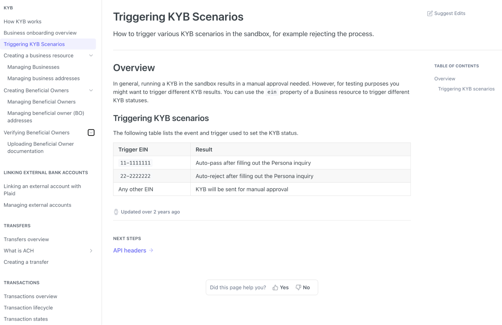 | 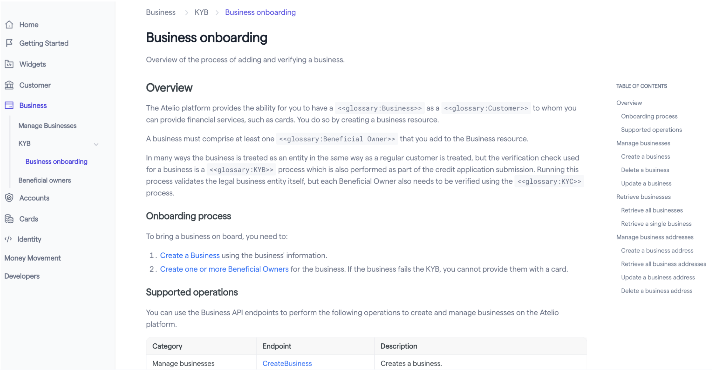 |
| (my 32 pg) / (inherited 104 pg) = 31% of the original | RESULTS:   69% fewer pages and customer clicks to find data. |

## 70% more + 70% less

#### Nium (San Francisco) –– <mark> 70% more customers onboarded while 70% fewer helpdesk issues </mark>

| Before (Oct 2022) | After (Dec 2022) |
|-------------------|------------------|
| PROBLEM:   New clients were unable to onboard themselves due to the unclear method to them–-and even to Nium.     Each region (AU, EU, HK, SG, UK, US) contains five very complex spreadsheets describing various steps of onboarding for various client types and situations: | MY SOLUTION:   I created **[a clear onboarding process with sections of customer types](https://docs.nium.com/docs/onboarding)** for common onboarding steps and for region-specific parameter and example pages.     Immediately saw twice as many customers onboarded and only a quarter of the Helpdesk requests for onboarding |
| 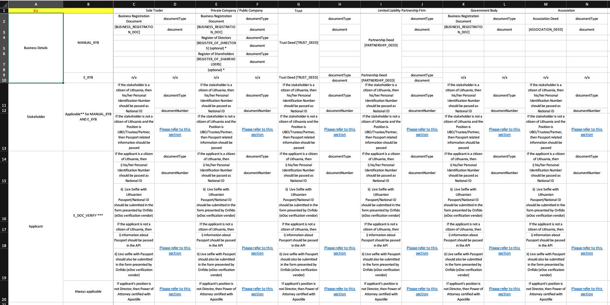 | 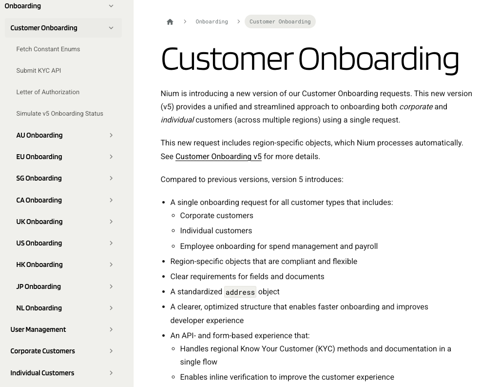 |
| For every 10 customers who tried to onboard:   - 2 (20%) were successful   - 8 (80%) filed helpdesk tickets.    After I created the onboarding process:   - 9 (90%) were successful   - 1 (10%) filed helpdesk tickets | Successful onboarding rose 70%   while helpdesk tickets reduced by 70%. |

## New UX with 2x details

#### Nium (San Francisco) –– <mark> Completely different UX and information architecture with twice as many pages of information </mark>

| Before (May 2023) | After (July 2023) |
|-------------------|-------------------|
| PROBLEM:   Pages were hastily written by engineers just to have "something" documented, for example:   - &nbsp;1 pg [Payins](https://mpdocs.nium.com/payout-payin/pay-in---key-concepts)   - 14 pg [Payouts](https://mpdocs.nium.com/payout-payin/Payout)   ======   15 pages total| MY SOLUTION:   I revamped and authored pages with many more details and related concepts, for example:   - 12 pg [Payins](https://docs.nium.com/docs/payins)   - 19 pg [Payouts](https://docs.nium.com/docs/payouts)   ======   31 pages total |
| 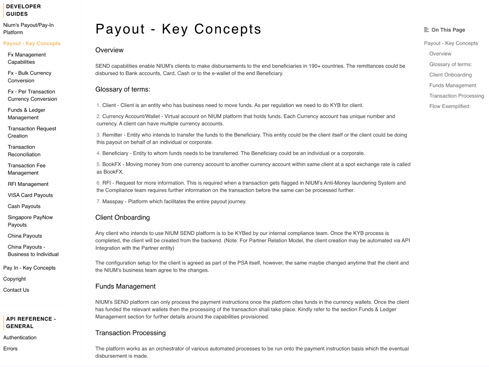 | 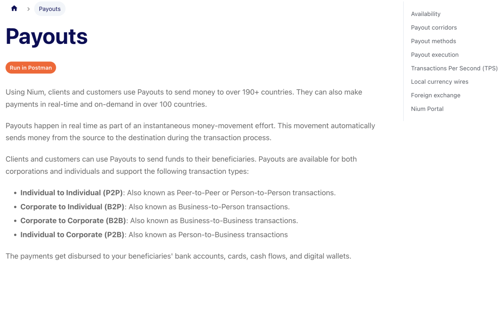 |

## 25% more players and sales

#### Mica Games (Seattle) –– <mark> 25% more players and revenue from my suggested changes to his games </mark>

| Before (Mar 1998) | After (Apr 2013) |
|-------------------|------------------|
| PROBLEM:   Brilliant word games were largely unknown because of clumsy UX/UI:   - [WordZap](https://wordzap.com/Zap8/wordzap.html)   - [Cricklers](https://crickler.com/html5/) | MY SOLUTION:   [31 ideas](https://docs.google.com/spreadsheets/d/1yl2lhoAfoSuBdQbbNGwThpeygqJj4Ppng0-V7-VOIRw/edit#gid=741302803) to improve the UX/UI, gameplay, settings, and other aspects. |
| 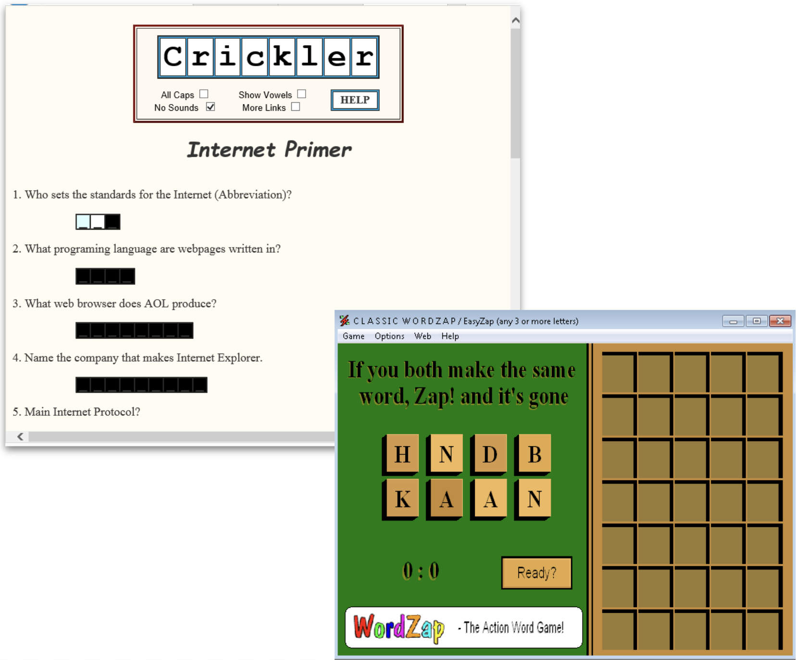 | 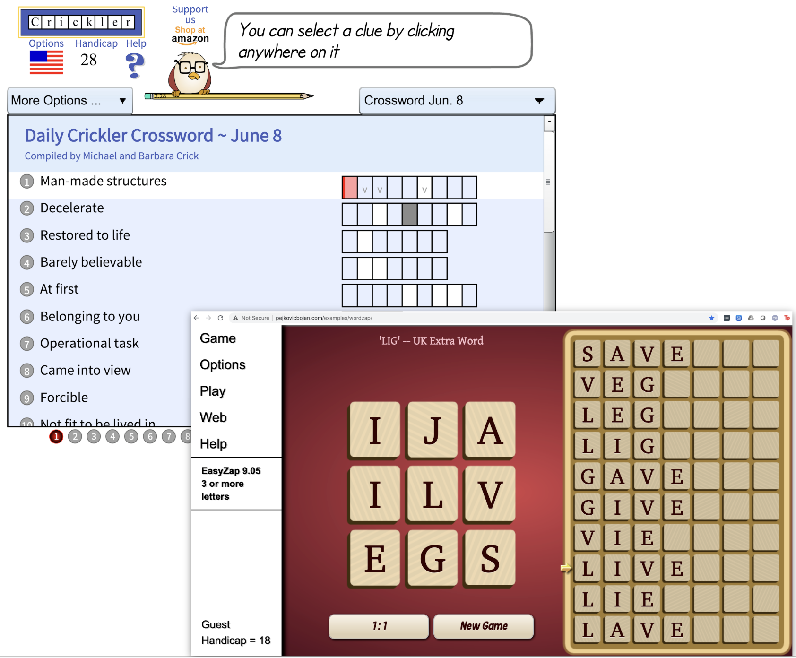 |
| | RESULTS:   The owner of the game said the number of players had increased by 25% due to word-of-mouth. |

## Saved 85% of translation

#### Pristine (Taipei) –– <mark> Improved readability while saving 85% on translation costs by converting paragraphs to a table </mark>

| Before (May 2008) | After (May 2008) |
|-------------------|------------------|
| I was given text for translation. | I reduced the translation cost by removing the repeated phrases while making it easier-to-read by converting the paragraphs into a table. |
| 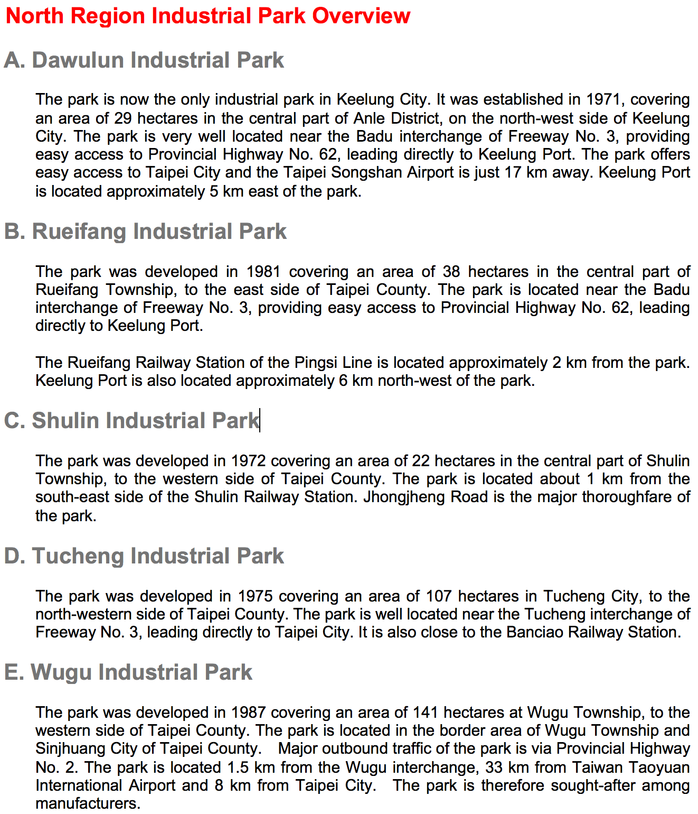 | 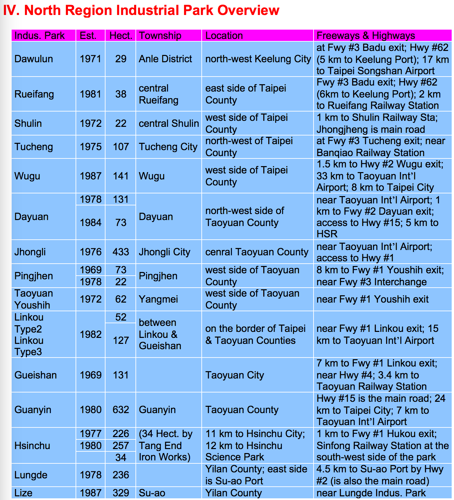 |
| | RESULTS:   By reducing the number of words, translation costs reduced by 85%. |

## 20% drop in i18n mistakes

#### Hewlett-Packard (Singapore) –– <mark> 20% drop in internationalization (i18n) and translation mistakes by PMs </mark>

| Before (Jan 2007) | After (May 2007) |
|-------------------|------------------|
| Hewlett-Packard's translation division used an Excel table to track which languages a project have been translated into and then reviewed for accuracy. I thought it was odd they used the standard ISO 2-letter language code on the X-axis while using their internal 3-letter languge code on the Y-axis. | After changing the 3-letter code to the 2-letter code, I noticed that a language wasn't reviewed yet--a mistake that the responsible project manager didn't notice either! |
| 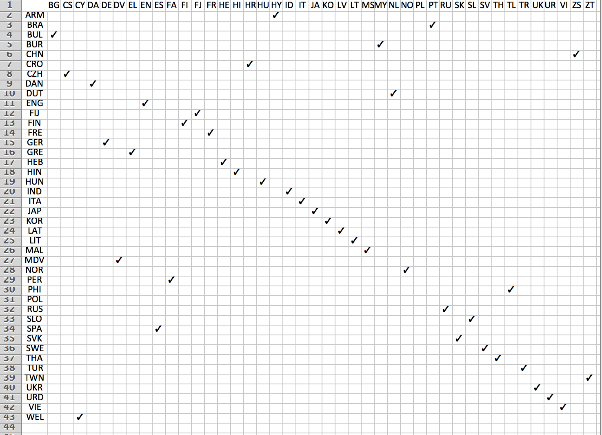 | RESULTS:    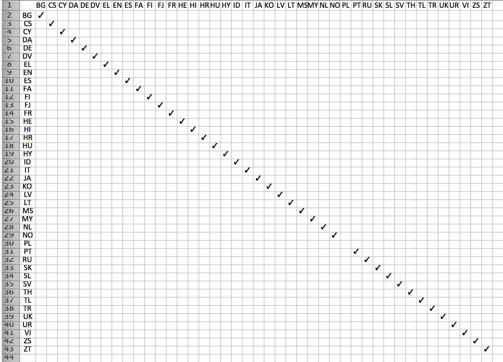 |
