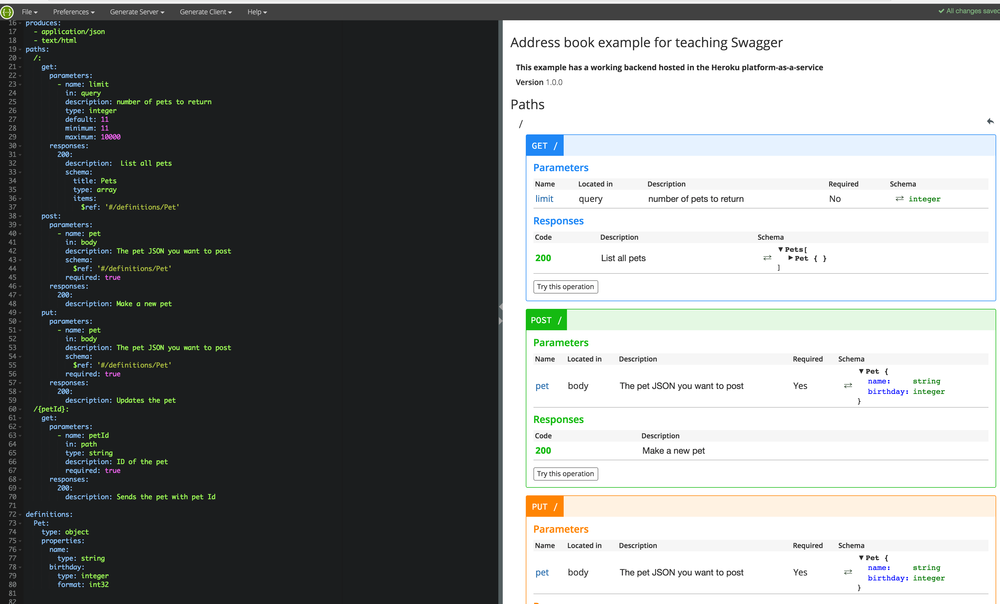

# Training and instructional design

## Software

### Swagger 

#### Edutainme (2015-2017) Bay Area

Audience: Technical writers wanting to learn how to use Swagger.

### Anti-counterfeiting labeling

#### OpSec Security (2013) Boston

Audience: Employees who need to 

### Excel 

| Description | Example |
|-------------|---------|
| Edutainme (2003-2004) Bay Area     Audience: Recent graduates who wanted to add Excel to their resumes.     Tools: Microsoft Excel and PowerPoint | <iframe src="https://docs.google.com/spreadsheets/d/e/2PACX-1vSqxy6YfWJ9ZZLGpLFgxmM638_yory6NPVpGCdMlyAS2kVKSRfYpPR9DAK3FwJcI69FEAUGj79Dl10c/pubhtml?widget=true&amp;headers=false" width="300" height="500"></iframe> |

<iframe src="https://docs.google.com/spreadsheets/d/e/2PACX-1vSqxy6YfWJ9ZZLGpLFgxmM638_yory6NPVpGCdMlyAS2kVKSRfYpPR9DAK3FwJcI69FEAUGj79Dl10c/pubhtml?widget=true&amp;headers=false" width="300" height="500"></iframe> 

