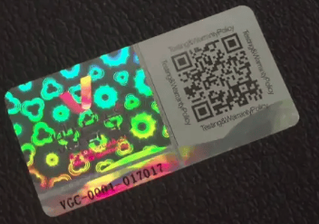
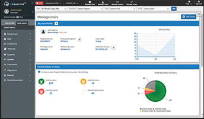
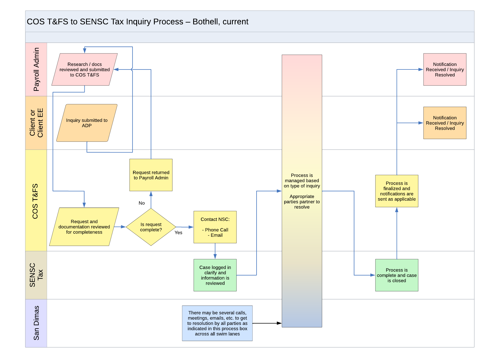

# Training and instructional design

## Overview

| Company             | Topic       | In-person trainer | 
Curriculum designer
 | City | 
Year
 |
|---------------------|---------------------------------------------------------------|:---:|:---:|-------------|:-----------:|
| Edutainme           | [Swagger](#swagger), DITA, MS Office, ESL, resumes            | Yes | Yes | Bay Area    | 2014 - now  |
| OpSec Security      | [anti-counterfeiting labeling](#anti-counterfeiting-labeling) | Yes | Yes | Boston      | 2013 - 2013 |
| VA Medical Center   | [eDC clinical trials](#edc-for-clinical-trials)               | Yes | Yes | Boston      | 2011 - 2013 |
| ADP Payroll         | [payroll reporting](#payroll-reporting)                       | Yes | Yes | Seattle     | 2008 - 2011 |
| Talk Group          | [ESL, MS Office](#esl-ms-office), resumes                     | Yes | Yes | Shanghai    | 2002 - 2008 |
| Expandable Software | ERP (Enterprise Resource Planning) modules                    | Yes | No  | San Jose    | 2000 - 2002 |
| FMU                 | English, Writing                                              | Yes | No  | Miami       | 1997 - 2000 |
| Mission College     | C++ fundamentals, Introduction to programming                 | Yes | No  | Santa Clara | 1997 - 1998 |
| Learning Technologies | [Excel](#excel), ESL, MS Office, resumes                  | Yes | Yes | Taipei      | 1994 - 1997 |

### Recommendations

**[9 Recommendations (describing my teaching style) on my LinkedIn profile by my managers and learners](https://guyklages.com/portfolio/recommendations#training--teaching)**

## Tools used

### By company

| Company        | Tools | Years |
|----------------|-------|-------|
| Adobe          | Acrobat, Distiller, Captivate, FrameMaker, RoboHelp | 8+ |
| Articulate 360 | Presenter, Engage, Quizmaker | 3+ |
| Corel          | Draw, PaintShop Pro | 4+ |
| ELB Learning   | Lectora authoring   | 4+ |
| Hyperion       | HyperCam, HyperSnap | 8+ |
| Microsoft      | Word, Excel, PowerPoint, SharePoint, Visio, Access, Teams | 9+ |
| TechSmith      | Camtasia, Snag-it   | 7+ |

### By function

| Function                      | Tool                            | Years |
|-------------------------------|---------------------------------|-------|
| Platforms (LMS, CMS)          | Blackboard, Moodle, Author-It, Academy (WordPress plugin) | 8+ |
| Survey                        | SurveyMonkey                    | 3+ |
| Webinars and virtual training | Zoom                            | 3+ |
| Video recording and editing   | Camtasia, Captivate, Zoomerang  | 3+ |

## Swagger 

| Description | Example |
|-------------|---------|
| **Edutainme (2015-2017) Bay Area     Audience**   Technical writers     **Deliverables**   Curriculum and hands-on classes using an address book example     **Tools**   Swagger and PowerPoint | <iframe src="https://docs.google.com/document/d/e/2PACX-1vSAFyqq2XqEuMWBQQDIl7dz2IlCzPeXTt-mDgf4ZekmjRsb_qXKvNpYons8GWn085jl6WMw4Yfvrw-X/pub?embedded=true" width="500" height="400"></iframe>|

## Anti-counterfeiting labeling

| Description | Example |
|-------------|---------|
| **OpSec Security (2013) Boston     Audience**   OpSec Employees     **Deliverables**   Internal training videos with voiceover explanations that demonstrate the complex process of how their anti-counterfeiting labels are made     **Method**   Documented and storyboarded the use of their in-house anti-counterfeiting system     **Tools**   Adobe Captivate and Camtasia |  |

## eDC for clinical trials

| Description | Example |
|-------------|---------|
| **VA Medical Center (2011-2013) Boston     Audience**   Clinical trial PMs     **Deliverables**   Technical documents and class materials for their in-house clinical trial software     **Method**   Provided Instructor Led Training (ILT) and Virtual Classroom Training (VCT) on their eDC software.     **Tools**   MS Word, Excel, Visio, Powerpoint, Access, SQL Server, SharePoint, Captivate |  |

## Payroll reporting

| Description | Example |
|-------------|---------|
| **ADP Payroll (2008-2011) Seattle     Audience**   Payroll Specialists     **Deliverables**   Training materials and curriculum for reporting of Garnishments, Payroll, AP/AR, GL, and Reimbursements     **Method**   Provided Instructor Led Training (ILT) and Virtual Classroom Training (VCT)     **Tools**   MS Word, Excel, Visio, Access, SQL Server, Captivate |  |

## ESL, MS Office

| Description | Example |
|-------------|---------|
| **Talk Group (2002-2008) Shanghai     Audience**   Recent college graduates     **Deliverables**   A 5GB database and website of all activities, schedules, teachers and 200+ on-line asynchronous and synchronous learning materials for each activity     **Method**   Provided Instructor Led Training (ILT) and Virtual Classroom Training (VCT) while training 60+ teachers in our experiential style of training (led many of the activities myself)     **Tools**   MS Word, Excel, Visio, Access, SQL Server |  |

## Excel 

| Description | Example |
|-------------|---------|
| **Learning Technologies (1994-1997) Taipei     Audience**   Recent college graduates     **Deliverables**   Curriculum for three levels of Excel learners     **Tools**   Microsoft Excel and PowerPoint | <iframe src="https://docs.google.com/spreadsheets/d/e/2PACX-1vSqxy6YfWJ9ZZLGpLFgxmM638_yory6NPVpGCdMlyAS2kVKSRfYpPR9DAK3FwJcI69FEAUGj79Dl10c/pubhtml?widget=true&amp;headers=false" width="600" height="400"></iframe> |

