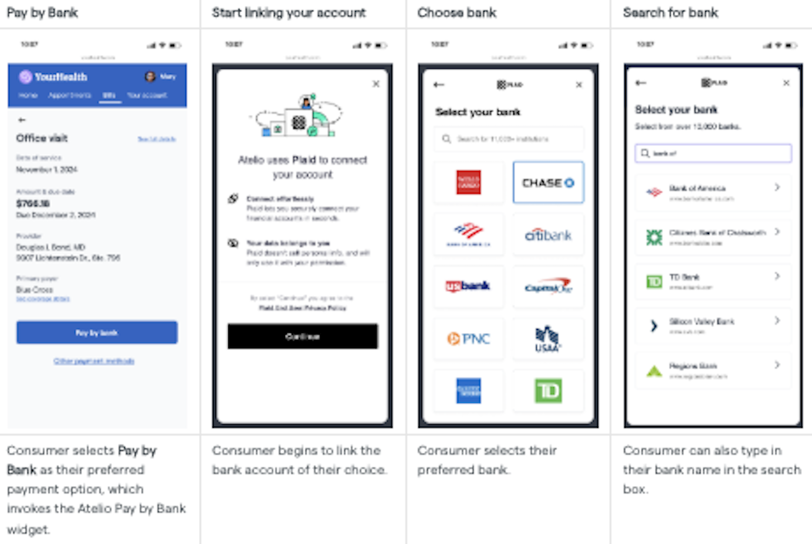
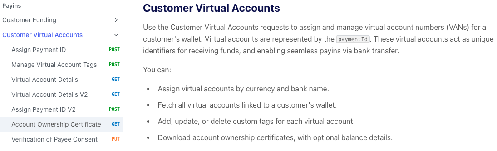
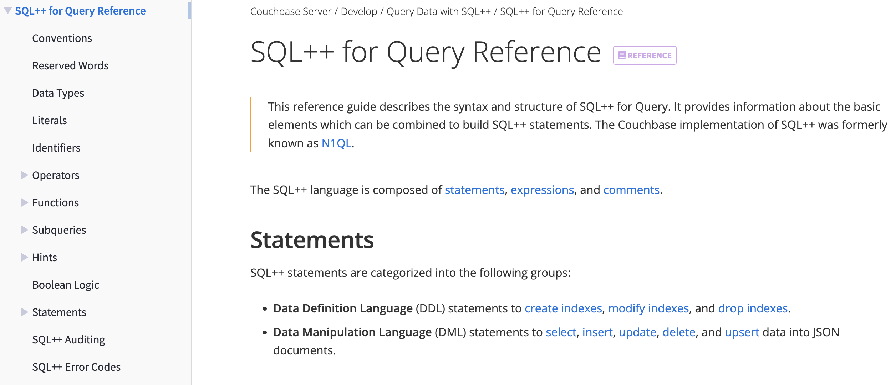

import { DefinitionProvider, DefTerm, DefinitionPanel } from '@site/src/components/DefTerm';

# Training and instructional design

## Overview

<DefinitionProvider>

| Company               | Topic | In-person   trainer | 
Curriculum designer
 | 
City
 | 
Year
 |
|-----------------------|---------------------------------------------------------------|:---:|:---:|-------------|:-----------:|
| <DefTerm def="Edutainme is my own (part-time) startup company that has been teaching/training college students and adults throughout the Bay Area on weekends.">Edutainme</DefTerm>             | [Swagger](#swagger), DITA, MS Office, etc.  | Yes | Yes | Bay Area    | 2014 - now  |
| <DefTerm def="Atelio was the fintech startup within Fidelity.">Atelio</DefTerm> | [Pay by Bank](#pay-by-bank)  | Yes | Yes | Bay Area | 2024 - 2025 |
| <DefTerm def="Nium is a fintech company driving the future of payments.">Nium</DefTerm>  | [Payins, Payouts](#payins-payouts) | Yes | Yes | Bay Area | 2022 - 2023 |
| <DefTerm def="Couchbase is the leader of NoSQL databases.">Couchbase</DefTerm>  | [SQL++ queries and indexes](#sql-queries-and-indexes) | Yes | Yes | Santa Clara | 2017 - 2018 |
| <DefTerm def="OpSec Security is the leading provider of integrated online protection and on-product authentication solutions for brands and governments. An example would be the label in a Prada bag that customers can verify authenticity with their mobile phone.">OpSec Security</DefTerm>        | [Anti-counterfeiting labeling](#anti-counterfeiting-labeling) | Yes | Yes | Boston      | 2013 - 2013 |
| <DefTerm def="The VA Medical Center in Jamaica Plain offers ambulatory care and primary care services, and serves as a hub for outpatient care, including ambulatory surgery, pharmacy, whole health, audiology and diagnostic imaging for military veterans.">VA Medical Center</DefTerm>     | [eDC clinical trials](#edc-for-clinical-trials)               | Yes | Yes | Boston      | 2011 - 2013 |
| <DefTerm def="ADP offers industry-leading online payroll and HR solutions, plus tax, compliance, benefit administration and more.">ADP Payroll</DefTerm>      | [Payroll reporting](#payroll-reporting)                       | Yes | Yes | Seattle     | 2008 - 2011 |
| <DefTerm def="Talk Group is an experiential language center that teaches through 2-hour activities called Mini Adventures at various topic-related venues throughout the city instead of a traditional (single) classroom.">Talk Group</DefTerm>   | [ESL, Excel](#esl-excel), resumes | Yes | Yes | Shanghai    | 2002 - 2008 |

<!--
| <DefTerm def="Expandable Software develops and implements an enterprise resources planning (ERP) software suite to help executives and managers of manufacturing companies maximize business performance with real-time visibility and control of their organization.">Expandable</DefTerm>   | ERP modules and reporting                                     | Yes | No  | San Jose    | 2000 - 2002 |
-->

<DefinitionPanel/>

</DefinitionProvider>

### Recommendations

**[9 Recommendations on my LinkedIn profile](https://guyklages.com/portfolio/recommendations#training--teaching)** by my former managers and learners that describe my teaching style.

## Tools used

### By company

| Company        | Tools | Years |
|----------------|-------|-------|
| Adobe          | Acrobat, Distiller, Captivate, FrameMaker, RoboHelp | 8+ |
| Articulate 360 | Presenter, Engage, Quizmaker | 3+ |
| Corel          | Draw, PaintShop Pro | 4+ |
| ELB Learning   | Lectora authoring   | 4+ |
| Hyperion       | HyperCam, HyperSnap | 8+ |
| Microsoft      | Word, Excel, PowerPoint, SharePoint, Visio, Access, Teams | 9+ |
| TechSmith      | Camtasia, Snag-it   | 7+ |

### By function

| Function                      | Tool                            | Years |
|-------------------------------|---------------------------------|-------|
| Platforms (LMS, CMS)          | Academy (WordPress plugin), Articulate, Author-It, Blackboard, Dozuki, Moodle | 8+ |
| Survey                        | SurveyMonkey                    | 3+ |
| Webinars and virtual training | Zoom                            | 3+ |
| Video recording and editing   | Camtasia, Captivate, Zoomerang  | 3+ |

## Topics taught

### Swagger 

| Description | Example |
|-------------|---------|
| **Edutainme (2015-2017) Bay Area    Audience**   Technical writers    **Deliverables**   Curriculum and hands-on classes using an address book example    **Tools**   Swagger and PowerPoint | <iframe src="https://docs.google.com/document/d/e/2PACX-1vSAFyqq2XqEuMWBQQDIl7dz2IlCzPeXTt-mDgf4ZekmjRsb_qXKvNpYons8GWn085jl6WMw4Yfvrw-X/pub?embedded=true" width="500" height="400"></iframe>|

### Pay by Bank

| Description | Example |
|-------------|---------|
| **Atelio (2024-2025) Bay Area    Audience**   Fintech developers    **Deliverables**   Curriculum and hands-on classes using a sandbox account to test Atelio's Pay by Bank app with customers' own app via API calls    **Tools**   PowerPoint |  |

### Payins, Payouts

| Description | Example |
|-------------|---------|
| **Nium (2022-2023) Bay Area    Audience**   Fintech developers    **Deliverables**   Curriculum and hands-on classes using a sandbox account to test Nium's API endpoints with customers' own app via API calls    **Tools**   PowerPoint |  |

### SQL++ queries and indexes

| Description | Example |
|-------------|---------|
| **Couchbase (2017-2018) Bay Area    Audience**   Big Data analysts, PMs, developers    **Deliverables**   Curriculum and hands-on classes using their Couchbase account to make advanced queries against Couchbase's sample database    **Tools** PowerPoint |  |

### Anti-counterfeiting labeling

| Description | Example |
|-------------|---------|
| **OpSec Security (2013) Boston     Audience**   OpSec Employees     **Deliverables**   Internal training videos with voiceover narration that explains the complex process of how OpSec makes their anti-counterfeiting labels     **Method**   Documenting and storyboarding the use of their in-house anti-counterfeiting system     **Tools**   Adobe Captivate and Camtasia |  |

### eDC for clinical trials

| Description | Example |
|-------------|---------|
| **VA Medical Center (2011-2013) Boston     Audience**   Clinical trial PMs     **Deliverables**   Technical documents and class materials for their in-house clinical trial software     **Method**   Provided Instructor Led Training (ILT) and Virtual Classroom Training (VCT) on their eDC software.     **Tools**   MS Word, Excel, Visio, Powerpoint, Access, SQL Server, SharePoint, Captivate |  |

### Payroll reporting

| Description | Example |
|-------------|---------|
| **ADP Payroll (2008-2011) Seattle     Audience**   Payroll Specialists     **Deliverables**   Training materials and curriculum for reporting of Garnishments, Payroll, AP/AR, GL, and Reimbursements     **Method**   Provided Instructor Led Training (ILT) and Virtual Classroom Training (VCT)     **Tools**   MS Word, Excel, Visio, Access, SQL Server, Captivate |  |

### ESL, Excel

| Description | Example |
|-------------|---------|
| **Talk Group (2002-2008) Shanghai     Audience**   Recent college graduates     **Deliverables**   A 5GB database and website of all activities, schedules, teachers and 200+ on-line asynchronous and synchronous learning materials for each activity     **Method**   Provided Instructor Led Training (ILT) and Virtual Classroom Training (VCT) while training 60+ teachers in our experiential style of training (led many of the activities myself)     **Tools**   MS Word, Excel, Visio, Access, SQL Server | <iframe src="https://docs.google.com/spreadsheets/d/e/2PACX-1vSqxy6YfWJ9ZZLGpLFgxmM638_yory6NPVpGCdMlyAS2kVKSRfYpPR9DAK3FwJcI69FEAUGj79Dl10c/pubhtml?widget=true&amp;headers=false" width="600" height="400"></iframe> |
