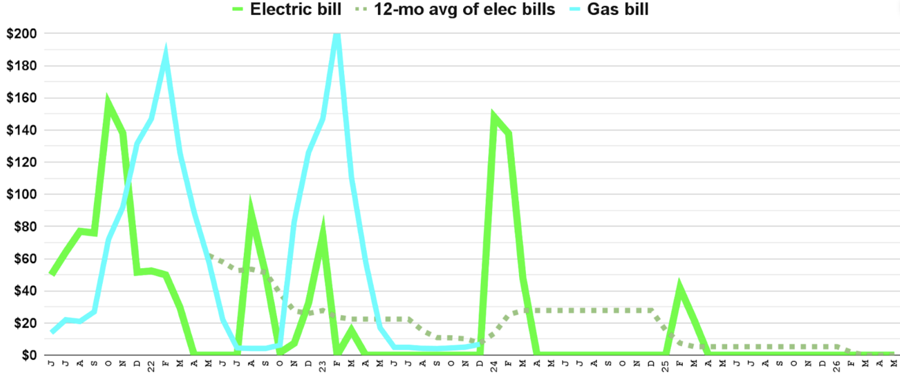

# Our solar mistakes

When we finally got our first single-family house, we were thrilled to be free from HOAs who are against solar, so we wanted to order our panels "yesterday"—but we wish we had known the following before buying:

## Before design

### Research more

| Mistake | Wasted   money | Wasted   days | Solution |
|---------|:------------------:|:-----------------:|----------|
| We didn't read this website before getting solar panels ;-) | ~$33k | 1,100 | Really think about [your solar goals](what-we-learned#know-your-goals) |

### Convert gas appliances to electric

| Mistake | Wasted   money | Wasted   days | Solution |
|---------|:------------------:|:-----------------:|----------|
| Our Solar Emergency Shut-off box is on the front of our garage instead of the normal side yard _because nothing can be within 36 inches of a gas meter._ | | 740 | After converting all gas appliances to electric, PG&E removed our gas meter and repaved our side yard for free.     **Note:** If your technician only removes the physical meter and caps the above-ground pipe, they will usually not perform any repaving; so be sure to request to _"cap the gas line near the main"_ so the company must dig up your gas line to physically cut and cap it, which is also safer. |

### Charge EV to know true kWh usage

| Mistake | Wasted   money | Wasted   days | Solution |
|---------|:------------------:|:-----------------:|----------|
| Since we were charging at the office before COVID, we didn't account for EV charging at home.     During and after COVID, we started charging an EV at home and learned that we installed too few panels. | $200/year | | Charge as much as you can at home during the month you use electricity the most to boost your electric bill for the maximum allowed panels you can install.     (also to future-proof your usage over the next 30-50 years) |

### Install heat pump before re-roofing

| Mistake | Wasted   money | Wasted   days | Solution |
|---------|:------------------:|:-----------------:|----------|
| We upgraded our roof _before_ upgrading our furnace. | $20,000 roof + $100/year on partially shaded panels | 3 | Install the heat pump first, then remove unused vents and move any active vents to the shaded side before re-roofing.     Moving vents to the shaded side avoids panel installation on the shaded side. |
| We upgraded to a heat pump two years after solar installation, so now we have too few panels for our winter kWh usage. | $390/year   (for two years) | 1,100 | Install your heat pump one winter before getting solar panels to know your true kWh usage. |

### Upgrade your main panel to 200 amps

| Mistake | Wasted   money | Wasted   days | Solution |
|---------|:------------------:|:-----------------:|----------|
| We trusted our installer who didn't explain the limitations of a 70-amp panel and said "It's fine", so big appliances weren't backed up and drew tons of power from the grid.| $800 | 720 | Upgrade your main panel to 200-amp before solar installation. |
| After upgrading our main panel, it took five months to find someone to fix the "partial backup" to be a "whole backup". | $1,000 + $600 labor | 150 | Our installer would've fixed this for free if we had upgraded our main panel on our own before solar installation. |

### Hire licensed contractors

| Mistake | Wasted   money | Wasted   days | Solution |
|---------|:------------------:|:-----------------:|----------|
| We hired unlicensed roofers to re-shingle our roof and ended up needing to re-roof their mistakes two years later. | $20,000 | 4 | Always use licensed contractors. |
| To re-roof, we had to remove and reinstall our solar panels. | $8,000 | 14 | [Licensed Tesla installer](https://www.tesla.com/support/certified-installers) was available to do the work four months before Tesla could. |

## During design

### Get Whole home backup

| Mistake | Wasted   money | Wasted   days | Solution |
|---------|:------------------:|:-----------------:|----------|
| We agreed to Tesla's original design of "partial home backup" since they said we could use our existing (obsolete) 70-amp main panel from 1964.    You always want a _"whole home backup"_ instead. | 20-30% of electric bills until fixed | 740 | Best to first upgrade your main panel to 200-amp, if it isn't already.    We eventually upgraded to a 200-amp panel and paid a [Licensed Tesla installer](https://www.tesla.com/support/certified-installers) to make our solar system a "whole home backup" |

### Submit your highest electric bill

| Mistake | Wasted   money | Wasted   days | Solution |
|---------|:------------------:|:-----------------:|----------|
| We didn't have one year of electric bills before solar installation, so we didn't know our true kWh usage during winter.     We ended up installing too few panels for our winter usage. | $200 / year | | Give your solar installer your electric bill with the **highest kWh** usage when applying for the solar permit, and then multiply that kWh number by 12 for "annual usage". |

### More batteries = lower bills

| Mistake | Wasted   money | Wasted   days | Solution |
|---------|:------------------:|:-----------------:|----------|
| Our design had only one battery (would've been worse if we didn't have any battery!) | $50-200 per month | 700 |  |

**Note:** Utility companies pay so little for your excess kWh, so increase your ROI by adding a battery.

Below is a graph of our utility bills before, during, and after solar panel installation--and a 2nd battery.

| 2021 | 2022 | 2023 | 2024 | 2025 |
|------|------|------|------|------|
| Sep: solar installed    Dec: solar approved | Jan: insulated walls    July-Aug: 4 weeks Powerwall offline | July: installed 2nd Powerwall    Nov: installed heat pump |  Aug: 2 weeks to reroof    moved 6 panels from NW to SE side | Dec: adjusted thermostat from 68º to 66º    |

## Before installer leaves

### Verify everything works

| Mistake | Wasted   money | Wasted   days | Solution |
|---------|:------------------:|:-----------------:|----------|
| We didn't verify everything works before the installers left. | $20-30 | 20 | Verify everything in the checklist below before your installer leaves. |

Checklist:

1. Plug in your EV charging cable. On your phone app, you should see your "Home kW" increase.
    - Increase/decrease the Amps to your car and see if the kW flow is reflected in your app.
2. Max out your electric load to verify 5.7 kW comes from your Powerwall before drawing from the Grid.
    - Run your clothes dryer or other heavy appliance to raise your Home usage 5.7 kW above solar production.
3. Verify all electrical outlets (breakers) are included in the measuring/metering and backup.
4. Verify that your contractors installed your panels and system per your planned diagram.
    - Our original (non-Tesla) contractors installed 14 panels on 1 String (max is 11 or 12), so our voltage was too much and dropped often. The only way to know of this mistake was the very technical diagram on page 17 (of 23) which only electrical engineers might notice that Tesla's design specifications do not match the actual installation.

## After installation

### Keep usage low until Power On

| Mistake | Wasted   money | Wasted   days | Solution |
|---------|:------------------:|:-----------------:|----------|
| After panels were installed, we immediately started using more electricity as if it were free. | $200 | 60 | Wait until after your local utility company gives a Final Inspection and official Approval for "Power On" since energy from your new solar panels is _not_ acknowledged or credited until that approval. |

That's 1 - 2 more months of high electric bills before your solar setup begins to lower your electric bills. So, keep your usage low until your utility company tells you that your solar setup has "Power On" status.

### If bill differs, call installer

| Mistake | Wasted   money | Wasted   days | Solution |
|---------|:------------------:|:-----------------:|----------|
| When our app's kWh imported/exported numbers didn't match our utility bill, we called our utility company. | $300 | 100 | Call the installer or the solar company. |

**Note:** Utility companies are almost always correct, so don't wait another month to call your solar provider.
    - You can't get back past data that wasn't measured--or was measured incorrectly.
    - Our non-Tesla installer submitted incorrect BOM paperwork and didn't install a meter on our main breaker panel, so our car charging and water heater usage weren't measured in our app for 2 months.
    - This took us 3 hours of transferred calls to solve; and Tesla said it'll take at least a week to fix.
- Start with your solar Customer Service to test if your system and inverter are configured properly.
