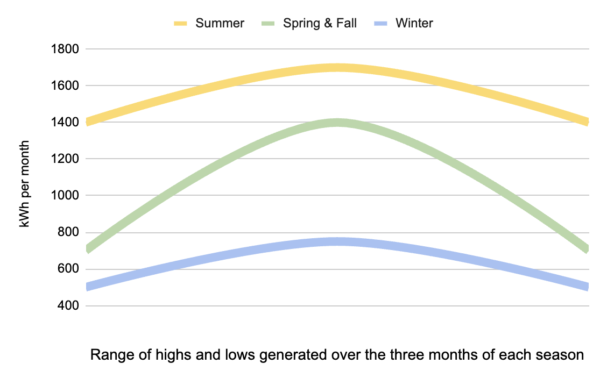

# What we learned

## If I could redo my solar setup

Before installing panels:

- Upgrade main panel to 200 amps
- Upgrade roof with certified roofer
- Upgrade all appliances to electric
- Remove gas meter (PG$E removes for free)
- Use December elec bill kWh (x12) to size system
- Oversize system as much as I can for the future

Planning the installtion:

- Add a 2nd inverter to avoid clipping and to have a backup inverter
- Add a 3rd battery instead of only two
- Install batteries outside in the shade instead of inside the garage (if your climate permits it)

## Know your goals

Before installing solar panels, we didn't know much and just had two goals:

- Be able to power our house during a power outage.
- Reduce our electric bills.

But after installing solar panels and learning more, our desires and goals changed:

- It's thrilling to see the ridiculous surplus of energy generated in spring and summer!
- Instead of reducing our electric bills in half, they're reduced by 90%--we're so close to being off-grid!
- Let's convert more gas appliances to electric to use all of this free excess energy!

And then some truths became apparent:

- Winter sun is so low and cloudy and generates [about one-third of summer sun](#install-as-much-as-you-can)...
- We need a 2nd battery to run the clothes dryer (or multiple appliances) without drawing from the grid...
- We need a few more solar panels ($600) to generate more power to avoid drawing from the grid...
- No installer will do $600 worth of work since they focus on installing $28,000 solar panel systems...

So, now we're stuck with what we have. We still love our solar panels, but it would've been nice to have a slightly bigger system from the start.

The moral: think carefully what you want to achieve because it's near impossible to find an installer willing to go out for a tiny amount of profit--changes need to be expensive enough to make it worth their time.

Other things to consider:

- Panels last many decades--latest studies say they'll last at least 40 or 50 years.
- Panels degrade 0.5% per year, so by year 40, your system will generate 20% less than their first year.
- Electricity rates keep increasing, so it's best to [oversize your solar panel system as much as you can](#install-as-much-as-you-can-afford).
- Batteries are expensive and can be added later, but start with at least one battery--two, if you can.
- 10-year financing is probably the most affordable method (we paid $260/mo for 8.5 kW + two Powerwalls) since there isn't a penalty on extra payments.

## Install as much as you can

Solar generation fluctuates throughout the year, so summer months generate about 2.5x as much energy as winter months.

So, if you size your solar array based on what solar installers use (kWh usage on your bills of the last 12 months), then you'll have:

- a surplus of energy during summer months --> that is either stored in batteries or sold to the grid.
- a deficit of energy during winter months --> that is drawn from the grid.
- not enough to power you during a winter outtage --> you will be affected just like houses without solar panels.

**The solution is to buy more than your annual kWh usage** and as many solar panels and batteries as you can afford.

For about 2-3% more money above covering your annual kWh usage, you can buy more panels that will heavily reduce your risk of being powerless during an outage.

For example, in our case:

