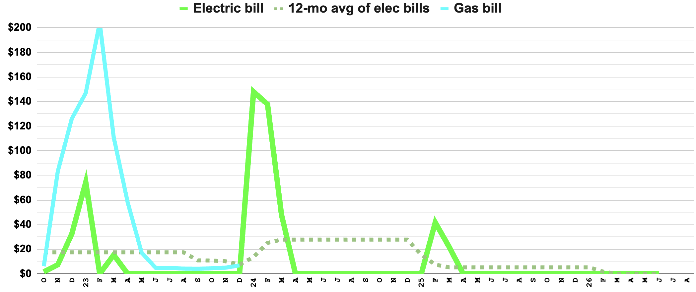

# What we learned

## If I could redo my solar setup

Before installing panels:

- Upgrade main panel to 200 amps
- Upgrade roof with certified roofer
- Upgrade all appliances to electric
- Remove gas meter (PG$E removes for free)
- Use our electric bill with the highest kWh, and then multiply it by 12 to size our system
- Oversize my solar panel system as much as I can for the future 5+ decades

Planning the installtion:

- Add a 2nd inverter to avoid clipping and to have a backup inverter
- Install batteries outside in the shade instead of inside the garage (if your climate allows it)

## Know your goals

Before installing solar panels, we didn't know much about solar and just had two goals:

- Be able to power our house during a power outage.
- Reduce our electric bills.

But after installing solar panels and learning more, our desires and goals _changed_:

- It's thrilling to see the huge surplus of energy generated in spring and summer!
- Instead of reducing our electric bills in half, ours were reduced by 90%--that's so close to being off-grid!
- Let's convert all gas appliances to electric to use all of this free excess energy!

And then some truths became apparent:

- Winter sun is so low and cloudy and generates [about one-third of summer sun](#install-as-much-as-you-can-afford)...
- We need a 2nd battery to run the clothes dryer (or multiple appliances) without drawing from the grid...
    - **Note:** This is no longer a problem with a single [Powerwall3 battery](https://energylibrary.tesla.com/docs/Public/EnergyStorage/Powerwall/3/Datasheet/en-us/Powerwall-3-Datasheet.pdf).
- We need four more solar panels (costs only $600) to generate more power to avoid drawing from the grid during winter...
- No installer will do $600 worth of work since they focus on installing $18,000+ solar panel systems...

So, now we're stuck with what we have. We still love our solar panels, but it would've been nice to have a slightly bigger system from the start.

The moral: think carefully what you want to achieve because it's near impossible to find an installer willing to go out for a tiny amount of profit--changes need to be expensive enough to make it worth their time.

Other things to consider:

- Panels last many decades--latest studies state solar panels last at least 40 or 50 years.
- Panels degrade 0.5% per year, so by year 40, your system will generate 20% less than their first year.
- Electricity rates keep increasing, so it's best to [oversize your solar panel system as much as you can](#install-as-much-as-you-can-afford).
- Batteries seem expensive but are totaaly worth it--and are necessary for evenings, cloudy days, and outtages.
- 10-year financing is probably the most affordable method (we paid $260/mo) since there's no penalty on extra payments.

## Install as much as you can

Solar generation fluctuates throughout the year, so summer months generate about 2.5x as much energy as winter months.

This fluctuation creates:

- a surplus of energy during summer months --> that is either stored in batteries or sold to the grid.
- a deficit of energy during winter months --> that is drawn from the grid.

<mark> So, if you size your solar array based on _annual_ kWh usage on your electric bills, then you won't have enough to power your home during a winter outtage --> you will be affected just like houses without solar panels. </mark>  

**The solution is to size your solar array on the single month that uses the most kWh and then multiply that number by 12 to calculate your "annual" usage**.

That will result in even more of a surplus during summer, which is good because:

- It'll cost only 2-3% more for the 4-6 added panels.
- You'll be fully energy independent all year.
- There's too small of a profit for any installer to add only 6 panels to a system, so they won't do it.
- Panels degrade 0.5% per year and last 50+ years, so you're future-proofing yourself.

For example, in our case:

If you have an EV made in 2024 or newer, your EV has bidirectional charging built-in. That means your home solar system needs only 1 battery because can use your EV's massive battery to be your home's 2nd (and 3rd and 4th) solar battery.

## Keep usage low till Power On

Energy from your new solar panels is not acknowledged or credited until after Final Inspection and Approval by your local utility company.

That's 1 - 2 more months of high electric bills before your solar setup begins to lower your electric bills. So, keep your usage low until your utility company tells you that your solar setup has "Power On" status.

## Before installer leaves

- Plug in your EV charging cable. On your phone app, you should see your "Home kW" increase.
    - Increase/decrease the Amps to your car and see if the kW flow is reflected in your app.
- Max out your electric load to verify 5.7 kW comes from your Powerwall before drawing from the Grid.
    - Run your clothes dryer or other heavy appliance to raise your Home usage 5.7 kW above solar production.
- Verify all electrical outlets (breakers) are included in the measuring/metering and backup.
- Verify that your contractors installed your panels and system per your planned diagram.
    - Our original (non-Tesla) contractors installed 14 panels on 1 String (max is 11 or 12), so our voltage was too much and dropped often. The only way to know of this mistake was the very technical diagram on page 17 (of 23) which only electrical engineers might notice that Tesla's design specifications do not match the actual installation.

## If bill differs, call installer

- If your app's kWh imported/exported numbers don't match your utility bill, call your installer or their solar company.
- Utility companies are almost always correct, so don't wait another month to call your solar provider.
    - You can't get back past data that wasn't measured--or was measured incorrectly.
    - Our non-Tesla installer submitted incorrect BOM paperwork and didn't install a meter on our main breaker panel, so our car charging and water heater usage weren't measured in our app for 2 months.
    - This took us 3 hours of transferred calls to solve; and Tesla said it'll take at least a week to fix.
- Start with your solar Customer Service to test if your system and inverter are configured properly.

## Without a battery, have bills

If you don't have a battery, you'll still draw from the grid in the evenings and on rainy days. Your electric bills will be reduced, not eliminated.

Utility companies pay so little for your excess kWh, so increase your ROI by adding a battery.

Below is a graph of our utility bills before, during, and after solar panel installation.

| 2021 | 2022 | 2023 | 2024 | 2025 |
|------|------|------|------|------|
| Sep: solar installed    Dec: solar approved | Jan: walls insulated    July-Aug: PW offline 4 weeks | July: installed 2nd PW    Nov: installed heat pump |  Aug: moved 6 panels from NW to SE | Dec: adjusted thermostat from 68º to 66º |

