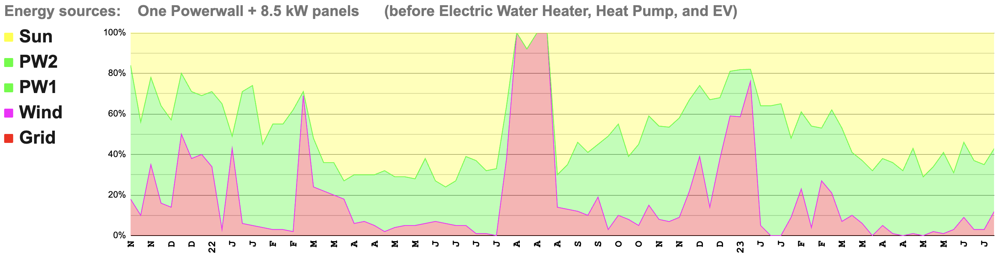
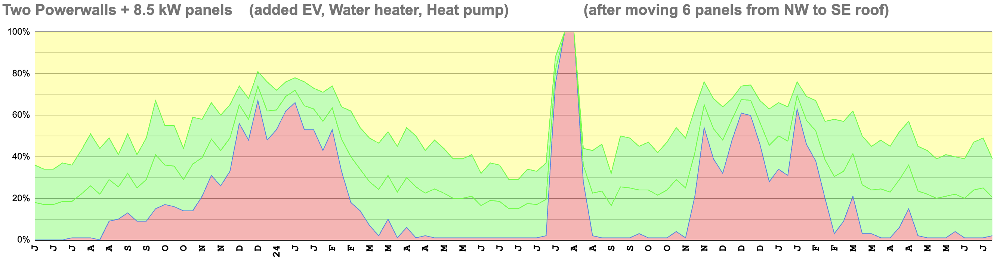
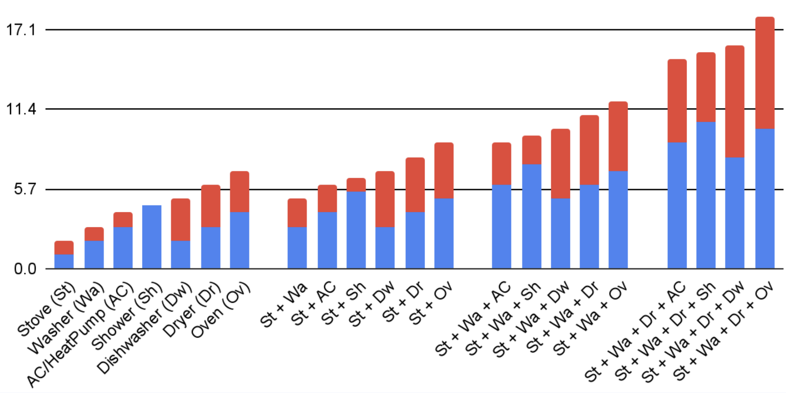

# What we learned

## If I could redo my setup

Before installing panels:

- Upgrade main panel to 200 amps
- Upgrade roof with certified roofer
- Upgrade all appliances to electric
- Remove gas meter (PG$E removes for free)
- Use our electric bill with the highest kWh, and then multiply it by 12 to size our system
- Oversize my solar panel system as much as I can for the future 5+ decades

Planning the installtion:

- Add a 2nd inverter to avoid clipping and to have a backup inverter
- Install batteries outside in the shade instead of inside the garage (if your climate allows it)

## Know your solar goals

Before installing solar panels, we didn't know much about solar and just had two goals:

- Be able to power our house during a power outage.
- Reduce our electric bills.

But after installing solar panels and learning more, our desires and goals _changed_:

- It's thrilling to see the huge surplus of energy generated in spring and summer!
- Instead of reducing our electric bills in half, ours were reduced by 90%--that's so close to being off-grid!
- Let's convert all gas appliances to electric to use all of this free excess energy!

And then some truths became apparent:

- Winter sun is so low and cloudy and generates [about one-third of summer sun](#install-as-much-as-you-can-afford)...
- We need a 2nd battery to run the clothes dryer (or multiple appliances) without drawing from the grid...
    - **Note:** This is no longer a problem with a single [Powerwall3 battery](https://energylibrary.tesla.com/docs/Public/EnergyStorage/Powerwall/3/Datasheet/en-us/Powerwall-3-Datasheet.pdf).
- We need four more solar panels (costs only $600) to generate more power to avoid drawing from the grid during winter...
- No installer will do $600 worth of work since they focus on installing $18,000+ solar panel systems...

So, now we're stuck with what we have. We still love our solar panels, but it would've been nice to have a slightly bigger system from the start.

The moral: think carefully what you want to achieve because it's near impossible to find an installer willing to travel for a tiny amount of profit--changes need to be expensive enough to make it worth their time.

Other things to consider:

- Panels last many decades--latest studies state solar panels last at least 40 or 50 years.
- Panels degrade 0.5% per year, so by year 40, your system will generate 20% less than their first year.
- Electricity rates keep increasing, so it's best to [oversize your solar panel system as much as you can](#install-as-much-as-you-can-afford).
- Batteries seem expensive but are totaaly worth it--and are necessary for evenings, cloudy days, and outtages.
- 10-year financing is probably the most affordable method (we paid $260/mo) since there's no penalty on extra payments.

## Install as much as you can

Solar generation fluctuates throughout the year, so summer months generate about 2.5x as much energy as winter months.

This fluctuation creates:

- a surplus of energy during summer months --> that is either stored in batteries or sold to the grid.
- a deficit of energy during winter months --> that is drawn from the grid.

<mark> So, if you size your solar array based on _annual_ kWh usage on your electric bills, then you won't have enough to power your home during a winter outtage --> you will be affected just like houses without solar panels. </mark>  

**The solution is to size your solar array on the single month that uses the most kWh and then multiply that number by 12 to calculate your "annual" usage**.

That will result in even more of a surplus during summer, which is good because:

- It'll cost only 2-3% more for the 4-6 added panels.
- You'll be fully energy independent all year.
- There's too small of a profit for any installer to add only 6 panels to a system, so they won't do it.
- Panels degrade 0.5% per year and last 50+ years, so you're future-proofing yourself.

For example, in our case:

If you have an EV made in 2024 or newer, your EV has bidirectional charging built-in. That means your home solar system needs only 1 battery because you can use your EV's huge battery to be your home's 2nd (and 3rd and 4th) solar battery.

### 2nd battery avoids grid usage

- During spring/summer/fall, one battery stays at least 50% charged on sunny days but needs a second battery during non-sunny days; winter days absolutely need a 2nd battery.
- The [Powerwall3's 11 kW output](https://energylibrary.tesla.com/docs/Public/EnergyStorage/Powerwall/3/Datasheet/en-us/Powerwall-3-Datasheet.pdf) removes the need for a 2nd Powerwall2 during spring/summer/fall but not winter.
- 2024 EVs and newer have bi-directional charging and can be used as a 2nd battery.

In the below graph:
- X-axis denotes weeks.
- Y-axis denotes the energy sources per our Tesla mobile app.

Notes:

2022

- Mar: a problem with the PW caused 3 weeks of grid usage that a 2nd PW would've helped.
- Aug: a cheap 3rd-party Gateway breaker broke, causing 6 weeks of grid usage.

2023

- Jan: we had two weeks of no grid usage because half of us weren't home.
- Jul: we installed a second Powerwall2 which removed 99% of our grid usage in July and Aug.
- Sep: we started charging our EV at home instead of the office.
- Nov: we installed a Heat Pump.

2024

- Aug: we re-roofed (3 weeks) and moved 6 panels from our NW to SE roof.
- Oct: a heat wave caused our Powerwalls to stop supplying power occasionally until they cooled down.

## Charge EV slowly

Although charging an EV at high kW speeds degrade the batteries only [1-2% over many years](https://www.google.com/search?q=how+much+does+supercharging+degrade+battery&oq=how+much+does+supercharging+de&gs_lcrp=EgZjaHJvbWUqCggAEAAYgAQYtAcyCggAEAAYgAQYtAcyBggBEEUYOTIICAIQABgWGB4yDQgDEAAYhgMYgAQYigUyDQgEEAAYhgMYgAQYigUyDQgFEAAYhgMYgAQYigUyCggGEAAYogQYiQXSAQkxMDE4NmowajeoAgCwAgA&sourceid=chrome&source=chrome.ob&ie=UTF-8), it's better to charge your EV at low kW (amperage) whenever possible for the benefits of charging at 1 kW:

- While using other appliances, it reduces your overall load and lowers the chance you'll draw from the grid.
- Your Powerwall2 won't heat up as much and won't use a fan to cool down as much, and thus lasts longer.

If your EV doesn't support adjustable amperage, you can get a wall charger (and [maybe a rebate](https://www.google.com/search?q=ev+wall+charger+rebates&oq=ev+wall+charger+rebates&aqs=chrome..69i57j33i160j33i22i29i30l5.7098j0j7&sourceid=chrome&ie=UTF-8)).

Unless urgent, don't charge your EV until your Powerwall2 battery is at least 80% charged.

The routine I follow:

| Time | Routine description |
|------|---------------------|
| 8pm  | After dinner and shower, I start charging our EV 5 amps (1 kW) until our Powerwall2 SoC is ~50% (~10pm), depending on how cloudy tomorrow will be. |
| Noon | After our single Powerwall2 is charged 100%, I continue charging our EV 5 amps (1 kW) or higher when needed. |

**Note:** After adding a second Powerwall2, we can charge our EV throughout the night and finish by 6am at 5 amps (1 kW).

## Tips for 1-battery systems

Always try to keep your battery SoC above 30%.

| SoC       | Supplies     | Powerwall2 behavior         |
|-----------|:------------:|-----------------------------|
| Above 30% | 5.7 kW       | Supplies its maximum output |
| 21 - 30%  | 2 - 3 kW     | Limits supply to protect itself from fully discharging, even in Self-Powered mode |
| Below 11% | 0 kW         | 100% of solar goes to the Powerwall2 while your Home is powered 100% by the Grid  |

**Note:** Unless urgent, don't charge extra items overnight, especially if the next morning will be cloudy.

### Use Self-Powered mode

**Note:**  If you live in an outage-prone area, then this tip won't apply to you since you should use the default Tesla settings that learn your usage patterns and optimize keeping your battery charged as possible for outages.

To reduce your use of the Grid, go to your Tesla app _Settings_ and select **Self-Powered**.  This will use your Powerwall2 at all times except:

- If your kW power usage exceeds the power generation from your panels + Powerwall2 max (about 5 kW).
- If your Powerwall2 falls below your minimum setting (Tesla recommends 20%).
- Very brief (1 - 3 seconds) "transition periods" of 0.1 - 0.2 kW when energy usage spikes from a big appliance.

### Don't use Storm Watch

**Note:** If you live in an outage-prone area, then this tip won't apply to you since you may want to keep your Powerwall2 fully charged as often as possible.

Storm Watch uses the Grid to fully charge your Powerwall; but if your Powerwall2 is usually fully charged by the sun by the afternoon, then you don't need to use the Grid to charge it.

### How many appliances at a time?

To avoid drawing from the Grid, keep in mind:

| How much                          | kW        | Remarks                       |
|-----------------------------------|:---------:|-------------------------------|
| A) Your battery can supply        | 0.1 - 5.7 | Depends on your battery's SoC |
| B) Your panels are generating     | 0.0 - 4.0 | Depends on your sunlight      |
|                                   | ========= |                               |
| C) The sum of (A) plus (B)        | 0.1 - 9.7 |                               |

Plan ahead which electrical appliances you'll use, and schedule their use to avoid drawing from the grid:

| Electric appliance | kW usage | Average | Remarks      |
|--------------------|:--------:|:-------:|--------------|
| Oven               | 5 - 9    | 7.0     |              |
| Clothes dryer      | 5 - 6    | 5.5     | 1 |
| Dishwasher         | 3 - 7    | 5.0     | 1 |
| Shower             | 4.5      | 4.5     | 1 |
| Clothes washer     | 2 - 6    | 4.0     | 1 |
| Stove              | 1 - 3    | 2.0     |              |

1  Electric water heaters use an immense 4.5 kW, so be aware of anything that might use hot water.

The following is a graph of appliances' electrical use compared between 1, 2, and 3 Powerwall2 batteries:

